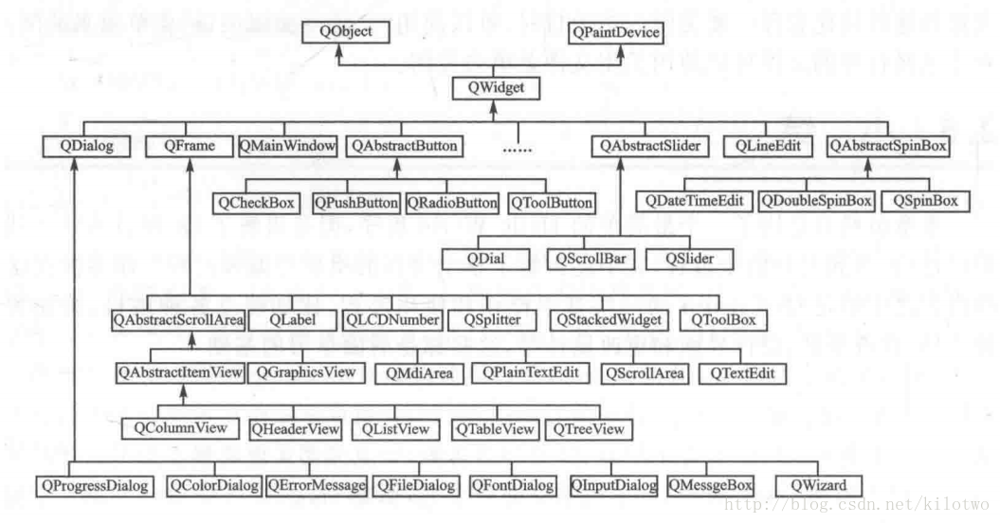
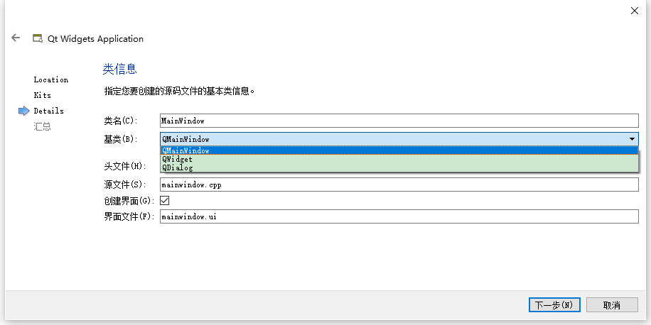
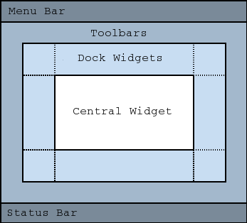

# dialog、widget、mainwindow的区别和选择   

## 1 概述   
- QT提供的默认基类只有QMainWindow、QWidget、和QDialog这三种，这三种窗体也是用的最多的，QMainWindow是**带有菜单栏和工具栏的主窗口类**，QDialog是**各种对话框的基类**，而他们全部继承自QWidget。不仅如此，**所有的窗口部件都继承自QWidget**，继承关系如图所示。        

    

- 在创建qt项目时，往往有一个步骤是，选择建立项目基本类信息   
- 那么这三个基本类如何选择，**三者的主要区别**如下：   
	- dialog有exec函数，如果是dialog窗口，后边的窗口时不可选的(模态的话) ；     
	- widget和dialog都有show函数，如果通过这个函数显示这两种类型的窗口，则两个窗口都是可选的；   
	- widget主要是在上面放置布局和控件；   
	- mainwindow可以显示菜单，工具栏，状态栏、托盘等功能。   
- **使用原则**   
	- 如果需要嵌入到其他窗体中，则基于QWidget创建。  
	- 如果是顶级对话框，则基于QDialog创建。  
	- 如果是主窗体，则基于QMainWindow创建。  

    

## 2 QMainWindow   
- QMainWindow类提供一个有菜单条、工具栏、状态条的主应用程序窗口（例如：开发Qt常用的IDE-Visual Studio、Qt Creator等）。   
- QMainWindow拥有自己的布局，我们可以使用QMenuBar（菜单栏）、QToolBar（工具栏）、QStatusBar（状态栏）以及QDockWidget（悬浮窗体），布局有一个可由任何种类小窗口所占据的中心区域。   

   

## 3 QWidget   
- QWidget类是所有用户界面对象的基类。属于基础窗口部件，   
- **窗口部件是用户界面的一个原子：**它从窗口系统接收鼠标、键盘和其他事件，并且将自己的表现形式绘制到屏幕上。  
- 每一个窗口部件都是矩形，并且它们按Z轴顺序排列。一个窗口部件可以被它的父窗口部件或者它前面的窗口部件盖住一部分。  
- QWidget有很多成员函数，但是它们中的一些有少量的直接功能：例如，QWidget有字体属性，但是自己从来不用。为很多继承它的子类提供了实际的功能，比如QLabel、QPushButton、QCheckBox等等。  
- 没有父窗体的小部件始终是一个独立的窗口（**顶级窗口部件**）    
- QT把没有嵌入到其它部件的部件称为窗口，一般窗口都有边框和标题栏，就像程序中的widget和label一样，QMainWindow和大量的QDialog子类是最一般的窗口类型，窗口就是没有父部件的部件，所以又称为**顶级部件**    
- 非窗口的小部件为子部件，它们在父窗口中显示。Qt中大多数部件主要被用作子部件。    

## 4 QDialog   
- QDialog类是对话框窗口的基类。   
- 对话框窗口是一个顶级窗体，主要用于短期任务以及和用户进行简要通讯。   
- QDialog可以是模式的也可以是非模式的。   
### 4.1 模式对话框   
- 阻塞同一应用程序中其它可视窗口输入的对话框。模**式对话框有自己的事件循环，用户必须完成这个对话框中的交互操作，并且关闭了它之后才能访问应用程序中的其它任何窗口。**  
- 模式对话框仅阻止访问与对话相关联的窗口，允许用户继续使用其它窗口中的应用程序。   
- 显示模态对话框最常见的方法是调用其exec()函数，当用户关闭对话框，exec()将提供一个有用的返回值，并且这时流程控制继续从调用exec()的地方进行。   
- 通常情况下，要获得对话框关闭并返回相应的值，我们连接默认按钮，例如：”确定”按钮连接到accept()槽，”取消”按钮连接到reject()槽。另外我们也可以连接done()槽，传递给它Accepted或Rejected。   

### 4.2 非模式对话框   
- 和同一个程序中其它窗口操作无关的对话框。在文字处理中的查找和替换对话框通常是非模式的，允许用户同时与应用程序的主窗口和对话框进行交互。       
- 调用show()来显示非模式对话框，并立即将控制返回给调用者。  

- 如果隐藏对话框后调用show()函数，对话框将显示在其原始位置，这是因为窗口管理器决定的窗户位置没有明确由程序员指定，为了保持被用户移动的对话框位置，在closeEvent()中进行处理，然后在显示之前，将对话框移动到该位置。   

### 4.3 半模式的对话框  
- 调用setModal(true)或者setWindowModality()，然后show()。有别于exec()，show() 立即返回给控制调用者。    
- 对于**进度对话框**来说，调用setModal(true)是非常有用的，用户必须拥有与其交互的能力，例如：取消长时间运行的操作。    
- 如果使用show()和setModal(true)共同执行一个长时间操作，则必须定期在执行过程中调用QApplication::processEvents()，以使用户能够与对话框交互（可以参考QProgressDialog）。    

## 参考文献  
1. https://blog.csdn.net/Dashi_Lu/article/details/89470039    
2. https://www.cnblogs.com/584709796-qq-com/p/4949410.html   
3. https://blog.csdn.net/tjcwt2011/article/details/77169413  
4. https://blog.csdn.net/kilotwo/article/details/79238545   
