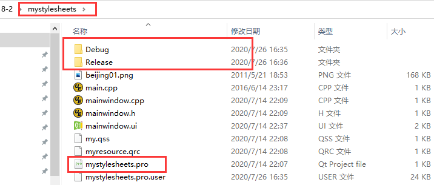

# qt修改build目录   

## 1 问题描述   
- qt creator编译生成的程序，会生成在与当前工程同级目录下，而且名字比较长，当有多个项目时，显得十分凌乱   
- 可以将qt creator编译生成的程序，放入当前工程目录，同时将编译文件的目录名字变得简洁，方便管理   

## 2 借鉴VS的文件结构  
1. 在VS中，生成的项目都在一个独立的目录下    

   

2. 设置qtcreator的生成的目录结构：工具->选项->构建和运行->Default build directory   
## 3 默认目录及含义   
- `../`：返回上一目录    
- `%{CurrentProject:Name}`：当前项目的名字   
- `%{CurrentKit:FileSystemName}`：当前Kit套件名字，一般同一个电脑都一样    
- `%{CurrentBuild:Name}`：当前编译的方式，Debug或者release或者profile   

```bash
../build-%{CurrentProject:Name}-%{CurrentKit:FileSystemName}-%{CurrentBuild:Name}   
# 例如：build-testgif-Desktop_Qt_5_6_1_MinGW_32bit-Debug
# 例如：build-untitled-Desktop_Qt_5_6_1_MinGW_32bit-Debug
```
将`../build-%{CurrentProject:Name}-%{CurrentKit:FileSystemName}-%{CurrentBuild:Name}`其修改为`./%{CurrentBuild:Name}`    

## 4 生成效果   

  


## 参考资料   
1. https://www.cnblogs.com/h2zZhou/p/9522993.html   

