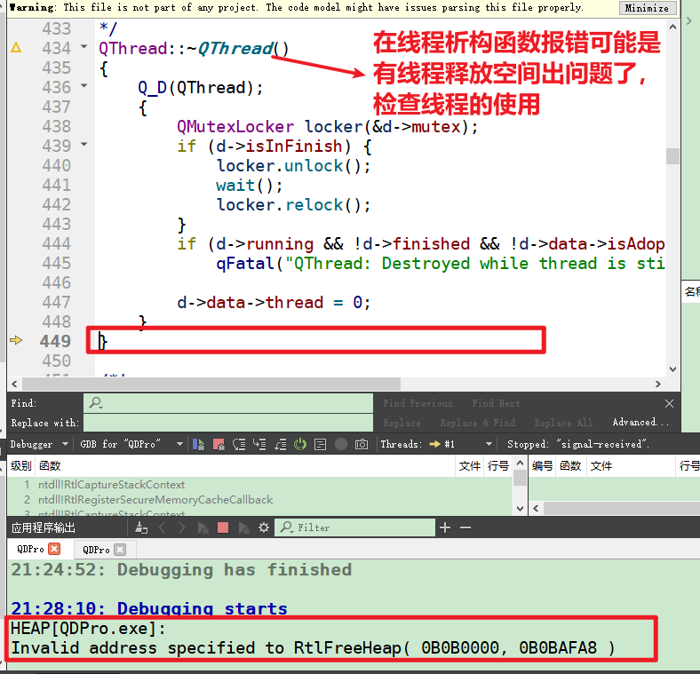

# qt运行出现出现错误  
## 1 错误描述
- 调试一个程序，在非break point的地方，弹出窗口，说是出现错误，看底部 out put窗口说是Invalid Address specified to RtlValidateHeap   

```
HEAP[QDPro.exe]: 
Invalid address specified to RtlFreeHeap( 0AEF0000, 0AEFAFA8 )  
```
  

## 2 原因及解决方法     
- 用空间被重复释放，或者释放了不在堆区的空间    
- 检查代码发现`m_thr_doWork`在栈区，不能用`deleteLater`释放，因此注释掉即可     
```C++
// 2. 线程结束后，退出线程并销毁线程(m_thr_doWork不用手动的删除，因为不是new出来的 去掉即可)
    // connect(&m_thr_doWork, SIGNAL(finished()), &m_thr_doWork, SLOT(deleteLater()));

```

## 3 参考资料   
1. https://www.cnblogs.com/titer1/archive/2011/12/19/2293650.html   


