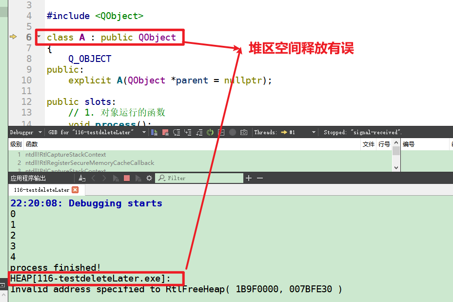

# deleteLater的用法   

## 1 delete与deleteLater   
- deleteLater() 是QT的产物， 而C++标准是没有的。    
- delete是C++与QT公用的。所以很多人，是不太相信deleteLater（）的。    
- 调用deleteLater表示对象将在下一次事件循环处理时被删除，但是在这个函数后面还可以继续使用它    
- 两者主要区别是delete会马上销毁目标对象的，而deleteLater并没有将对象立即销毁，而是向主消息循环发送了一个event，下一次主消息循环收到这个event之后才会销毁对象。    
- 界面不使用delete销毁而使用deleteLater()，就可以让对象的方法顺利执行完毕。而又不担心对象没有销毁而占用内存。    
- [deleteLater的实现原理](https://blog.csdn.net/weixin_42981623/article/details/107804077?utm_medium=distribute.pc_relevant_t0.none-task-blog-OPENSEARCH-1.control&depth_1-utm_source=distribute.pc_relevant_t0.none-task-blog-OPENSEARCH-1.control)    

## 2 具体操作    
```C++
// a.h
class A : public QObject
{
    Q_OBJECT
public:
    explicit A(QObject *parent = nullptr);
public slots:
    // 1. 对象运行的函数
    void process();
    // 2. 对象自行销毁
    void myDelete();
signals:
    // 3. process执行结束发送信号
    void endsig();
};
// a.cpp
A::A(QObject *parent) : QObject(parent) {
    // 1. 当对象收到结束信号，调用释放空间的槽函数
    connect(this, SIGNAL(endsig()), this, SLOT(myDelete()));
}
void A::process() {
    for(int i = 0; i < 5; ++i){
        qDebug() << i ;
        QThread::msleep(300);
    }
    // process执行结束发信号
    // (PS：同一个对象通过信号槽调用挺别扭，纯碎举例子而已)
    emit endsig();
}

void A::myDelete(){
    qDebug() << "process finished!";
    // 1. 对象自行销毁
    // this->deleteLater();
    // 2. 或将对象立即销毁均可，因此一定要保证对象是new出来的
    delete this;
}
// mainwindow.h
QT_BEGIN_NAMESPACE
namespace Ui { class MainWindow; }
QT_END_NAMESPACE

class MainWindow : public QMainWindow
{
    Q_OBJECT

public:
    MainWindow(QWidget *parent = nullptr);
    ~MainWindow();

private:
    Ui::MainWindow *ui;
    // A m_a;
};
// mainwindow.cpp
MainWindow::MainWindow(QWidget *parent)
    : QMainWindow(parent)
    , ui(new Ui::MainWindow)
{
    ui->setupUi(this);
    // 1. new出来的对象可以正常运行，因此一定要保证对象是new出来的
    A* m_pa = new A;
    connect(ui->pushButton,SIGNAL(clicked()), m_pa, SLOT(process()));


    // 2. 栈区对象放在这里单击按钮，没有反应，
    //    放在属性成员里面单击有反应，但是提示： HEAP[116-testdeleteLater.exe]
    // A m_a;
    //  connect(ui->pushButton,SIGNAL(clicked()), &m_a, SLOT(process()));
}

MainWindow::~MainWindow()
{
    delete ui;
}

```
## 3 结论   
1. deleteLater 不是将对象立马释放，而是执行完一次事件循环才进行    
2. 要想用deleteLater 或者delete释放空间，对象一定要new出来，否则会出错     

   


## 4 参考资料   
1. https://blog.csdn.net/c54514331/article/details/80954352    
2. https://blog.csdn.net/rebiy12/article/details/103713438   
3. https://blog.csdn.net/ZXHL_hxf/article/details/83410852?utm_medium=distribute.pc_relevant.none-task-blog-searchFromBaidu-1.control&depth_1-utm_source=distribute.pc_relevant.none-task-blog-searchFromBaidu-1.control    
4. https://blog.csdn.net/li235456789/article/details/50599757?utm_medium=distribute.pc_relevant.none-task-blog-BlogCommendFromMachineLearnPai2-2.control&depth_1-utm_source=distribute.pc_relevant.none-task-blog-BlogCommendFromMachineLearnPai2-2.control    