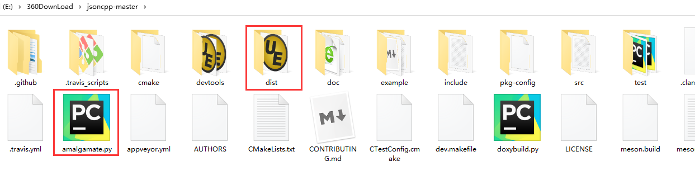

# 在Qt中使用JsonCPP解析Json格式  

## 1 Json与JsonCpp的简介   
- 由于在使用qt4时，并没有qt5的Json库来处理Json文件，因此采用JsonCpp来解析Json文件   
- Json的简介   
	- JSON是一个轻量级的数据定义格式，比起XML易学易用，而扩展功能不比XML差多少，用之进行数据交换是一个很好的选择   
	- JSON的全称为：JavaScript Object Notation ，顾名思义，JSON是用于标记javascript对象的，详情参考http://www.json.org/。  
		- 1. []中括号代表的是一个数组；  
		- 2. {}大括号代表的是一个对象  
		- 3. 双引号“”表示的是属性值  
		- 4. 冒号：代表的是前后之间的关系，冒号前面是属性的名称，后面是属性的值，这个值可以是基本数据类型，也可以是引用数据类型。  
	- 本文选择第三方库JsonCpp来解析json,JsonCpp是比较出名的c++解析库,在json官网也是首推的。   
- JsonCpp的简介  
	- JsonCpp主要包含三种类型:     
		- Value：代表每个值，可以转成不同的数据类型    
		- Reader： 对json字符串或者文件进行反序列化(解析Json序列)    
		- FastWriter：序列化json字符串，输出的是多字节内容，如果需要utf8格式，需要自己对输出的字符串进行转换。(生成Json序列)   
	- jsoncpp中所有对象、类名都在namespace json中，包含json.h即可。   
- 注意：  
	- 注意: Json::Value只能处理ANSI类型的字符串，如果C++程序使用Unicode编码的，最好加一个Adapt类来适配。   

## 2 JsonCpp的下载及编译   
- JsonCpp是开源的，保存在[本地的位置](../10-others/22-jsoncpp-master.zip)，github地址是：https://github.com/open-source-parsers/jsoncpp。   
- 解压后，利用Python运行里面的amalgamate.py文件：    
```python
python amalgamate.py 
```
   

- 此时，会生成dist文件夹，里面有三个文件，`jsoncpp.cpp`和`/json/json.h`和`/json/json-forwards.h`    

- 将jsoncpp.cp和json.h放入自己的项目目录即可使用(**仅限于qt5，对于qt4来说，还要加上所有文件**) ，详见[20-在qt4下使用JsonCpp.md](./20-在qt4下使用JsonCpp.md)       

## 3 JsonCPP的用法   
### 3.1 序列化  
```C++
// 序列化
void ProcessJson::createJson()
{
    QDateTime time = QDateTime::currentDateTime();
    QString date = time.toString("yyyy-MM-dd hh:mm:ss");

    // 1. 如果没有嵌套，直接赋值，如果遇到嵌套，由内而外赋值
    m_RootJson ["type"] = "hakzt";
    m_RootJson["sbdw"] = "A01";

    Json::Value status;


    Json::Value deviceStatus;
    Json::Value mmjk;
    mmjk["code"] = "00001";
    mmjk["fsd"] = 1;
    mmjk["sdsj"] = 1;
    mmjk["status"] = 2;
    mmjk["type"] = 1;
    mmjk["tzy"] = 1;
    mmjk["updatetime"] = date.toStdString();
    deviceStatus["mmjk"] = mmjk;
    status["deviceStatus"] = deviceStatus;

    Json::Value lockStatus;
    Json::Value byb;
    byb["code"] = "02001";
    byb["mode"] = 0x00;
    byb["resultsqjg"] = 0x00;
    byb["resultzxjg"] = 0x00;
    byb["type"] = 2;
    byb["updatetime"] = date.toStdString();
    lockStatus["byb"] = byb;

    Json::Value dh;
    dh["code"] = "04001";
    dh["kxtd"] = 1;
    dh["mode"] = 0x00;
    dh["resultsqjg"] = 0x00;
    dh["resultzxjg"] = 0x00;
    dh["type"] = 4;
    dh["updatetime"] = date.toStdString();
    lockStatus["dh"] = dh;

    Json::Value djmb;
    djmb["code"] = "01001";
    djmb["resultdjmb"] = 0;
    djmb["type"] = 1;
    djmb["updatetime"] = date.toStdString();
    lockStatus["djmb"] = djmb;
    status["lockStatus"] = lockStatus;


    Json::Value weaponstatus;
    weaponstatus["bdnm"] = "A01B01C01D01E01F12";
    weaponstatus["weaponType"] = 3;
    weaponstatus["zbzt"] = 1;

    status["weaponstatus"] = weaponstatus;

    // 2. 先有内部，再构造外部；次序变了，外部可能为空
    m_RootJson["status"] = status;

    // 3. Json::Value 转成 QString
    m_JsonOfQString = m_RootJson.toStyledString().c_str();

    qDebug().noquote() << m_JsonOfQString ;

}
```

## 3.2 反序列化  
```C++
void ProcessJson::AnalysisJsonByJsonCpp()
{
    // 1. QString 强转成 标准的 String
    std::string strValue = m_JsonOfQString.toStdString();
    Json::Reader reader;
    Json::Value root;

    // 2. 利用Json::Reader 将 String 转成 Json::Value
    reader.parse(strValue, root);

    // 3. 依次根据 键值 来取值：
    //   3.1 如果是string，则asString()；


    std::string type = root["type"].asString();
    qDebug() <<  type.c_str();

    //   3.2 如果是Json::Value，则什么都不写，直接赋值给一个Json::Value对象；
    const Json::Value status = root["status"];
    const Json::Value weaponstatus = status["weaponstatus"];
    std::string bdnm = weaponstatus["bdnm"].asString();
    //   3.3 如果是int，则asInt()；
    int weaponType = weaponstatus["weaponType"].asInt();
    int zbzt = weaponstatus["zbzt"].asInt();

    qDebug() << bdnm.c_str();
    qDebug() << weaponType;
    qDebug() << zbzt;
}
```


## 4 总结   
1. Json::Value：可以表示所有支持的类型，如：int , double ,string , object, array等。其包含节点的类型判断(isNull,isBool,isInt,isArray,isMember,isValidIndex等),类型获取(type),类型转换(asInt,asString等),节点获取(get,[]),节点比较(重载<,<=,>,>=,==,!=),节点操作(compare,swap,removeMember,removeindex,append等)等函数。   

2. Json::Reader：将文件流或字符串创解析到Json::Value中，主要使用parse函数。Json::Reader的构造函数还允许用户使用特性Features来自定义Json的严格等级。  

3. Json::Writer：与JsonReader相反，将Json::Value转换成字符串流等，Writer类是一个纯虚类，并不能直接使用。在此我们使用 Json::Writer 的子类：Json::FastWriter(将数据写入一行,没有格式),Json::StyledWriter(按json格式化输出,易于阅读)。  

4. Json::Reader可以通过对Json源目标进行解析，得到一个解析好了的Json::Value，通常字符串或者文件输入流可以作为源目标。  


## 5 参加资料  
1. https://blog.csdn.net/u012532263/article/details/82801745?utm_medium=distribute.pc_relevant.none-task-blog-BlogCommendFromMachineLearnPai2-1.channel_param&depth_1-utm_source=distribute.pc_relevant.none-task-blog-BlogCommendFromMachineLearnPai2-1.channel_param   
2. https://blog.csdn.net/u011973222/article/details/60135519   
3. https://blog.csdn.net/oMingZi12345678/article/details/9669785?utm_medium=distribute.pc_relevant.none-task-blog-BlogCommendFromMachineLearnPai2-1.channel_param&depth_1-utm_source=distribute.pc_relevant.none-task-blog-BlogCommendFromMachineLearnPai2-1.channel_param  
4. https://www.cnblogs.com/chechen/p/7251128.html  
5. https://www.cnblogs.com/ggjucheng/archive/2012/01/03/2311107.html   
6. https://blog.csdn.net/qq_25408423/article/details/84867196   


