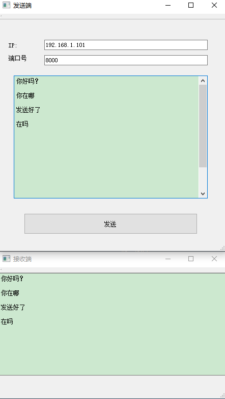

# 网络编程-UDP协议  

## 1 UDP的简介  
- UDP（User Datagram Protocol即用户数据报协议）是一个轻量级的，不可靠的，面向数据报的无连接协议。  
- UDP的特点  
	1. 网络数据大多为短消息   
	2. 拥有大量客户端   
	3. 对数据安全性无特殊要求   
	4. 网络负担非常重，但对响应速度要求高    
- UDP的应用场景    
	- QQ聊天    
	- 在线视频    
	- 网络语音电话（即时通讯，速度要求高，但是出现偶尔断续不是太大问题，并且此处完全不可以使用重发机制）   
	- 广播通信（广播、多播）   
## 2 套接字  
- 在Qt中提供了QUdpSocket 类来进行UDP数据报（datagrams）的发送和接收。   
- Socket简单地说，就是一个IP地址加一个port端口   
	- IP地址确定一台主机   
	- 端口来指定UDP程序(可能运行着各种各样的网络程序)  
	- Socket指明了数据报传输的路径  

## 3 基本原理  
- 客户端：建立一个UDP Socket并绑定自己的IP和端口号，用信号与槽的方式进行监听是否有数据来临。   
- 服务器端：建立一个UDP Socket，绑定客户机的IP地址和端口号，转成QByteArray进行发送。   

## 4 具体实现   

### 4.1 服务器(发送端)   
1. 新建一个项目`testUdp` ，选带有`mainwindow`的   
2. 在项目文件`testUdp.pro`中，添加`network`模块，就可以使用网络通信相关的函数库，例如：`<QUdpSocket>`  

```C++
QT       += core gui network
```

3. `mainwindow.h`修改如下    
```C++
#include <QMainWindow>
// 1. 添加UDP的头文件
#include <QUdpSocket>

namespace Ui {
class MainWindow;
}

class MainWindow : public QMainWindow
{
    Q_OBJECT

public:
    explicit MainWindow(QWidget *parent = 0);
    ~MainWindow();
    // 2. 发送UDP数据报的函数
    void SendUDPData();

private slots:
    // 3. 添加按钮的单击事件，也可以不通过按钮触发，那就定义一个普通的
    void on_pushButtonwrite_clicked();
private:
    Ui::MainWindow *ui;
    
    // 4. 定义一个UDP套接字的对象指针
    QUdpSocket *udpsocket;
};
```


4. `mainwindow.cpp` 修改如下 ：   
```C++
MainWindow::MainWindow(QWidget *parent) :
    QMainWindow(parent),
    ui(new Ui::MainWindow)
{
    ui->setupUi(this);
    // 1. 创建一个UdpSocket的对象，否则会有空指针报错
    udpsocket = new QUdpSocket();
}

MainWindow::~MainWindow()
{
    delete ui;
}

// 发送数据报的函数
void MainWindow::SendUDPData(){

    // 1. 获取对方的端口号和ip
    QString ip = ui->lineEditip->text();
    // 2. 获取对方的端口号，注意类型是：quint16
    quint16 port = ui->lineEditport->text().toInt();

    // 3. 获取文本框的内容，也就是要发送的内容
    QString str = ui->textEdit->toPlainText();

    // 4. 将要发送的数据转换成QByteArray 类型
    QByteArray sendByteArray = str.toUtf8();
    // 5. 将信息发送给指定的ip
    // 将sendByteArray数据报发送到端口端口的主机地址。返回成功时发送的字节数；否则返回-1。
    udpsocket->writeDatagram(sendByteArray, (QHostAddress)ip, port);
}

void MainWindow::on_pushButtonwrite_clicked()
{
    SendUDPData();
}
```

### 4.2 客户端(接收端)  
1. 新建一个项目`UdpRecive` ，选带有`mainwindow`的   
2. 在项目文件`UdpRecive.pro`中，添加`network`模块，就可以使用网络通信相关的函数库，例如：`<QUdpSocket>`  

```C++
QT       += core gui network
```

3. `mainwindow.h`修改如下    

```C++
#include <QMainWindow>
// 1. 添加UDP套接字函数库，若显示黄色下划线，编译一下即可
#include <QUdpSocket>


namespace Ui {
class MainWindow;
}

class MainWindow : public QMainWindow
{
    Q_OBJECT
public:
    explicit MainWindow(QWidget *parent = 0);
    ~MainWindow();
// 4. 获取本机的IP地址
    QString getHostIpAddress();
public slots:
// 3. 监听到发来信息后，调用receive()
    void receive();
private:
    Ui::MainWindow *ui;
// 2. 建立套接字对象，用于调用库函数
    QUdpSocket *uSocket;
};
```

4. `mainwindow.cpp` 修改如下 ：   

```C++

#include <QDebug>
// 1. 该文件用于获取本机的IP
#include <QNetworkInterface>


MainWindow::MainWindow(QWidget *parent) :
    QMainWindow(parent),
    ui(new Ui::MainWindow)
{
    ui->setupUi(this);
    // 2. 创建UdpSocket对象，不创建的话，会因为空指针报错
    uSocket = new QUdpSocket();
    qDebug() << getHostIpAddress();
    // 3. 绑定自己的IP地址和给定的端口号
    uSocket->bind(QHostAddress(getHostIpAddress()), 8000);
    // 4. 通过信号槽机制时刻监听，是否有发来的信息，若有的话，调用receive()
    connect(uSocket, SIGNAL(readyRead()), this, SLOT(receive()));
}

MainWindow::~MainWindow(){
    delete ui;
}

void MainWindow::receive()
{
    QByteArray ba;
    // 5. 如果至少有一个数据报等待读取，则返回true；否则返回false。
    while(uSocket->hasPendingDatagrams())
    {
        // 6. 设置数组的大小，并初始化每个字节的数据字节
        ba.resize(uSocket->pendingDatagramSize());
        // 7. 在ba.data()中存储接收到的不大于ba.size()字节的数据报。
        uSocket->readDatagram(ba.data(), ba.size());
        qDebug() <<  ba.data() ;
        // 8. 将接收到的数据包，显示在标签中
        ui->label->setText(ba.data());
    }
}

// 获取本机的IP地址
QString MainWindow::getHostIpAddress()
{
    QString strIpAddress;
    // 1. 获取IP地址列表
    QList<QHostAddress> ipAddressesList = QNetworkInterface::allAddresses();
    // 2. 获取第一个本主机的IP地址
    int nListSize = ipAddressesList.size();
    for (int i = 0; i < nListSize; ++i)    {
        // 3. toIPv4Address() 是获取IPv4 ，toIPv6Address() 是获取IPv6
           if (ipAddressesList.at(i) != QHostAddress::LocalHost &&
               ipAddressesList.at(i).toIPv4Address()) {
               strIpAddress = ipAddressesList.at(i).toString();
               // 4. break去掉是获取局域网的IP，不去掉是获取互联网的IP
               // break;
           }
     }
     // 4. 如果没有找到，则以本地IP地址为IP
     if (strIpAddress.isEmpty())
        strIpAddress = QHostAddress(QHostAddress::LocalHost).toString();
     return strIpAddress;
}
```

### 4.3 运行效果   

   


## 5 参考资料  
1. https://blog.csdn.net/y____xiang/article/details/80529993?utm_medium=distribute.pc_relevant.none-task-blog-BlogCommendFromMachineLearnPai2-1.channel_param&depth_1-utm_source=distribute.pc_relevant.none-task-blog-BlogCommendFromMachineLearnPai2-1.channel_param   
2. https://blog.csdn.net/weixin_42216430/article/details/80780297?utm_medium=distribute.pc_relevant.none-task-blog-BlogCommendFromMachineLearnPai2-1.channel_param&depth_1-utm_source=distribute.pc_relevant.none-task-blog-BlogCommendFromMachineLearnPai2-1.channel_param   
3. https://blog.csdn.net/u012260238/article/details/53264031   
4. http://blog.sina.com.cn/s/blog_c41654190101ejkc.html   

   