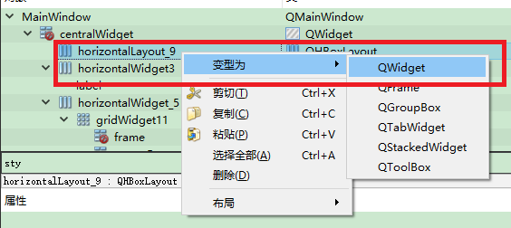

# 图层层叠显示   
## 1 图层提升widget

    

- 为了把设置大小和位置     
- 放入`QStackedLayout`中    

## 2 设置图层   
- 将多个图层的大小和位置调整一致   

## 3 存入图层栈   

```C++
m_pStackedLayout = new QStackedLayout();
m_pStackedLayout->addWidget(ui->verticalWidget1);
m_pStackedLayout->addWidget(ui->verticalWidget2);
m_pStackedLayout->addWidget(ui-> horizontalWidget3);
```
## 4 循环图层栈下标显示   

```C++
// 获取栈的大小
int nCount = m_pStackedLayout->count();
// 获取当前图层下标
int nIndex = m_pStackedLayout->currentIndex();
// nIndex:[0,nCount-1]  
m_pStackedLayout->setCurrentIndex(nIndex);
```

## 5 参考文献   
1. https://blog.csdn.net/u011012932/article/details/51539851   
