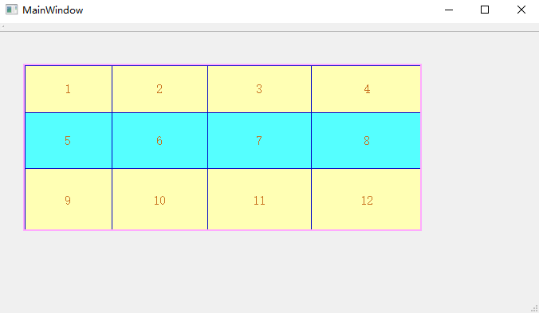
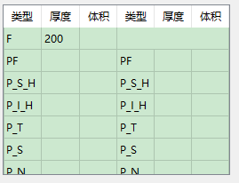
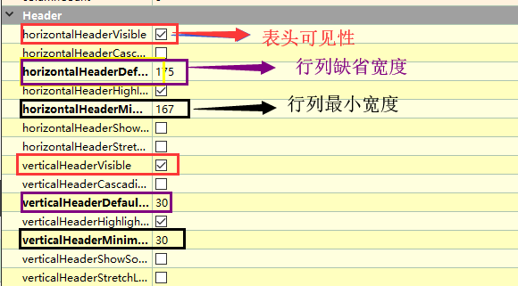
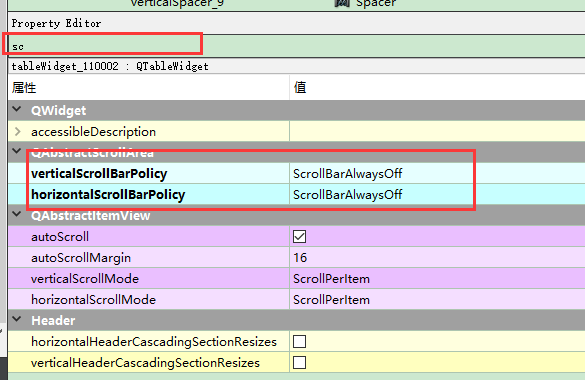
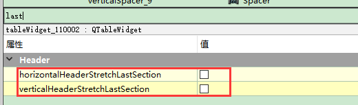
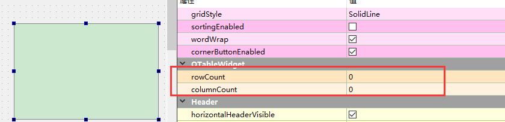

# TableWidget单元格用法   

## 1 表格的设置   
- 修改单元格的背景：`table->item(0,0)->setBackground(QColor(233, 233, 241));`        
- 单元格必须先创建再设置
```
    // 方法1：
    QTableWidgetItem *item = new QTableWidgetItem("你好");
    item->setBackgroundColor(QColor(255,255,255));
    item->setFont(QFont("宋体", 5));
    ui->tableWidget->setItem(1,1,item);

    // 方法2：
    ui->tableWidget->setItem(1,2,new QTableWidgetItem("你好吗"));
    //  没有new 的话 Item 不能用
    ui->tableWidget->item(1,2)->setFont(QFont("宋体", 5));

```

- `clear();`是清空所有单元格，将所有的单元格的内存也释放了，不可轻易用，否则还要重建和重新设置   

   


## 2 表格的初始化   

```C++
void MainWindow::InitTableWidget() {

    for(int i = 0; i < ui->tableWidget->rowCount(); ++i)
        for(int j = 0; j < ui->tableWidget->columnCount(); ++j){
            // 1. 为每个单元格申请空间
            ui->tableWidget->setItem(i,j,new QTableWidgetItem(QString::number(i*ui->tableWidget->columnCount() + j + 1)));
            // 2. 设置每个单元格的字体及字号
            ui->tableWidget->item(i,j)->setFont(QFont("宋体", 12));
            // 3. 设置单元格的对齐方式
            ui->tableWidget->item(i,j)->setTextAlignment(Qt::AlignHCenter | Qt::AlignVCenter);

            // 4. 设置奇数行和偶数行不同背景色
            if(i % 2 == 0)
                ui->tableWidget->item(i,j)->setBackgroundColor(QColor(255,255,180));
            else{
                ui->tableWidget->item(i,j)->setBackgroundColor(QColor(255,255,180, 0));
            }

            // 5. 设置字体的颜色
            ui->tableWidget->item(i,j)->setTextColor(QColor(200,111,30)); //设置文字颜色

            // 6. 设置该单元格为屏蔽状态，不能编辑和选中。
            ui->tableWidget->item(i,j)->setFlags(Qt::ItemIsEditable);
        }

    // 6. 设置每列的宽度
    ui->tableWidget->setColumnWidth(0,110);
    ui->tableWidget->setColumnWidth(1,120);
    ui->tableWidget->setColumnWidth(2,130);
    ui->tableWidget->setColumnWidth(3,140);

    // 7. 设置每行的高度
    ui->tableWidget->setRowHeight(0,60);
    ui->tableWidget->setRowHeight(1,70);
    ui->tableWidget->setRowHeight(2,80);

    // 8. 设置渲染效果:背景色，线的颜色，边界的线宽、线型、颜色
    ui->tableWidget->setStyleSheet("background-color: rgb(85, 255, 255);"\
                                   "gridline-color: rgb(0, 5, 200);" \
                                   "border:2px solid #ffaaff;");


}

```


## 2 表格填数据   
```C++
ui->tableWidget->setRowCount(8);     //设置行数为8
ui->tableWidget->setColumnCount(6);  //设置列数为6
ui->tableWidget->clear();
//自适应宽度
ui->tableWidget->horizontalHeader()->setStretchLastSection(true);
ui->tableWidget->horizontalHeader()->setSectionResizeMode(QHeaderView::Stretch);
//设置默认高度
ui->tableWidget->verticalHeader()->setDefaultSectionSize(25);

//隐藏滚动条
ui->tableWidget->setHorizontalScrollBarPolicy(Qt::ScrollBarAlwaysOff);
ui->tableWidget->setVerticalScrollBarPolicy(Qt::ScrollBarAlwaysOff);
ui->tableWidget->setEditTriggers(QAbstractItemView::NoEditTriggers);//不可编辑
ui->tableWidget->setSelectionMode(QAbstractItemView::NoSelection);//不可选择
ui->tableWidget->verticalHeader()->setVisible(false); //隐藏列表头

//设置表头
QStringList header;
header << "类型" << "厚度" << "体积" << "类型" << "厚度" << "体积";
ui->tableWidget->setHorizontalHeaderLabels(header);

ui->tableWidget->setSpan(0, 3, 1, 5);//将无用单元格合并

//设置每一项
// 第0行，第0列，插入F
ui->tableWidget->setItem(0, 0, new QTableWidgetItem("F"));//
ui->tableWidget->setItem(1, 0, new QTableWidgetItem("PF"));//
ui->tableWidget->setItem(2, 0, new QTableWidgetItem("P_S_H")); //
ui->tableWidget->setItem(3, 0, new QTableWidgetItem("P_I_H"));//
ui->tableWidget->setItem(4, 0, new QTableWidgetItem("P_T"));//
ui->tableWidget->setItem(5, 0, new QTableWidgetItem("P_S"));//
ui->tableWidget->setItem(6, 0, new QTableWidgetItem("P_N"));//
ui->tableWidget->setItem(7, 0, new QTableWidgetItem("P_I"));//

ui->tableWidget->setItem(1, 3, new QTableWidgetItem("PF")); //
ui->tableWidget->setItem(2, 3, new QTableWidgetItem("P_S_H"));//
ui->tableWidget->setItem(3, 3, new QTableWidgetItem("P_I_H"));//
ui->tableWidget->setItem(4, 3, new QTableWidgetItem("P_T"));//
ui->tableWidget->setItem(5, 3, new QTableWidgetItem("P_S"));//
ui->tableWidget->setItem(6, 3, new QTableWidgetItem("P_N"));//
//每一项的厚度值
ui->tableWidget->setItem(7, 3, new QTableWidgetItem("P_I"));//
ui->tableWidget->setItem(0, 1, new QTableWidgetItem(QString::number(200))); // 插入数字  

```

## 3 运行效果   

   


## 4 注意事项   
- 对于tableWidget最好把表头去掉，方便调格式    
  

- 当没有表头时，可以用setText方法改单元格的值`item(0,0)->setText("作战模式");`，但是有表头的话，只能用setItem方法修改`tableWidget->setItem(7, 3, new QTableWidgetItem("P_I"))`    
- 可以去掉滑动框    
  

- 可以设置最后行或者最后一列自适应到表格大小    
    

- 表格的大小和单元格的大小算完后，需要加上大约3px的线宽才比较好看    

- 可以设置行数和列数    

   

- 可以通过加空格的方式，修改标头的宽度   

## 参考资料   
1. https://www.cnblogs.com/aiguona/p/10400111.html   
2. http://blog.sina.com.cn/s/blog_bf9f9b850102y4of.html   