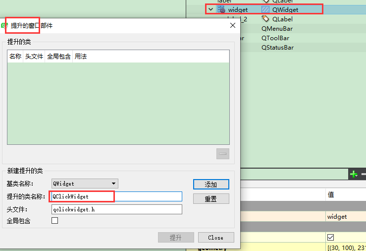
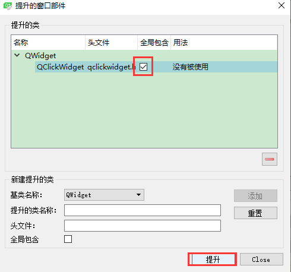
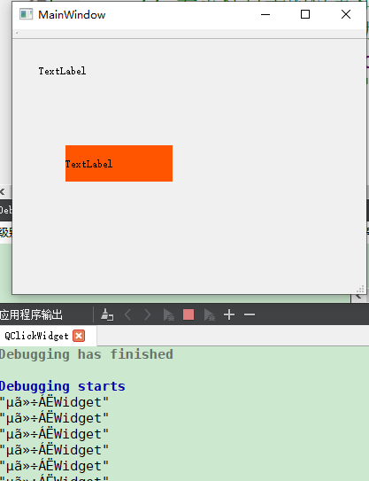
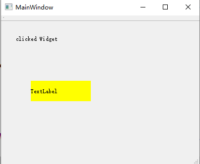

# QWidget单击事件   
## 1 借助于鼠标事件    
- 根据QWidget的像素位置进行设置即可   
- [用法详见鼠标键盘事件](./42-qt界面设计-鼠标键盘事件.md)     

## 2 重写鼠标事件再提升    
1. 定义一个类QClickWidget，继承了QWidget   
2. 在 QClickWidget 中定义一个信号和一个接收这个信号的槽函数   
3. 重写鼠标的点击事件   
4. 将要添加单击事件的QWidget，提升为QClickWidget   

## 3 具体实现  
### 3 .1 代码部分   
```C++
// QClickWidget.h
class QClickWidget : public QWidget
{
    Q_OBJECT
public:
    explicit QClickWidget(QWidget *parent = 0);
signals:
    // 1. 定义一个信号
    void clicked(QString s);
public slots:
    // 2. 定义Widget单击的槽函数：
    // 注意：槽函数的位置一般是谁接收这个信号，谁就有一个槽函数与这个信号相对应，本例子是自己调用自己 
    void mouseClicked(QString s);
protected:
    // 3. 重写鼠标单击事件和释放事件
    void mousePressEvent(QMouseEvent *ev);
    void mouseReleaseEvent(QMouseEvent *ev);
private:
    QPoint mousePos;
};
```

```C++ 
// QClickWidget.cpp
QClickWidget::QClickWidget(QWidget *parent) : QWidget(parent)
{
// 如果QClickWidget发出clicked(QString)信号，QClickWidget调用mouseClicked(QString)
connect(this, SIGNAL(clicked(QString)), this, SLOT(mouseClicked(QString)));
}

void QClickWidget::mouseClicked(QString s)
{
    qDebug() << s;
    this->setStyleSheet("background-color: rgb(255, 85, 0);");
}

void QClickWidget::mousePressEvent(QMouseEvent *ev)
{
    // 将鼠标点击的位置保留在mousePos中
    mousePos = QPoint(ev->x(), ev->y());
}

void QClickWidget::mouseReleaseEvent(QMouseEvent *ev)
{
    // 若鼠标点击的位置和鼠标释放的位置一样，那就发射信号
    // 但是若鼠标按住滑动，那么鼠标点击的位置和鼠标释放的位置不一样，不会发射信号
    if(mousePos == QPoint(ev->x(), ev->y()))
        emit clicked("点击了Widget");
}
```

### 3.2 提升部分   

    

    

## 4 运行效果  

    


## 5 另一种写法，调用对象不是QWidget类型   
- 上面例子是，自己的发信号自己的槽接收    
- 可以是自己发信号，其他类的对象接收，那么需要将槽函数和connect都放在其他对象的类声明和定义中    
- QClickWidget类的内容如下：   

```C++
// QClickWidget.h
class QClickWidget : public QWidget
{
    Q_OBJECT
public:
    explicit QClickWidget(QWidget *parent = 0);
signals:
    // 1. 定义一个信号
    void clicked(QString   s);
protected:
    // 3. 重写鼠标单击事件和释放事件
    void mousePressEvent(QMouseEvent *ev);
    void mouseReleaseEvent(QMouseEvent *ev);
private:
    QPoint mousePos;
};
// QClickWidget.cpp
QClickWidget::QClickWidget(QWidget *parent) : QWidget(parent){
}
void QClickWidget::mousePressEvent(QMouseEvent *ev){
    // 将鼠标点击的位置保留在mousePos中
    mousePos = QPoint(ev->x(), ev->y());
}
void QClickWidget::mouseReleaseEvent(QMouseEvent *ev){
    // 若鼠标点击的位置和鼠标释放的位置一样，那就发射信号
    // 但是若鼠标按住滑动，那么鼠标点击的位置和鼠标释放的位置不一样，不会发射信号
    if(mousePos == QPoint(ev->x(), ev->y()))
        emit clicked("clicked Widget");
}
```

- MainWindow的定义和声明如下：    

```C++
// MainWindow.h
namespace Ui {
class MainWindow;
}
class MainWindow : public QMainWindow
{
    Q_OBJECT

public:
    explicit MainWindow(QWidget *parent = 0);
    ~MainWindow();
public slots:
    // 2. 定义Widget单击的槽函数
    void mouseClickedWidget(QString s);
private:
    Ui::MainWindow *ui;
};
// MainWindow.cpp
MainWindow::MainWindow(QWidget *parent) :
    QMainWindow(parent),
    ui(new Ui::MainWindow){
    ui->setupUi(this);
// 若ui->widget发出clicked(QString)信号，MainWindow就调用mouseClickedWidget(QString)的槽函数  
connect(ui->widget, SIGNAL(clicked(QString)), this, SLOT(mouseClickedWidget(QString)));

}

MainWindow::~MainWindow(){
    delete ui;
}

void MainWindow::mouseClickedWidget(QString s){
    static int f = 1;
    if(f){
        ui->widget->setStyleSheet("background-color: rgb(255, 0, 0);");
        ui->label->setText(s + f);
    }else{
        ui->widget->setStyleSheet("background-color: rgb(255, 255, 0);");
        ui->label->setText(s + f);
    }
    f = !f;
}
```

- 运行效果  

      


## 5 参考资料   
1. https://blog.csdn.net/u012587637/article/details/106948769    
2. https://www.cnblogs.com/qiantao/p/9638050.html  
3. https://blog.csdn.net/l285345042/article/details/8161320      
