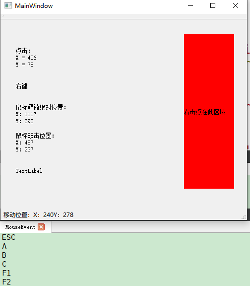
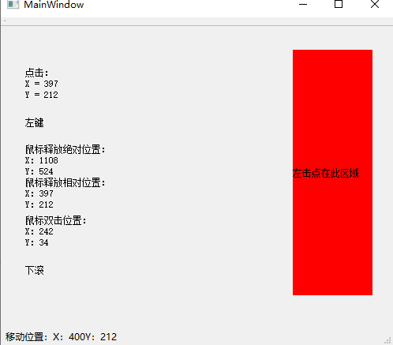

# 自定义控件的鼠标键盘事件   
## 1 鼠标事件的分类   
- 在事件声明中最好用`protected:`   
- 鼠标的点击事件和释放事件的位置不一定是一样的   
	- 若鼠标在一个点点击一下，那么点击事件和释放事件的位置一样   
	- 若鼠标按住滑动，那么点击事件位置是滑动的起点，释放事件的位置是滑动的终点   

```C++
// mainwindow.h 添加
protected:
    // 1. 鼠标点击事件
    void mousePressEvent(QMouseEvent * event);
    // 2. 鼠标移动事件
    void mouseMoveEvent(QMouseEvent * event);
    // 3. 鼠标松开(释放)事件
    void mouseReleaseEvent(QMouseEvent * event);
    // 4. 鼠标双击事件
    void mouseDoubleClickEvent(QMouseEvent * event);
    // 5. 滚轮事件
    void wheelEvent(QWheelEvent * event);
    // 6. 键盘事件
    void keyPressEvent(QKeyEvent * event);
```

### 1.1 mousePressEvent点击事件 
- 左键、中键、右键和点击的坐标轴值等，实际上属于鼠标的点击   
- 可以通过重写`void mousePressEvent(QMouseEvent * event);`这个函数    

```C++
// 1. 鼠标的点击事件
void MainWindow::mousePressEvent(QMouseEvent *event)
{
    // x()和y()返回距离窗体的相对位置，返回值是int
    ui->label_1->setText("点击：\n" + QString("X = ") + QString::number(event->x()) +"\n" + "Y = " + QString::number(event->y()));
    if(event->button() == Qt::LeftButton)
        ui->label_2->setText("左键");
    else if(event->button() == Qt::RightButton)
        ui->label_2->setText("右键");

    int x_min = ui->label_6->pos().x();
    int y_min = ui->label_6->pos().y();
    int x_max = x_min + ui->label_6->width();
    int y_max = y_min + ui->label_6->height();
    
    if(event->button() == Qt::LeftButton &&
            event->x() > x_min && event->x() < x_max &&
            event->y() > y_min && event->y() < y_max)
        ui->label_6->setText("左击点在此区域");
    else if(event->button() == Qt::RightButton &&
            event->x() > x_min && event->x() < x_max &&
            event->y() > y_min && event->y() < y_max)
        ui->label_6->setText("右击点在此区域");
    else
        ui->label_6->setText(" ");
}
```

- 可以判断鼠标点击的区域  

### 1.2 鼠标移动事件   
- 利用`void MainWindow::mouseMoveEvent(QMouseEvent *event)`   
- 默认是按下时捕捉鼠标位置   
- 实时捕捉鼠标位置，需要在构造函数开启所有控件的setMouseTracking(true)   
- 如果有Layout，可以先提升为QWidget再开启setMouseTracking(true)   


```C++
// 在构造函数中，开启所有控件setMouseTracking(true);
    QMainWindow(parent),
    ui(new Ui::MainWindow)
{
    ui->setupUi(this);
    // 启动移动事件
    this->setMouseTracking(true);
    ui->centralWidget->setMouseTracking(true);   // centralWidget必须开启 
    ui->label_1->setMouseTracking(true);
    ui->label_2->setMouseTracking(true);
    ui->label_3->setMouseTracking(true);
    ui->label_4->setMouseTracking(true);
    ui->label_5->setMouseTracking(true);
    ui->verticalWidget->setMouseTracking(true);
}
MainWindow::MainWindow(QWidget *parent) :
    QMainWindow(parent),
    ui(new Ui::MainWindow)
{
    ui->setupUi(this);
    // 启动移动事件
    this->setMouseTracking(true);
    ui->centralWidget->setMouseTracking(true);
    ui->label_1->setMouseTracking(true);
    ui->label_2->setMouseTracking(true);
    ui->label_3->setMouseTracking(true);
    ui->label_4->setMouseTracking(true);
    ui->label_5->setMouseTracking(true);
    ui->verticalWidget->setMouseTracking(true);
}

// 2. 鼠标移动事件
void MainWindow::mouseMoveEvent(QMouseEvent *event)
{

    statusBar()->showMessage("移动位置：" + QString("X：") + QString::number(event->x()) + "Y：" + QString::number(event->y()));
}
```

### 1.3  鼠标释放事件   
- 利用`void MainWindow::mouseReleaseEvent(QMouseEvent *event)`   

```C++
// 3. 鼠标释放事件
void MainWindow::mouseReleaseEvent(QMouseEvent *event)
{
    ui->label_3->setText("鼠标释放绝对位置：\n" + QString("X：") + QString::number(event->globalX()) + "\nY：" + QString::number(event->globalY()));
}
```

### 1.4 鼠标双击事件   
- 利用`void MainWindow::mouseDoubleClickEvent(QMouseEvent *event)`     

```C++
// 4. 鼠标双击事件
void MainWindow::mouseDoubleClickEvent(QMouseEvent *event)
{                                                                       // QString::number(value, 'f', 2);
    ui->label_4->setText("鼠标双击位置：\n" + QString("X：") + QString::number(event->x()) + "\nY：" + QString::number(event->y()));

}
```

### 1.5 滚轮事件   
- 利用`void MainWindow::wheelEvent(QWheelEvent *event)`   
- 注意此时的形参是`QWheelEvent`类型和之前不一样   

```C++
// 5. 滚轮事件
void MainWindow::wheelEvent(QWheelEvent *event)
{

    if(event->delta()>0)
        ui->label_5->setText("上滚");
    else if(event->delta() < 0)
        ui->label_5->setText("下滚");
    else
        ui->label_5->setText("未滚");
}
```

## 2 键盘事件   
- 键盘也有很多事件，以单击为例   
- 利用`void keyPressEvent(QKeyEvent *event);`   

```C++
//键盘事件
void MainWindow::keyPressEvent(QKeyEvent * event)
{
    switch (event->key())
    {
    case Qt::Key_Escape:
        qDebug() <<"ESC";
        break;
    case Qt::Key_F1:
        qDebug() <<"F1";
        break;
    case Qt::Key_F2:
        qDebug() <<"F2";
        break;
    case Qt::Key_5:
        qDebug() <<"5";
        break;
    case Qt::Key_Back:
        qDebug() <<"Back";
        break;
    case Qt::Key_Enter:
        qDebug() <<"Enter";
        break;
    case Qt::Key_A:
        qDebug() <<"A";
        break;
    case Qt::Key_B:
        qDebug() <<"B";
        break;
    case Qt::Key_C:
        qDebug() <<"C";
        break;
    default:
        qDebug() << event->key();
        break;
    }
}

```

## 3 运行效果   

   

   


## 4 参考资料   
1. https://www.cnblogs.com/xixixing/p/12130968.html   
2. https://blog.csdn.net/qq_26787115/article/details/79988277   
3. https://blog.csdn.net/yu132563/article/details/53028226  
