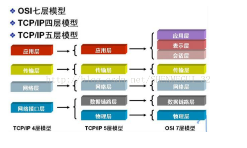
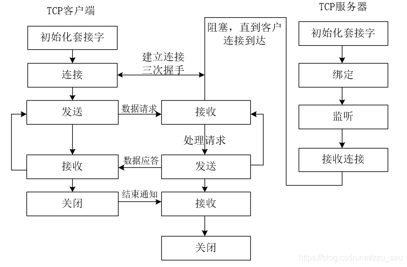

# 网络编程TCP与Socket的关系   

## 1 TCP和UDP的比较   

比较项|TCP|UDP  
-|-|-  
是否连接|面向连接|无连接  
传输是否可靠|可靠|不可靠  
流量控制|提供|不提供  
工作方式|全双工|可以是全双工  
应用场合|大量数据|少量数据  
速度|慢|快  

- **注意**：TCP是面向连接的，如果要通过TCP来通信的话，先要要建立连接    

- 分层网络结构：    

  

- 每层的TCP/IP协议   
    

- 与Socket的对应关系   
    

## 2 TCP和Socket的关系       
- TCP是面向连接的运输层协议。应用和曾许在使用TCP协议之前，必须首先建立TCP连接。在传输数据完毕之后，必须将已经建立好的TCP给释放。也就是说，应用进程之间的通信好像在“打电话”：通话之前首先要拨通号码建立连接，通话结束之后必须挂掉电话释放连接    
- 每一条TCP连接只能有两个端点，每一条TCP连接只能是点对点的。   
- TCP提供的是可靠交付的服务。通过TCP连接传送的数据，无差错，不丢失，不重复，按照顺序到达。   
- TCP提供全双工通信。   
	- TCP允许通信双方的应用进程在任何时候都能够发送数据。   
	- TCP连接的两端都设置了发送缓冲和接收缓冲区用来临时存放双向通信的数据。   
	- 在发送时候，应用程序把数据传送给TCP的缓存之后，就可以去干自己的事情了，TCP会在合适的时候把数据发送出去。     
	- 在接收的时候，TCP会把收到的数据放入缓存，上层应用进程在合适的时候会读取缓冲区的数据。   
- 面向字节流    

## 3 TCP编程模型   
- 套接字（Socket），具体的定义为：端口拼接到IP地址即构成套接字。因此套接字的表示方法是在点分十进制的IP地址后面写上端口号，中间使用冒号或者逗号隔开。例如，若IP地址是192.168.3.4 而端口号是50，那么得到的套接字就是（192.168.3.4:50）。  

    

- 具体步骤：  
	1. 首先是启动服务器，一段时间之后启动客户端，它与此服务器经过三次握手后建立连接。     
	2. 在此后的一段时间内，客户端向服务器发送一个请求；    
	3. 服务器处理这个请求，并为客户端发回一个响应。这个过程会一直持续下去，直到客户端为服务器发送一个文件结束符，并关闭客户端的连接，接着服务器也会关闭服务器端的连接，结束运行或者等待一个新的客户端加入。   
- 在QT中使用QTcpSocket类和QTcpServer类实现TCP协议的编程。   


## 4 代码实现   
### 4.1 客户端   
- 客户机实现步骤：   
	1. 创建套接字   
	2. 通过pbnConnect单击事件与服务器建立连接   
	3. 连接建立成功后，监听连接   
	4. 进行信息的通讯  
	5. 通讯结束了，可以关闭连接   

```C++
////////////// mainwindow.h
#include <QTcpSocket>   // 通信套接字
namespace Ui {
class MainWindow;
}
class MainWindow : public QMainWindow
{
    Q_OBJECT
public:
    explicit MainWindow(QWidget *parent = 0);
    ~MainWindow();
public slots:
    void createConnect();
    void tcpCommunicate();
private slots:
    void on_pbnSend_clicked();
    void on_pbnClose_clicked();
    void on_pbnConnect_clicked();
private:
    Ui::MainWindow *ui;
    QTcpSocket* m_ptcpSocket_correspond;// 定义通信套接字对象指针
};

////////////// mainwindow.cpp
/// 客户机端
/// 主动和服务器建立连接和通信

MainWindow::MainWindow(QWidget *parent) :
    QMainWindow(parent),
    ui(new Ui::MainWindow)  {
    ui->setupUi(this);

    // 1. 创建socket套接字
    m_ptcpSocket_correspond = new QTcpSocket(this);
    qDebug() << m_ptcpSocket_correspond;
    // 2. 第一次监听到时，建立连接
    connect(m_ptcpSocket_correspond, & QTcpSocket::connected, this, createConnect);
}

MainWindow::~MainWindow()
{
    delete ui;
}

// 2. 建立连接，监听IP和端口号
void MainWindow::createConnect()
{
    ui->textEditReceive->setText("成功和服务器建立连接！");
    connect(m_ptcpSocket_correspond, &QTcpSocket::readyRead, this, tcpCommunicate);
}
// 3. 读取接收缓冲区内容
void MainWindow::tcpCommunicate()
{
    // 3.1 利用套接字读取缓冲区内容
    // readLine()：此函数从设备中读取一行ASCII字符，停止依据：①`\n` ② 最大长度③ 数据结束
    // QByteArray array = m_ptcpSocket_correspond->readLine();
    // readAll();：此函数从设备中读取ASCII字符，停止依据：① 最大长度 ②数据结束
    QByteArray array = m_ptcpSocket_correspond->readAll();
    //使用settext可以将以前的进行覆盖，使用append会在后面添加
    // 3.2 读取内容显示界面
    ui->textEditReceive->append(array);
}
// 4. 发送信息
void MainWindow::on_pbnSend_clicked()
{
    // 4.1 若未建立连接，直接返回，客户机用isOpen
    if(!m_ptcpSocket_correspond->isOpen()){
        ui->textEditReceive->append("连接未建立，发送失败！");
        return;
    }
    // 4.2 获取编辑区内容
    QString str = ui->textEditWrite->toPlainText();
    // 4.3 给对方发送数据，使用套接字是tcpSocket
    m_ptcpSocket_correspond->write(str.toUtf8().data());
}
// 5. 关闭连接
void MainWindow::on_pbnClose_clicked()
{
    // 5.1 若连接未建立，则不用关闭， 客户机用isOpen
    if(!m_ptcpSocket_correspond->isOpen())  {
        ui->textEditReceive->append("连接未建立，不用关闭！");
        return;
    }
    // 5.2 主动和客户端断开连接，
    m_ptcpSocket_correspond->disconnectFromHost();
    // m_ptcpSocket_correspond->close();
    ui->textEditReceive->append("已关闭连接！");

}
// 6. 连接按钮的单击事件
void MainWindow::on_pbnConnect_clicked()
{
    // 6.1 获取服务器IP和端口
    QString ip = ui->lineEditIP->text();
    qint16 port = ui->lineEditPort->text().toInt();
    // 6.2 如果涉及到再次拨号的话，需要先将之前的先挂断(很重要)
    //     然后建立新连接
    if(m_ptcpSocket_correspond->isOpen()) {
        ui->textEditReceive->append("已经挂断之前的连接！");
        m_ptcpSocket_correspond->disconnectFromHost();
        // m_ptcpSocket_correspond->close();
    }

    //6.3 主动和服务器建立连接
    m_ptcpSocket_correspond->connectToHost(QHostAddress(ip),port);
}
```

### 4.2 服务器端    
- 服务器端实现步骤：   
	1. 建立服务器套接字对象，监听自己的IP和端口号   
	2. 当有新的连接时，取出服务器连接的套接字对象   
	3. 通过套接字对连接进行监听   
	4. 进行信息的通讯  
	5. 通讯结束了，可以关闭连接，或者连接关闭了界面提示   


```C++
/////////////   MainWindow.h
#include <QTcpServer>   // 监听套接字
#include <QTcpSocket>   // 通信套接字

namespace Ui {
class MainWindow;
}
class MainWindow : public QMainWindow
{
    Q_OBJECT
public:
    explicit MainWindow(QWidget *parent = 0);
    ~MainWindow();
public slots:
    void createConnect();
    void tcpCommunicate();
private slots:
    void on_pbnSend_clicked();
    void on_pbnClose_clicked();
    void ClientDisconnected();
private:
    Ui::MainWindow *ui;
    QTcpServer* m_ptcpServer_monitor;   // 定义监听套接字对象指针
    QTcpSocket* m_ptcpSocket_correspond;// 定义通信套接字对象指针
};
// MainWindow.cpp
/////
/// 服务器端
/// 用于接收客户端连接和通信

MainWindow::MainWindow(QWidget *parent) :
    QMainWindow(parent),
    ui(new Ui::MainWindow)
{
    ui->setupUi(this);

    m_ptcpSocket_correspond = NULL;

    m_ptcpServer_monitor = new QTcpServer(this);
    // 1. 设置监听的主机IP和端口号
    m_ptcpServer_monitor->listen(QHostAddress::Any, 6666);

    // 2. 主机接收到新连接:每次新连接可用时，都会发出此信号。
    connect(m_ptcpServer_monitor, &QTcpServer::newConnection, this, createConnect);
}

MainWindow::~MainWindow() {
    delete ui;
}
// 1. 创建连接
void MainWindow::createConnect() {
    // 1.1 取出连接建立后的套接字
    m_ptcpSocket_correspond = m_ptcpServer_monitor->nextPendingConnection();
    qDebug() << m_ptcpSocket_correspond;
    // 1.2 从套接字获取对方的IP和端口
    QString ip = m_ptcpSocket_correspond->peerAddress().toString();
    qint16 port = m_ptcpSocket_correspond->peerPort();
    QString temp = QString("[%1：%2]:成功连接").arg(ip).arg(port);
    ui->textEditReceive->setText(temp);
    // 1.3 通过套接字，进行监听新建立的连接
    connect(m_ptcpSocket_correspond, &QTcpSocket::readyRead, this, tcpCommunicate);
    // 1.4 若套接字断开连接，显示提示信息
    connect(m_ptcpSocket_correspond, &QTcpSocket::disconnected, this, ClientDisconnected);
}
// 2. 读取接收缓冲区内容
void MainWindow::tcpCommunicate() {
    // 2.1 从通讯套接字中取出内容
    QByteArray array = m_ptcpSocket_correspond->readAll();
    // 2.2 使用settext可以将以前的进行覆盖，使用append会在后面添加
    ui->textEditReceive->append(array);
}
// 3. 发送按钮的单击事件
void MainWindow::on_pbnSend_clicked() {
    // 3.1 若未建立连接，返回， 服务器用判空
    if(NULL == m_ptcpSocket_correspond)   {
        ui->textEditReceive->append("连接未建立，发送失败！");
        return;
    }
    // 3.2 获取编辑区内容
    QString str = ui->textEditWrite->toPlainText();
    // 3.3 给对方发送数据，使用套接字是tcpSocket
    m_ptcpSocket_correspond->write( str.toUtf8().data());
}
// 4. 关闭连接按钮单击事件
void MainWindow::on_pbnClose_clicked() {
    // 4.1 若未建立连接，返回
    if(NULL == m_ptcpSocket_correspond)   {
        ui->textEditReceive->append("连接未建立，不用关闭！");
        return;
    }
    //4.2 主动和客户端断开连接
    // 4.2.1 发送完未发送信息，暂时关闭，保留之间的端口信息
    m_ptcpSocket_correspond->disconnectFromHost();
    // 4.2.2 关闭，重置Ip和端口
    // m_ptcpSocket_correspond->close();
    m_ptcpSocket_correspond = NULL;
}
// 5. 若连接断开，界面提示
void MainWindow::ClientDisconnected()
{
    ui->textEditReceive->append("**连接已关闭**"  );
    m_ptcpSocket_correspond = NULL;
}
```


##  5 注意事项：   
1. 客户机端`m_ptcpSocket_correspond->isOpen()`来判断连接是否还在使用；服务器端若连接断开，直接将socket对象置空，因此用`NULL == m_ptcpSocket_correspond` 来判断连接是否还在使用      
2. `m_ptcpSocket_correspond->disconnectFromHost()`和  `m_ptcpSocket_correspond->close();`都可以关闭连接     
	- 在服务器端，两者只能用一个，执行任意一个的结果是，socket指针为空   
	- 在客户端，两者可以共存，但是效果不同，建议取其一即可   
3. 断开连接时，在使用socket时，切记服务器端和客户机端的内容已经发生变化，不能再次使用里面的IP和port信息   
4. 服务器端的socket套接字不用new，它来自于TCPServer，因此和客户机端的socket使用有区别    
	- 服务器端的套接字连接一旦断开，即可置空   
	- 客户机端的套接字，即使连接断开，也不能置空，否则产生内存泄露，而且若还要继续通信的话，需要继续new    


## 参考资料  
1. https://blog.csdn.net/bailang_zhizun/article/details/78327974   

2. https://blog.csdn.net/lvyuan30276/article/details/50458572   

3. https://www.cnblogs.com/suntp/p/6434644.html  

4. https://www.cnblogs.com/loveqian/p/10833815.html     

   