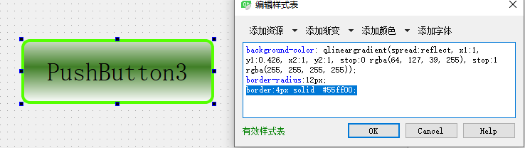

# 设置按钮颜色   

- 对于按钮的效果设置可以通过调色板，也可以是styleSheet，但是两者各有不同，分别控制不同的方面  


## 1 设计器实现   
### 2.1 字体颜色   
- button的字体颜色，在palette中button Text中修改即可   
-  也可以在styleSheet中，设置color : `color: rgb(255, 170, 127);`   

   

## 2.2 背景色   
- 设置按钮的背景色，可以在styleSheet中进行设置   

   

   

## 2.3 插入背景图   
- 设置按钮的背景图，可以在styleSheet中进行设置   

   

## 2.4 设置圆角效果   
- 设置按钮的圆角效果，可以在styleSheet中进行设置   
```C++
// styleSheet中添加如下：
border-radius:12px
```
   


## 2.5 设置粗边框   
```
border:4px solid  #55ff00;
```
   


## 2.4 不同的动作效果  
- 设置按钮的不同动作效果，可以在styleSheet中进行设置   
```C++
// styleSheet中添加如下：
/*按钮按下*/
QPushButton:pressed{
	border:1px solid  #55ff00;
	background-color: rgb(0, 85, 255);
}
/*按钮选中*/
QPushButton:checked{
	border:2px solid  #55fff0;
	background-color: rgb(255, 85, 255);
}
/*鼠标划过*/
QPushButton:hover{
	border:2px solid  #f5fff0;
}

```


## 2 用命令实现    

```C++
	QPalette pal = ui->pushButton_3->palette();
    // 1. 设置调色板颜色：红色
    pal.setColor(QPalette::Button,QColor(255,0,0));
    ui->pushButton_3->setPalette(pal);
    // 2. 此属性保存是否自动填充小部件背景。
    ui->pushButton_3->setAutoFillBackground(true);

    // 3.此属性保存按钮边框是否凸起。
    // 此属性的默认值为false。
    // 如果设置了此属性，除非按钮被按下，否则大多数样式不会绘制按钮背景。
    ui->pushButton_3->setFlat(true);
```

## 3 QSS参考CSS设置   
- 由于Qt的QSS是参考CSS设置的，所以大部分CSS设置都可以直接拿到QSS上用！  
- https://www.w3school.com.cn/cssref/pr_border-style.asp   


## 参考文献  
1. https://blog.csdn.net/yanjiang2008666/article/details/8471552?utm_medium=distribute.pc_relevant.none-task-blog-BlogCommendFromMachineLearnPai2-1.channel_param&depth_1-utm_source=distribute.pc_relevant.none-task-blog-BlogCommendFromMachineLearnPai2-1.channel_param   
2. https://blog.csdn.net/kanyun123/article/details/105306795/   
3. https://www.w3school.com.cn/cssref/pr_border-style.asp  
4. https://blog.csdn.net/naibozhuan3744/article/details/82226245  