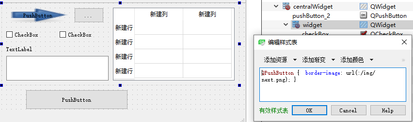

# qt界面设计-StyleSheet以及QSS语法规则   

## 1 简介  
### 1.1 关于 StyleSheet   
- [官方例子qt-5.8](https://doc.qt.io/archives/qt-5.8/stylesheet-examples.html)    
- Qt Creater中，对button或者window等部件设置背景、颜色、透明等样式时，需要用到style sheet，可以直接在代码里写，也可以在ui设计师里通过右键change style sheet的方法来设置，本人是使用的后面的方式。  
- 在StyleSheet中，写的代码是遵循QSS语法的，因此，下面介绍下QSS   
### 1.2 关于QSS语法   
- QSS是一种从CSS借鉴过来的机制，用来实现对控件外观的自定义。但是它比CSS功能要弱化一些，有一些属性和选择器，QSS并没有。   
- Qt中的各个控件可以使用QSS来实现界面的个性化定制、美化，使用起来也是特别方便的。  
- [QSS使用与基本语法](https://blog.csdn.net/u011832525/article/details/105907181?utm_medium=distribute.pc_relevant.none-task-blog-BlogCommendFromMachineLearnPai2-3.channel_param&depth_1-utm_source=distribute.pc_relevant.none-task-blog-BlogCommendFromMachineLearnPai2-3.channel_param )   
- [使用Qss设置QT程序界面的样式和皮肤](https://www.cnblogs.com/bclshuai/p/9809679.html)  
## 2 QSS基本语法  
- 定义：在CSS中，模式匹配规则决定哪些样式规则应用于文档树中的元素。这些模式称为[选择器](https://www.w3.org/TR/CSS2/selector.html#pattern-matching)，范围从简单的元素名称到丰富的上下文模式。   
- 如果某个元素的模式中的所有条件都为真，则选择器将匹配该元素。  
- 选择器中文档语言元素名称的大小写敏感度取决于文档语言。例如，在HTML中，元素名不区分大小写，但在XML中，它们区分大小写。    
- 通俗的说，就是确定，将这个样式作用与哪些对象   


## 3 语法规则-选择器     

选择器| 示例	|说明  
:-:|:-|:-
:one:通用选择器|`*` |匹配所有部件
:two:类型选择器|QPushButton|匹配QPushButton及其子类的实例
:three:属性选择器|QPushButton[ flat = "false" ]|匹配所有flat属性为false的对象
:four:类型选择器|.QPushButton|匹配QPushButton实例，不包含子类
:five:ID选择器| QPushButton#btnOk|匹配对象名为btnOk的实例
:six:子控件选择器|QDialog QPushButton|匹配QDialog上所有的QPushButton
:seven:子选择器|QDialog > QPushButton|匹配属于QDialog直接子类QPushButton实例
:eight:子控件设置|QComboBox::drop-dow{ }|   	 
:nine:伪选择器|QPushButton:hover { }	 |  


1. 通用选择器`*`  
- 匹配所有控件（QWidget）   
```css
* { border-image: url(:/img/next.png); }
```
   

2. 类型选择器   
- "类名" + 样式，作用与于本类及其子类：   
```css
QPushButton {  border-image: url(:/img/next.png); }
// 包括：QPushButton以及继承QPushButton的子类
```
   

3. 类选择器   
- "类名" + 样式，仅仅作用于本类：   
```css
. QPushButton {  border-image: url(:/img/next.png); }
// 仅包括：QPushButton
```
4. 属性选择器   
- "类名[属性=‘值’]"作为选择器，值一定是字符串。   
```css
QCheckBox[text='CheckBox111'] { background-color: red; }
// 仅包括：QCheckBox中text='CheckBox111'的控件
```
   

5. ID选择器  
- `#` + objectName” 作为选择器，只作用于此objectName对象；#前面可加类名，也可省略。  

```css
#label_2 { background-color: rgb(85, 255, 255); }
// #号后面没有空格
// 若有多个的话  
#label_1, #label_2 { background-color: rgb(85, 255, 255); }
```
   

6. 子控件选择器   
- "父控件类型 子控件类型"作为选择器，选择器之间用空格隔开；作用于父控件下所有指定类型直接和间接子控件。  

```css
QWidget QLabel { background-color: red; }
```
   

7. 子选择器   
- "父控件 > 子控件"作为选择器，作用于父控件下所有指定类型直接子控件。与包含选择器的区别是否作用于间接子控件。    

```CSS
QWidget > QTextEdit { background-color: red; }
```
   

8. 子控件设置   
- "类名::部件名"作为选择器，类由多个部件组成，通过它可以设置部件的外观。  

```CSS
QCheckBox::indicator:checked { image: url(:/img/new.png); }
QCheckBox::indicator:unchecked { image: url(:/img/next.png);}
```
   

9. 伪选择器   
- "选择器:状态"作为选择器，状态支持!操作符，表示取非。   

```CSS
QPushButton:pressed { color: red; }
QPushButton:!pressed { color: green; }
// 伪选择器还支持链式规则：
QCheckBox::indicator:checked { image: url(:/res/check.png); }
QCheckBox::indicator:unchecked { image: url(:/res/uncheck.png); }
```
   


## 4 加载qss文件   
- qss文件如下 ：

```CSS
// test.qss：
QMainWindow { 
	border-image: url(:/res/car.jpg); 
}
```

- 加载qss文件   

```CSS
void MainWindow::loadQssFile()
{
    QFile file(":/res/test.qss");
    if(file.open(QIODevice::ReadOnly | QIODevice::Text))
    {
        qApp->setStyleSheet(file.readAll());
        file.close();
    }
}
```


## 5 参考资料   
1. https://blog.csdn.net/lywzgzl/article/details/41488281   
2. https://blog.csdn.net/yansmile1/article/details/52936182   
3. https://blog.csdn.net/xuhongtao123459/article/details/5875614   
4. https://blog.csdn.net/qq_37631516/article/details/104911449  
5. https://blog.csdn.net/wzz953200463/article/details/102925629  