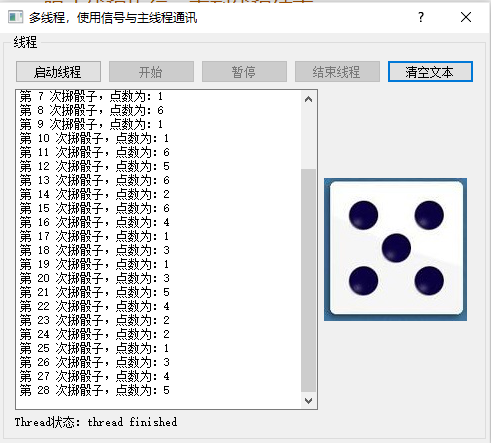

# qt掷骰子多线程实现   
- 一个应用程序一般有一个线程，一个线程内的操作是顺序执行的，如果有个比较耗时的操作可能会冻结界面，不能及时响应。    
- 多线程是创建一个线程来处理执行比较耗时间的操作，并与主线程做好同步和数据交互     
- qt为多线程提供了完整的支持，QThread是线程类，是实现多线程的操作的核心，一般从QThread继承定义自己的线程类。    
- 线程之间同步是其交互的主要问题，qt提供了QMutex、QMutexLocker等实现进程同步   
- qt还提供了Qt Concurrent模块，提供一些高级的API实现多线程编程，而无需使用QMutex等基础操作。    
- Qt Concurrent模块会自动根据处理器内核个数调整线程个数    
## 1 多线程的功能简介    
1. 一个QThread类的对象管理一个线程，一般是从QThread继承一个自定义的类，并重定义虚函数run()，在run()函数里面实现线程需要完成的任务。    
2. 将应用程序的线程称为主线程，额外创建的线程称为工作线程。一般是在主线程中创建工作线程，并调用start() 开始执行工作线程任务。    
3. start() 会在内部调用run()函数，进入工作事件循环，在run() 函数里面调用exit()或quit()可以结束线程的事件循环，或者在主线程里面调用terminate()强制结束线程    
4. QThread自身定义了started()和finished()两个信号，started()信号在线程开始执行之前发射，finished()信号在线程就要结束时发射。   

## 2 多线程实例-掷骰子  
- 情景描述：
	- 写一个掷骰子的程序，掷骰子的执行放在一个子线程   
	- 主线程可以调用掷骰子的子线程，而且可以接收子线程执行的中间结果   
	- 主线程可以修改，掷骰子子线程对象中的属性成员，从而完成控制子线程的执行结果   
### 2.1 先定义掷骰子的子线程：qdicethread    
```C++
/****************** qdicethread.h ******************/
// 1. 添加线程函数库
#include  <QThread>
// 公有继承QThread，成为QThread的一个子类
class QDiceThread : public QThread {
    Q_OBJECT
public:
    QDiceThread();
    // 定义掷骰子的成员函数
    void diceBegin();    // 掷一次骰子
    void dicePause();    // 暂停
    void stopThread();   // 结束线程
protected:
    // 2. 重写线程的中 run 函数
    void run() Q_DECL_OVERRIDE;  // 线程任务
signals:
    // 3. 定义信号，发射：掷骰子的次数和最新的掷骰子中间结果发出去
    void newValue(int seq,int diceValue);
private:
    int m_seq;      // 掷骰子次数序号
    int m_diceValue;// 骰子点数
    bool m_Paused;   // 掷一次骰子
    bool  m_stop;     // 停止线程
};

/****************** qdicethread.cpp ******************/
#include "qdicethread.h"
#include <QTime>
QDiceThread::QDiceThread() {
// 构造函数中，初始化属性成员
    m_seq = 0; //掷骰子次数序号
    m_Paused = true; //掷一次骰子
    m_stop = false; //停止线程
}
void QDiceThread::diceBegin() {
    m_Paused = false;	// 开始掷骰子
}
void QDiceThread::dicePause() {
    m_Paused=true;	    // 暂停掷骰子
}
void QDiceThread::stopThread() {
    m_stop=true;		// 停止线程
}

// 1. 重写run函数，线程中执行的内容就是，run函数中的内容
void QDiceThread::run() {
    // 线程任务
    m_stop = false; //启动线程时令m_stop=false
    m_seq = 0; //掷骰子次数
    qsrand(QTime::currentTime().msec());//随机数初始化，qsrand是线程安全的
    // 若不停止掷骰子
    while(!m_stop)  {//循环主体    
        // 若不暂停掷骰子
        if (!m_Paused)  {
            // 生成1~6的随机数
            m_diceValue = qrand(); //获取随机数
            m_diceValue = (m_diceValue % 6)+1;
            // 掷骰子的次数增一
            m_seq++;
            // 将掷骰子的次数和最新的掷骰子结果发出去
            emit newValue(m_seq,m_diceValue);  //发射信号
        }
        msleep(500); //线程休眠500ms
    }
//  在  m_stop==true时结束线程任务
    quit();//相当于  exit(0),退出线程的事件循环
}
```

### 2.2 再定义掷骰子的主线程：Dialog   
```C++
/****************** dialog.h ******************/
// 1. 声明定义的线程类头文件
#include "qdicethread.h"
namespace Ui {
class Dialog;
}
class Dialog : public QDialog
{
    Q_OBJECT
public:
    explicit Dialog(QWidget *parent = 0);
    ~Dialog();
protected:
    // 2. 重写关闭窗口事件：关闭窗口即结束进程
    void closeEvent(QCloseEvent *event);
private:
    // 3. 声明子线程对象，用于运行子线程
    QDiceThread threadA;

private slots:
    // 4. 定义槽函数：接收启动线程信号
    void onthreadA_started();
    // 5. 定义槽函数：接收结束线程信号
    void onthreadA_finished();
    // 6. 定义槽函数：接收线程执行的中间结果
    void onthreadA_newValue(int seq, int diceValue);
    void on_btnClear_clicked();
    
    // 8. 定义槽函数：通过子线程的成员函数修改子线程的属性成员m_Paused
    void on_btnDiceEnd_clicked();
    // 9. 定义槽函数：通过子线程的成员函数修改子线程的属性成员m_Paused
    void on_btnDiceBegin_clicked();

    // 10. 定义槽函数：通过子线程的成员函数修改子线程的属性成员m_stop
    void on_btnStopThread_clicked();
    // 11. 定义槽函数：通过调用继承的start()方法来启动子线程
    void on_btnStartThread_clicked();

private:
    Ui::Dialog *ui;
};
/****************** dialog.cpp******************/
// 1. 定义窗口关闭，线程也跟着关闭
void Dialog::closeEvent(QCloseEvent *event)
{   // 窗口关闭事件，必须结束线程
    // 1.1 如果线程还在启动
    if (threadA.isRunning())    {
        // 1.2 结束线程
        threadA.stopThread();
        // 1.3 阻止线程执行，直到线程结束
        threadA.wait();
    }
    // 1.4 表示子类事件中需要它，
    //     否则可能会在子类部件中清除它
    event->accept();
}

Dialog::Dialog(QWidget *parent) : QDialog(parent),  ui(new Ui::Dialog)
{//构造函数
    ui->setupUi(this);
    // 2. 谁调用这个线程，在谁的构造函数中，定义槽函数，并接收子线程的执行中间结果
    connect(&threadA,SIGNAL(started()),this,SLOT(onthreadA_started()));     // 接收开始信号
    connect(&threadA,SIGNAL(finished()),this,SLOT(onthreadA_finished()));   // 接收结束信号
    connect(&threadA,SIGNAL(newValue(int,int)),this,SLOT(onthreadA_newValue(int,int))); // 接收中间结果
}

Dialog::~Dialog()
{
    delete ui;
}

void Dialog::onthreadA_started()  {//线程的started()信号的响应槽函数
    ui->LabA->setText("Thread状态：thread started");
}

void Dialog::onthreadA_finished()  {//线程的 finished()信号的响应槽函数
    ui->LabA->setText("Thread状态：thread finished");
}

// 6. 定义槽函数：接收线程执行的中间结果
void Dialog::onthreadA_newValue(int seq,int diceValue)  {//QDiceThread的newValue()信号的响应槽函数，显示骰子次数和点数
    // 根据点数和次数实时刷新字符串
    QString  str = QString::asprintf("第 %d 次掷骰子，点数为：%d",seq,diceValue);
    ui->plainTextEdit->appendPlainText(str);

    QPixmap pic; //图片显示
    // 根据点数和次数实时刷新图片
    QString filename = QString::asprintf(":/dice/images/d%d.jpg",diceValue);
    pic.load(filename);
    ui->LabPic->setPixmap(pic);
}

void Dialog::on_btnClear_clicked() { //清空文本 按钮
    ui->plainTextEdit->clear();
}

// 8. 定义槽函数：通过子线程的成员函数修改子线程的属性成员m_Paused
void Dialog::on_btnDiceEnd_clicked()  {
    //3. 可以对线程的数据实时修改，暂停 掷骰子按钮
    threadA.dicePause();
    ui->btnDiceBegin->setEnabled(true);
    ui->btnDiceEnd->setEnabled(false);
}

// 9. 定义槽函数：通过子线程的成员函数修改子线程的属性成员m_Paused
void Dialog::on_btnDiceBegin_clicked()  {
    //开始 掷骰子按钮
    threadA.diceBegin();
    ui->btnDiceBegin->setEnabled(false);
    ui->btnDiceEnd->setEnabled(true);
}

// 10. 定义槽函数：通过子线程的成员函数修改子线程的属性成员m_stop
void Dialog::on_btnStopThread_clicked()  {//结束线程 按钮
    threadA.stopThread();   // 结束线程的run()函数执行
    threadA.wait();         // 阻止线程执行，直到线程结束
    ui->btnStartThread->setEnabled(true);
    ui->btnStopThread->setEnabled(false);
    ui->btnDiceBegin->setEnabled(false);
    ui->btnDiceEnd->setEnabled(false);
}

// 11. 定义槽函数：通过调用继承的start()方法来启动子线程
void Dialog::on_btnStartThread_clicked()  {//启动线程 按钮
    threadA.start();
    ui->btnStartThread->setEnabled(false);
    ui->btnStopThread->setEnabled(true);
    ui->btnDiceBegin->setEnabled(true);
    ui->btnDiceEnd->setEnabled(false);
}

```

## 3 运行效果   

   