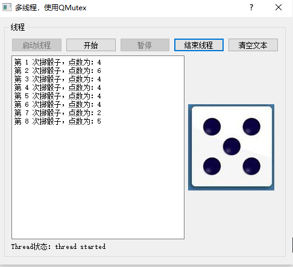

# 线程同步-QMutex   
- 在多线程应用程序中，由于多个线程的存在，线程之间可能需要访问同一个变量，或一个线程需要等待另外一个线程完成某个操作后才产生相应的动作   
- 例如：上一节中子线程产生随机的骰子点数，主线程读取骰子点数并显示，主线程需要等待子线程产生一个新的骰子数后**通过信号**通知主线程，读取新的数据。   
- **若不使用信号槽机制，如何进行线程间的通信？**  
## 1 问题思考   
- 若不同信号槽的方式实现子线程和主线程通信，那么需要在子线程中定义公有的成员函数，方便主线程进行调用   
- 若没有信号和槽的关联，主线程只能采用不断查询的方法主动查询是否有新数据，并读取它  
- 但是，当主线程通过调用子线程公有成员函数读取新数据时，子线程可能在修改这个数据的值    
- 而子线程在修改这个数据值时，是不希望被主线程调用子线程的成员函数所中断，如果中断，可能得到错误的值    
- 在这种情况下，子线程中修改数据的代码段需要保护起来，在执行过程中，不被其他线程打断，以保证计算结果的完整性   
- 在Qt中有多个类可以实现线程同步的功能，包括：QMutex,  QMutexLocker,  QReadWriteLock,  QReadLock,  QWriteLock,  QWaitCondition和QSemaphore。    

## 2 互斥量的线程同步   
- QMutex和QMutexLocker是基于互斥量的线程同步类，QMutex定义的实例是一个互斥量，主要包括三个函数：   
	- lock()：锁定互斥量，如果另外一个线程锁定了这个互斥量，它将阻塞执行直到其他线程解锁这个互斥量    
	- unlock()：解锁一个互斥量，需要和lock()配对使用    
	- tryLock()：试图锁定一个互斥量，如果成功锁定就返回true；如果其他线程已经锁定了这个互斥量，就返回false，但是不阻塞程序执行   

### 2.1 定义子线程   
```c++
/****************** qdicethread.h ******************/
#include <QObject>
#include <QThread>
#include <QMutex>

class QDiceThread : public QThread  {
    Q_OBJECT
public:
    QDiceThread();
    // 定义掷骰子的成员函数
    void diceBegin();   //掷一次骰子
    void diceEnd();     // 暂停
    void stopThread();  // 结束线程
    // 1. 主线程用来读数据的成员函数(新增)
    bool readValue(int *seq, int *diceValue); //用于主线程读取数据的函数
protected:
    // 2. 重写线程中的run函数
    void run() Q_DECL_OVERRIDE;
// signals: 因为不用信号槽实现子线程和主线程数据通信，所以不用定义信号
//    // 定义信号，发射：掷骰子的次数和最新的掷骰子中间结果发出去 (去掉)
//    void newValue(int seq,int diceValue)*/;

private:
    // 3. 定义互斥信号量，用于进程同步
    QMutex mutex; //互斥量
    int m_seq;
    int m_diceValue;
    bool m_paused;
    bool m_stop; //停止线程
}; 
/****************** qdicethread.cpp ******************/
#include <QTime>

QDiceThread::QDiceThread()
{
    m_seq = 0;
    m_paused = true;
    m_stop = false;
}

void QDiceThread::diceBegin()
{
//    mutex.lock();
    m_paused = false;
//    mutex.unlock();
}

void QDiceThread::diceEnd()
{   // 原则上，对于两个或两个以上线程可能会同时读或写的变量应该使用互斥量进行保护
    // 但是，若只有一条赋值语句的话，
//    mutex.lock();
    m_paused=true;   // 只有一行语句，是原子操作，不用进行保护和锁定
//    mutex.unlock();
}

void QDiceThread::stopThread()
{
//    mutex.lock();
    m_stop=true;
//    mutex.unlock();
}

// 1. 主线程通过调用该函数，获取子线程的成员变量的值
bool QDiceThread::readValue(int *seq, int *diceValue)
{
    // 试图锁定一个互斥量，若锁定成功返回true；
    // 若有其他线程已经锁定了这个互斥量，返回false
    if (mutex.tryLock()) {
        // 锁定成功，进if语句
        *seq = m_seq;
        *diceValue = m_diceValue;
        mutex.unlock();  // 读取值后解锁
        return true;
    }
    else
        return false;
}

void QDiceThread::run()
{
    m_stop=false;//启动线程时令m_stop=false
    m_seq=0;
    qsrand(QTime::currentTime().msec());//随机数初始化，qsrand是线程安全的

    while(!m_stop)//循环主体
    {
        if (!m_paused)  {
            // 通过mutex.lock();和mutex.unlock();对属性成员进行保护
            mutex.lock();
            m_diceValue=qrand(); //获取随机数
            m_diceValue=(m_diceValue % 6)+1;
            m_seq++;
            mutex.unlock();
        }
        msleep(500); //线程休眠100ms
    }
}
```


### 2.2 再定义掷骰子的主线程   
```C++
/****************** dialog.h ******************/
class Dialog : public QDialog
{
    Q_OBJECT
public:
    explicit Dialog(QWidget *parent = 0);
    ~Dialog();
protected:
    void closeEvent(QCloseEvent *event);

private slots:
    // 1. 定义槽函数：接收启动线程信号
    void onthreadA_started();
    // 2. 定义槽函数：接收结束线程信号
    void onthreadA_finished();
    // 3. 定时处理读取子线程数据 (新增)
    void onTimeOut(); 
    
    void on_btnClear_clicked();
    // 4. 定义槽函数：通过子线程的成员函数修改子线程的属性成员m_Paused
    void on_btnDiceEnd_clicked();
    // 5. 定义槽函数：通过子线程的成员函数修改子线程的属性成员m_Paused
    void on_btnDiceBegin_clicked();
    // 6. 定义槽函数：通过子线程的成员函数修改子线程的属性成员m_stop
    void on_btnStopThread_clicked();
    // 7. 定义槽函数：通过调用继承的start()方法来启动子线程
    void on_btnStartThread_clicked();
private:
    Ui::Dialog *ui;
    // 8. 定义属性成员用来存储子线程获取的数据
    int mSeq,mDiceValue;
    // 9. 声明子线程对象，用于运行子线程
    QDiceThread threadA;
    // 10. 声明定时器对象，用于定时
    QTimer mTimer;//定时器
};
/****************** dialog.cpp******************/
void Dialog::closeEvent(QCloseEvent *event)
{//窗口关闭时
    if (threadA.isRunning())
    {
        threadA.stopThread();
        threadA.wait();
    }
    event->accept();
}

Dialog::Dialog(QWidget *parent) : QDialog(parent), ui(new Ui::Dialog)
{//构造函数
    ui->setupUi(this);

    // 1. 接收子线程开始信号
    connect(&threadA,SIGNAL(started()),this,SLOT(onthreadA_started()));
    // 2. 接收子线程结束信号
    connect(&threadA,SIGNAL(finished()),this,SLOT(onthreadA_finished()));
    // 3. 定时读取子线程中的数据
    connect(&mTimer,SIGNAL(timeout()),this,SLOT(onTimeOut()));
}

Dialog::~Dialog()
{
    delete ui;
}

void Dialog::onthreadA_started()
{
    ui->LabA->setText("Thread状态：thread started");
}

void Dialog::onthreadA_finished()
{
    ui->LabA->setText("Thread状态：thread finished");
}
// 4. 定时读取子线程的数据
void Dialog::onTimeOut()
{ //定时器到时处理槽函数
    int tmpSeq = 0,tmpValue = 0;    // 用来记录上一次的次数和点数 
    bool valid = threadA.readValue(&tmpSeq, &tmpValue); //读取数值
    if (valid && (tmpSeq != mSeq)) //获取成功，并且是新数据(次数不同)
    {
        mSeq = tmpSeq;
        mDiceValue = tmpValue;
        QString  str=QString::asprintf("第 %d 次掷骰子，点数为：%d",mSeq,mDiceValue);
        ui->plainTextEdit->appendPlainText(str);
        QPixmap pic;
        QString filename=QString::asprintf(":/dice/images/d%d.jpg",mDiceValue);
        pic.load(filename);
        ui->LabPic->setPixmap(pic);
    }
}
void Dialog::on_btnClear_clicked()
{//清空文本
    ui->plainTextEdit->clear();
}
void Dialog::on_btnDiceEnd_clicked()
{//暂停掷骰子
    threadA.diceEnd(); //
   	 // 5. 定时器暂停
    mTimer.stop();

    ui->btnDiceBegin->setEnabled(true);
    ui->btnDiceEnd->setEnabled(false);
}

void Dialog::on_btnDiceBegin_clicked()
{//开始掷骰子
    threadA.diceBegin();
    // 定时器每隔100毫秒，发一个timeout()信号
    mTimer.start(100); 
    
    ui->btnDiceBegin->setEnabled(false);
    ui->btnDiceEnd->setEnabled(true);
}

void Dialog::on_btnStopThread_clicked()
{//结束线程
    threadA.stopThread();//结束线程的run()函数执行
    threadA.wait();//

    ui->btnStartThread->setEnabled(true);
    ui->btnStopThread->setEnabled(false);

    ui->btnDiceBegin->setEnabled(false);
    ui->btnDiceEnd->setEnabled(false);
}
void Dialog::on_btnStartThread_clicked()
{//启动线程
    mSeq = 0;
    threadA.start();

    ui->btnStartThread->setEnabled(false);
    ui->btnStopThread->setEnabled(true);

    ui->btnDiceBegin->setEnabled(true);
    ui->btnDiceEnd->setEnabled(false);
}

```

## 3 运行效果   

    


