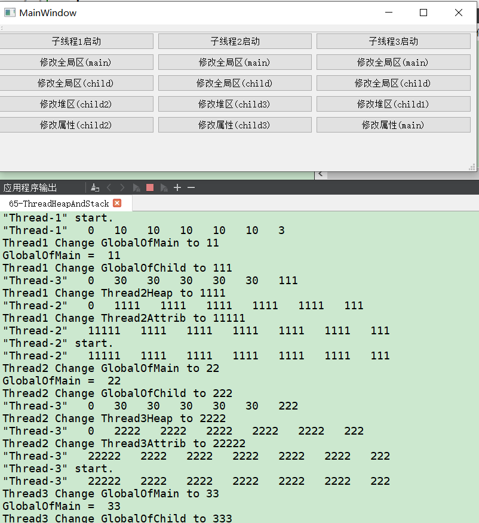

# qt中线程的堆栈及其共用问题    

## 1 问题描述    
- 线程之间共享的区域有哪些 ？
	- 线程占有的都是不共享的，其中包括：栈、寄存器、状态、程序计数器  
	- 线程间共享的有：堆，全局变量，静态变量；  
	- 进程占有的资源有：地址空间，全局变量，打开的文件，子进程，信号量、账户信息。  

## 2 示例演示   
```c++
// mainwindow.h
class MainWindow : public QMainWindow
{
    Q_OBJECT
public:
    explicit MainWindow(QWidget *parent = 0);
    ~MainWindow();
private slots:
    void on_pushButton_1_clicked();
    void on_pushButton_2_clicked();
    void on_pushButton_3_clicked();
    void on_pushButton_4_clicked();
    void on_pushButton_5_clicked();
    void on_pushButton_6_clicked();
    void on_pushButton_7_clicked();
    void on_pushButton_8_clicked();
    void on_pushButton_9_clicked();
    void on_pushButton_10_clicked();
    void on_pushButton_11_clicked();
    void on_pushButton_12_clicked();
    void on_pushButton_13_clicked();
    void on_pushButton_14_clicked();
    void on_pushButton_15_clicked();
private:
    Ui::MainWindow *ui;
    ChildThread m_childOne;
    ChildThread m_childTwo;
    ChildThread m_childThree;
    int *m_mainHeap;
};

// mainwindow.cpp
int GlobalOfMain;
extern int GlobalOfChild;   // 外部引用，一定要包含所引用的头文件

MainWindow::MainWindow(QWidget *parent) :
    QMainWindow(parent),
    ui(new Ui::MainWindow)
{
    ui->setupUi(this);
    m_childOne.setThread("Thread-1", 0, 1, 1);
    m_childTwo.setThread("Thread-2", 0, 2, 2);
    m_childThree.setThread("Thread-3", 0, 3, 3);
    m_mainHeap = new int[5];
    for(int i = 0; i < 5 ; ++i)
        m_mainHeap[i] = 0;
}
MainWindow::~MainWindow() {
    delete ui;
}

void MainWindow::on_pushButton_1_clicked()  {
    m_childOne.threadStart();
}
void MainWindow::on_pushButton_2_clicked()  {
    m_childTwo.threadStart();
}
void MainWindow::on_pushButton_3_clicked()  {
    m_childThree.threadStart();
}
void MainWindow::on_pushButton_4_clicked()
{
    qDebug() << "Thread1 Change GlobalOfMain to 11" ;
    m_childOne.ChangeMainGlobal(11);
    qDebug() << "GlobalOfMain = " << GlobalOfMain;
}
void MainWindow::on_pushButton_5_clicked()
{
    qDebug() << "Thread2 Change GlobalOfMain to 22" ;
    m_childTwo.ChangeMainGlobal(22);
    qDebug() << "GlobalOfMain = " << GlobalOfMain;
}
void MainWindow::on_pushButton_6_clicked()
{
    qDebug() << "Thread3 Change GlobalOfMain to 33" ;
    m_childThree.ChangeMainGlobal(33);
    qDebug() << "GlobalOfMain = " << GlobalOfMain;
}
void MainWindow::on_pushButton_7_clicked()
{
    qDebug() << "Thread1 Change GlobalOfChild to 111" ;
    GlobalOfChild = 111;
    m_childThree.display();
}
void MainWindow::on_pushButton_8_clicked()
{
    qDebug() << "Thread2 Change GlobalOfChild to 222" ;
    GlobalOfChild = 222;
    m_childThree.display();
}
void MainWindow::on_pushButton_9_clicked()
{
    qDebug() << "Thread3 Change GlobalOfChild to 333" ;
    GlobalOfChild = 333;
    m_childThree.display();
}
void MainWindow::on_pushButton_10_clicked()
{
    qDebug() << "Thread1 Change Thread2Heap to 1111" ;
    m_childOne.ChangeThreadHeap(&m_childTwo, 1111);
    m_childTwo.display();
}
void MainWindow::on_pushButton_11_clicked()
{
    qDebug() << "Thread2 Change Thread3Heap to 2222" ;
    m_childTwo.ChangeThreadHeap(&m_childThree, 2222);
    m_childThree.display();
}
void MainWindow::on_pushButton_12_clicked()
{
    qDebug() << "Thread3 Change Thread3Heap to 3333" ;
    m_childThree.ChangeThreadHeap(&m_childOne, 3333);
    m_childOne.display();
}
void MainWindow::on_pushButton_13_clicked()
{
    qDebug() << "Thread1 Change Thread2Attrib to 11111" ;
    m_childOne.ChangeThreadAttrib(&m_childTwo, 11111);
    m_childTwo.display();
}
void MainWindow::on_pushButton_14_clicked()
{
    qDebug() << "Thread2 Change Thread3Attrib to 22222" ;
    m_childOne.ChangeThreadAttrib(&m_childThree, 22222);
    m_childThree.display();
}
void MainWindow::on_pushButton_15_clicked()
{
    qDebug() << "Thread3 Change Thread1Attrib to 11111" ;
    m_childThree.ChangeThreadAttrib(&m_childOne, 33333);
    m_childOne.display();
}
// ChildThread.h
class ChildThread : public QThread
{
public:
    ChildThread();

    void threadStart();
    void threadStop();
    void setThread(QString name, int data,int numHeap,int numGlobal);
    void display();
    int m_childAttribData;  // 1. 普通属性成员(方便演示设置公有)
    int *m_childHeap;       // 2. 堆区(方便演示设置公有)

    void ChangeThreadAttrib(ChildThread *p, int n);
    void ChangeThreadHeap(ChildThread *p, int arr);
    void ChangeThreadGlobal( int g);
    void ChangeMainGlobal( int g);
protected:
    void run();

private:
    QString m_name;

};
// ChildThread.h
int GlobalOfChild;          // 1. 全局区
extern int GlobalOfMain;

ChildThread::ChildThread()
{
    m_childAttribData = 0;
}

void ChildThread::threadStart()
{
    start();
    qDebug() << m_name << "start.";
}

void ChildThread::threadStop()
{
    qDebug() << m_name << "stop.";
    terminate();
    wait();
}

void ChildThread::setThread(QString name, int data,int numHeap,int numGlobal)
{
    m_name = name;
    m_childAttribData = data;
    m_childHeap = new int[5];
    for(int i = 0; i < 5 ;++i)
        m_childHeap[i] = numHeap * 10;

    GlobalOfChild = numGlobal;

}

void ChildThread::display()
{

    qDebug() << m_name << " " <<  m_childAttribData << " "
             << m_childHeap[0]  << " " << m_childHeap[1]  << " "
             << m_childHeap[2]  << " " << m_childHeap[3]  << " "
             << m_childHeap[4]   << " "<< GlobalOfChild ;

}

void ChildThread::ChangeThreadAttrib(ChildThread *p, int num)
{
    p->m_childAttribData = num;
}

void ChildThread::ChangeThreadGlobal(int g)
{
    GlobalOfChild = g;
}

void ChildThread::ChangeMainGlobal(int g)
{
    GlobalOfMain = g;
}
void ChildThread::ChangeThreadHeap(ChildThread *p, int a)
{
    for(int i = 0; i < 5; ++i)
        p->m_childHeap[i] = a;
}

void ChildThread::run()
{
    display();
}
```
## 3 输出效果   
- 从上到下，从左到右依次点击输出效果    
    


## 4 注意事项  
1. 子线程的堆区和全局区可以相互修改，但是栈区肯定不行，所以没进行测试     
2. 可以实现进程间的相互通信   

## 5 参考资料   
1. https://blog.csdn.net/qq_38410730/article/details/80783902    
2. https://www.cnblogs.com/senior-engineer/p/10963119.html   

   
