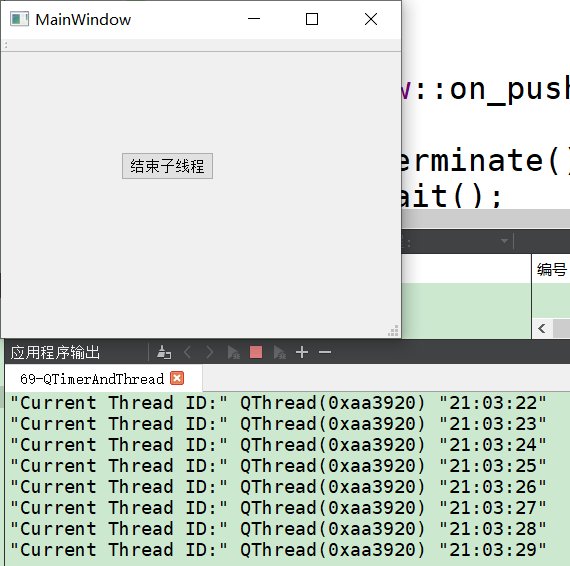

# qt中的Qtimer和多线程   
## 1 问题描述   
- qt编译出现： Timers cannot be stopped from another thread     
## 2 QTimer(定时器)介绍  
- QTimer类提供重复计时器和单次计时器。   
- 要使用它，请创建一个QTimer，将其timeout()信号连接到适当的插槽，然后调用start()。从那时起，它将以固定的间隔发出timeout()信号。   
- 在多线程应用程序中，可以在任何具有事件循环的线程中使用QTimer。     
- 要从非GUI线程启动事件循环，请使用QThread:：exec()。       
- Qt使用计时器的线程关联性来确定哪个线程将发出timeout()信号。**因此，必须在其线程中启动和停止计时器；不可能从另一个线程启动计时器。**   
- 启动计时器后，定时重复调用processOneThing。它应该以这样的方式编写：它总是快速返回（通常在处理一个数据项之后），这样Qt就可以向用户界面传递事件，并在完成所有工作后立即停止计时器。    
- 这是在GUI应用程序中实现繁重工作的传统方法，但是随着多线程处理在越来越多的平台上变得可用，我们**期望零毫秒的QTimer对象将逐渐被qthread所取代。**   

## 3 应用实例   
### 3.1 方法1：将QTimer在run函数中创建    
```C++
// CThread.h
#include <QObject>
#include <QThread>
#include <QTimer>
#include <QString>
// 1. 带有信号槽的子线程，替换 QObject 为 QThread
class CThread : public QThread {
    Q_OBJECT
public:
    explicit CThread(QObject *parent = 0);
signals:

public slots:
    void display();
protected:
    void run();
private:
    QTimer *m_pTimer;
};
// CThread.cpp
#include <QDebug>
#include <QTime>
CThread::CThread(QObject *parent) : QThread(parent) // 1. 带有信号槽的子线程，替换QObject
{
    // m_pTimer = new QTimer();   // 2.  不可放在构造函数中创建
}
void CThread::display()
{
    qDebug() << QString::fromLocal8Bit("Current Thread ID:") << QThread::currentThread() << QTime::currentTime().toString();
}
void CThread::run()
{
    m_pTimer = new QTimer();   // 3. 在子线程中创建
    connect(m_pTimer, SIGNAL(timeout()), this, SLOT(display()));
    m_pTimer->start(1000);
    this->exec();   // 4. 不可省略, 否则线程会立即结束，并发出finished()信号。
}
// MainWindow.h
class MainWindow : public QMainWindow
{
    Q_OBJECT
public:
    explicit MainWindow(QWidget *parent = 0);
    ~MainWindow();
private slots:
    void on_pushButton_clicked();
private:
    Ui::MainWindow *ui;
    CThread m_thread;
};
// MainWindow.cpp
MainWindow::MainWindow(QWidget *parent) :
    QMainWindow(parent),
    ui(new Ui::MainWindow)
{
    ui->setupUi(this);

    m_thread.start();   // --error
    // QObject::startTimer: Timers cannot be started from another thread
    // 刚开始只有主线程一个，CThread的实例是在主线程中创建的，定时器在CThread的构造函数中，所以也是在主线程中创建的。
    // 当调用CThread的start()方法时，这时有两个线程。定时器的start()方法是在另一个线程中，也就是CThread中调用的。
    // 创建和调用并不是在同一线程中，所以出现了错误。


}
MainWindow::~MainWindow()  {
    delete ui;
}
void MainWindow::on_pushButton_clicked()
{
    m_thread.terminate();
    m_thread.wait();
}
```

    

### 3.2 方法2：将QTimer实例在主线程，通过信号启动定时器    
- 借助moveToThread()方法       


## 4 注意事项   
- 不能跨线程启动定时器和停止定时器   
- 不能跨线程启动一个定时器关联的对象,但在另一个线程释放(析构)此和定时器关联的对象(相当于1>的情况不能在其他线程停止定时器).     
- 也就是定时器相关的逻辑和对象只能用在一个线程中，因为QT的定时器有内部的数据结构来关联定时器相关逻辑。    
- 否则:启动定时器的线程不能删除定时器,而定时器关联的对象已经不存在,那么下次定时器事件来时会崩溃。  


## 5 参考资料  
1. https://blog.csdn.net/xqhrs232/article/details/80616026    
2. http://www.cppblog.com/gaimor/archive/2012/03/25/168832.html  
3. https://www.cnblogs.com/hellovenus/p/qt_thread_timer.html  
4. https://blog.csdn.net/hai200501019/article/details/9748173?utm_source=tuicool&utm_medium=referral   


