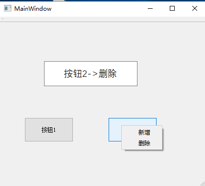

# 按钮的右击菜单   
## 1 操作步骤    
### 1.1 创建部分  
1. 创建菜单  
2. 创建条目   
3. 将条目放入菜单  
4. **初始化ContextMenuPolicy属性为Qt::CustomContextMenu**   
	- 他的属性保存小部件如何显示上下文菜单。    
	- 此属性的默认值是Qt::DefaultContextMenu，这意味着调用了contextMenuEvent()处理程序。    
	- 其他值包括Qt::NoContextMenu、Qt::PreventContextMenu、Qt::ActionsContextMenu和Qt::CustomContextMenu。    
	- 使用Qt::CustomContextMenu，将发出信号customContextMenuRequested()。
### 1.2 实现部分   
1. 定义每个条目对应的触发槽函数   
2. 连接信号槽   
3. 定义按钮的`customContextMenuRequested`触发事件   
## 2 具体实现   
```C++
void MainWindow::mainWindowInit()
{
    // 1.1 创建菜单   -- 第一个按钮
    m_pMenu_click_1 = new QMenu(ui->pushButton_1);  //这是右击弹出的菜单
    // 1.2  创建菜单选项
    m_paction_add_11 = new QAction("新增",this);
    m_paction_del_11 = new QAction("删除",this);
    // 1.3  给菜单添加菜单项
    m_pMenu_click_1->addAction(m_paction_add_11);
    m_pMenu_click_1->addAction(m_paction_del_11);

    // 2.1 创建菜单   -- 第二个按钮
    m_pMenu_click_2 = new QMenu(ui->pushButton_2);  //这是右击弹出的菜单
    // 2.2  创建菜单选项
    m_paction_add_21 = new QAction("新增",this);
    m_paction_del_21 = new QAction("删除",this);
    // 2.3  给菜单添加菜单项
    m_pMenu_click_2->addAction(m_paction_add_21);
    m_pMenu_click_2->addAction(m_paction_del_21);

    // 3. 初始化ContextMenuPolicy属性
    // 3.1 Mainwindow构造函数时初始化QpushButton的属性ContextMenuPolicy
    ui->pushButton_1->setContextMenuPolicy(Qt::CustomContextMenu);
    // 3.2 Mainwindow构造函数时初始化QpushButton的属性ContextMenuPolicy
    ui->pushButton_2->setContextMenuPolicy(Qt::CustomContextMenu);

}
void MainWindow::mainWindowConnect(){

    // 连接信号与槽
    // triggered:当用户激活某个操作时，会发出此信号；
    // 例如，当用户单击菜单选项、工具栏按钮或按某个操作的快捷组合键时，或在调用trigger（）时发出。
    connect(m_paction_add_11, &QAction::triggered, this, &choicePactionAdd_1);
    connect(m_paction_del_11, &QAction::triggered, this, &choicePactionDel_1);
    connect(m_paction_add_21, &QAction::triggered, this, &choicePactionAdd_2);
    connect(m_paction_del_21, &QAction::triggered, this, &choicePactionDel_2);

}

void MainWindow::choicePactionAdd_1() {
    ui->lineEdit->setText("按钮1->添加");
}

void MainWindow::choicePactionAdd_2() {
    ui->lineEdit->setText("按钮2->添加");
}

void MainWindow::choicePactionDel_1() {
    ui->lineEdit->setText("按钮1->删除");
}

void MainWindow::choicePactionDel_2()  {
    ui->lineEdit->setText("按钮2->删除");
}

void MainWindow::on_pushButton_1_customContextMenuRequested(const QPoint &pos)
{
    // pos = QCursor::pos();
    // 在当前光标位置出现
    m_pMenu_click_1->exec(QCursor::pos());
}

void MainWindow::on_pushButton_2_customContextMenuRequested(const QPoint &pos)
{
    // 在当前光标位置出现
    m_pMenu_click_2->exec(QCursor::pos());
}
```

## 3 运行效果   

  


## 4 注意事项  
1. **所有的QWidget的子类都可以实现这样的操作**   

   

## 参考资料  
1. https://blog.csdn.net/weixin_40953784/article/details/88962227?utm_medium=distribute.pc_relevant.none-task-blog-BlogCommendFromMachineLearnPai2-1.channel_param&depth_1-utm_source=distribute.pc_relevant.none-task-blog-BlogCommendFromMachineLearnPai2-1.channel_param   
2. https://blog.csdn.net/u011417605/article/details/50929986   
3. [右击菜单的常见用法](./45-qt界面设计-如何右击出现菜单.md)   
