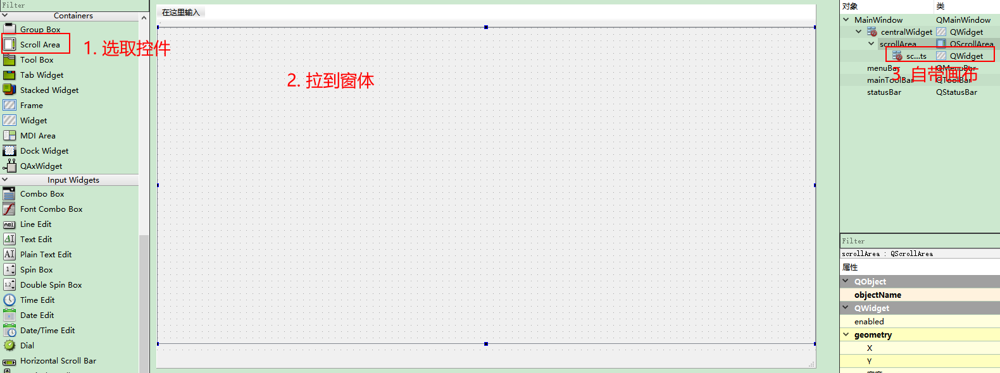

# qt实现滚动条    
## 1. 设计器实现   
1. 添加控件    
2. 拉入窗体，调整位置    
3. 自带画布窗体   
	- scrollArea可以理解为一个窗户    
	- 里面的自带的scrollAreaWidgetContents可以理解为一个画布   
	- **scrollArea实际的大小小于scrollAreaWidgetContents的(最小尺寸)MinimumSize**时，滚动条才有意义，才有滚动条   
	- 而许多时候scrollAreaWidgetContents的默认MinimumSize是`0*0`，因此一定要手动修改变大，大于  scrollArea的大小     

  

4. 可以隐藏垂直滑块    

   

5. 运行效果   
   

## 2. 代码实现   
```C++
void SetMainWindow::setScrollBar(QScrollArea *s, QWidget *w)
{
    // 1. 设置进度条的位置和大小
    s->setGeometry(0, 0, 1920, 1010);
    // 2. 垂直和水平滚动条不可见，只能通过鼠标滑动
    s->setVerticalScrollBarPolicy(Qt::ScrollBarAlwaysOff);
    s->setHorizontalScrollBarPolicy(Qt::ScrollBarAlwaysOff);
    // 3. 设置滚动区域的窗体
    s->setWidget(w);
    // 4. 设置窗体大小
    w->setGeometry(0, 0, 1920, 1010);
}
```

## 3 注意事项    
1. 画布的最小大小一定设置    
2. 当不想用scrollArea的滚动效果时，将画布的最小设置为`0*0`   


## 4 参考资料   
1. https://blog.csdn.net/Fiona_77/article/details/103611738?utm_medium=distribute.pc_aggpage_search_result.none-task-blog-2~all~baidu_landing_v2~default-2-103611738.nonecase&utm_term=qt%20%E6%BB%9A%E5%8A%A8%E6%9D%A1%E6%9C%89%E6%97%B6%E4%B8%8D%E6%98%BE%E7%A4%BA    
2. https://blog.csdn.net/jirryzhang/article/details/60142316?utm_medium=distribute.pc_relevant.none-task-blog-BlogCommendFromMachineLearnPai2-1.channel_param&depth_1-utm_source=distribute.pc_relevant.none-task-blog-BlogCommendFromMachineLearnPai2-1.channel_param    
3. https://blog.csdn.net/qq_31073871/article/details/83117430?utm_medium=distribute.pc_relevant.none-task-blog-title-2&spm=1001.2101.3001.4242   