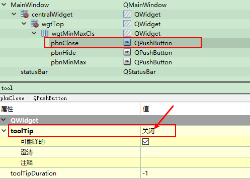
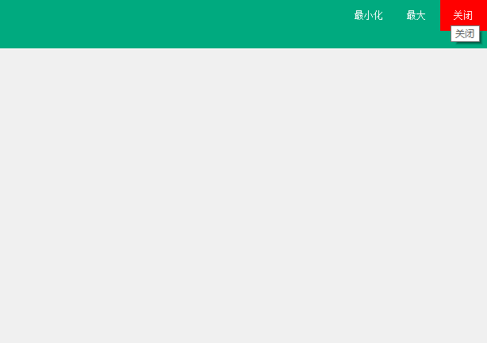

# 重写顶部事件   
## 1 实现步骤   
1. 隐藏白条   
2. 重写三个事件   
3. 实现移动：重写鼠标三事件   
4. 设置三个按钮的QSS   
5. 设置ToolTip   

## 2 具体实现  

### 2.1 实现代码  
```C++
MainWindow::MainWindow(QWidget *parent) :
    QMainWindow(parent),
    ui(new Ui::MainWindow)
{
    ui->setupUi(this);
    m_bl_minMaxFlag = true;

    // 1. 初始化
    // 1.1 去掉白条
    this->setWindowFlags(Qt::Widget|Qt::FramelessWindowHint);

    // 1.2 设置Tip
    ui->pbnMinMax->setToolTip("最大化");
    ui->pbnHide->setToolTip("最小化");
    ui->pbnClose->setToolTip("关闭");
}

MainWindow::~MainWindow()
{
    delete ui;
}

void MainWindow::on_pbnClose_clicked() {
    // 2. 关闭窗口
    this->close();
}

void MainWindow::on_pbnMinMax_clicked() {
    // 3. 判断点击次数
    if(m_bl_minMaxFlag){
        // 3.1 偶数是常规
        ui->pbnMinMax->setText("常规");
        ui->pbnMinMax->setToolTip("向下还原");
        this->showMaximized();
    } else{
        // 3.2 奇数是最大
        ui->pbnMinMax->setText("最大");
        ui->pbnMinMax->setToolTip("最大化");
        this->showNormal();
    }
    m_bl_minMaxFlag = (!m_bl_minMaxFlag);
}

void MainWindow::on_pbnHide_clicked() {
    // 4. 最小化窗口
    this->showMinimized();
}
// 5. 下面3个鼠标事件
// 5.1 鼠标点击事件
void MainWindow::mousePressEvent(QMouseEvent *e) {
    // 当鼠标点到上面的widget的左半部分时，获取点击位置的坐标
    if(e->x() > ui->wgtTop->x() && e->x() < ui->wgtMinMaxCls->x()
            && e->y() > ui->wgtTop->y() && e->y() < ui->wgtTop->y() + ui->wgtMinMaxCls->height() )

        m_pos_lastPos = e->globalPos();
}
// 5.2 鼠标移动事件
void MainWindow::mouseMoveEvent(QMouseEvent *e) {
    // 当鼠标点到上面的widget的左半部分移动,那么窗体也跟着相应移动
    if(e->x() > ui->wgtTop->x() && e->x() < ui->wgtMinMaxCls->x()
            && e->y() > ui->wgtTop->y() && e->y() < ui->wgtTop->y() + ui->wgtMinMaxCls->height() ){
        int dx = e->globalX() - m_pos_lastPos.x();
        int dy = e->globalY() - m_pos_lastPos.y();
        m_pos_lastPos = e->globalPos();
        this->move(x()+dx, y()+dy);
    }
}
// 5.3 鼠标释放事件(可以不写，作用和移动事件一样)
void MainWindow::mouseReleaseEvent(QMouseEvent *e) {
    // 当鼠标点到上面的widget的左半部分移动,那么窗体也跟着相应移动
    if(e->x() > ui->wgtTop->x() && e->x() < ui->wgtMinMaxCls->x()
            && e->y() > ui->wgtTop->y() && e->y() < ui->wgtTop->y() + ui->wgtMinMaxCls->height() ){
        int dx = e->globalX() - m_pos_lastPos.x();
        int dy = e->globalY() - m_pos_lastPos.y();
        this->move(x()+dx, y()+dy);
    }
}

```
### 2.2 QSS样式   
```css
/**************** 最大和常规 *********************/
#pbnMinMax {
    color:#ffffff;
    background-color:rgba(40, 85, 20,0); 
    border: 0px solid #ffffff;
}
/*鼠标悬浮时的效果*/
#pbnMinMax:hover
{
    color:#ffffff;
	background-color: rgba(0, 0,0 ,50);
    border: 0px solid #ffffff;
}
/*如果按下与悬浮想同时产生效果，hover必须写在pressed的后面*/
/*鼠标按下时的效果*/
#pbnMinMax:pressed
{
    color:#ffffff;
	background-color: rgba(0, 0,0 ,50);
    border: 0px solid #ffffff;
}

/**************** 关闭 *********************/
#pbnClose {
    color:#ffffff;
    background-color:rgba(40, 85, 20,0); 
    border: 0px solid #ffffff;
}
 
/*鼠标悬浮时的效果*/
#pbnClose:hover
{
    color:#ffffff;
	background-color: rgb(255, 0, 0);
    border: 0px solid #ffffff;
}
/*如果按下与悬浮想同时产生效果，hover必须写在pressed的后面*/
/*鼠标按下时的效果*/
#pbnClose:pressed
{
    color:#ffffff;
	background-color: rgb(255, 0, 0);
    border: 0px solid #ffffff;
}
```

### 2.3 修改ToolTip   
- 也可以在代码中改   
   

## 3 实现效果   

   

## 4 参考资料   
1. https://www.cnblogs.com/lcgbk/p/13257425.html   
2. https://blog.csdn.net/baixingzhi2917/article/details/102089717?utm_medium=distribute.pc_relevant.none-task-blog-title-3&spm=1001.2101.3001.4242    
3. https://blog.csdn.net/huangan_xixi/article/details/50907916?utm_medium=distribute.pc_relevant.none-task-blog-BlogCommendFromMachineLearnPai2-3.channel_param&depth_1-utm_source=distribute.pc_relevant.none-task-blog-BlogCommendFromMachineLearnPai2-3.channel_param   
4. https://blog.csdn.net/liuyang1990i/article/details/8227342?utm_medium=distribute.pc_relevant.none-task-blog-title-3&spm=1001.2101.3001.4242   
5. https://blog.csdn.net/l285345042/article/details/8161320    