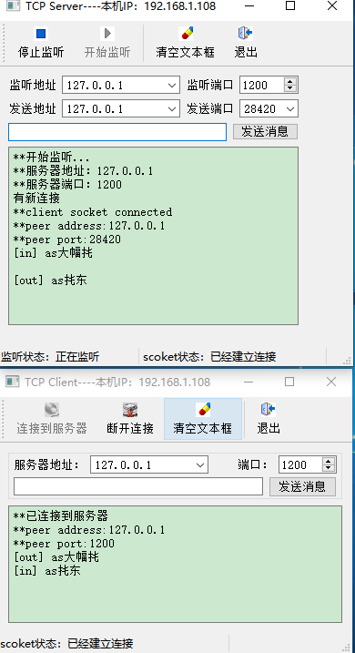

# 网络编程TCP进阶   

## 1 qt开发指南上的例子   
- 和47比较   
- 新增自动获取本机IP   
- 新增重写窗口关闭事件  
- 新增连接状态变化stateChanged   


## 2 客户机端  
```C++
#include <QHostAddress>
#include <QHostInfo>

/////  客户机
///   获取本主机的IPv4的IP地址
QString MainWindow::getLocalIP()
{
    // 1. 获取本地主机的名字
    QString hostName = QHostInfo::localHostName();//本地主机名
    // 2. 根据主机名获取主机信息
    QHostInfo   hostInfo=QHostInfo::fromName(hostName);
    QString   localIP="";
    // 3. 获取主机的IP列表
    QList<QHostAddress> addList=hostInfo.addresses();//

    if (!addList.isEmpty())
        for (int i=0;i<addList.count();i++)
        {
            // 4. 通过循环获取主机的IP地址
            QHostAddress aHost=addList.at(i);
            if (QAbstractSocket::IPv4Protocol==aHost.protocol())
            {
                localIP=aHost.toString();
                // break;   // 注释掉break，即可得到局域网的IP地址，
                // 不注释话获取的互联网IP地址
            }
        }
    return localIP;
}
///  重写窗口关闭事件
void MainWindow::closeEvent(QCloseEvent *event)
{
    // 1. 如果连接还存在，则断开连接
    if (tcpClient->state()==QAbstractSocket::ConnectedState)
        tcpClient->disconnectFromHost();
    // 2. 事件的接收者，还需要这个事件
    event->accept();
}
///  构造函数
MainWindow::MainWindow(QWidget *parent) :
    QMainWindow(parent),
    ui(new Ui::MainWindow)
{
    ui->setupUi(this);
    // 1. 创建Socket套接字
    tcpClient=new QTcpSocket(this); //创建socket变量
    // 2. 初始化状态栏标签
    LabSocketState=new QLabel("Socket状态：");//状态栏标签
    LabSocketState->setMinimumWidth(250);
    ui->statusBar->addWidget(LabSocketState);
    // 3. 获取本主机的IP
    QString localIP=getLocalIP();//本机IP
    this->setWindowTitle(this->windowTitle()+"----本机IP："+localIP);
    ui->comboServer->addItem(localIP);
    // 4. 如果建立了TCP连接，调用onConnected
    connect(tcpClient,SIGNAL(connected()),this,SLOT(onConnected()));
    // 5. 如果断开了TCP连接，调用onDisconnected
    connect(tcpClient,SIGNAL(disconnected()),this,SLOT(onDisconnected()));
    // 6. 如果TCP连接状态发生改变，调用 onSocketStateChange
    connect(tcpClient,SIGNAL(stateChanged(QAbstractSocket::SocketState)),
            this,SLOT(onSocketStateChange(QAbstractSocket::SocketState)));
    // 7. 如果TCP监听到数据时，调用onSocketReadyRead
    connect(tcpClient,SIGNAL(readyRead()),
            this,SLOT(onSocketReadyRead()));
}

MainWindow::~MainWindow()
{
    delete ui;
}
///  建立连接后显示连接的信息
void MainWindow::onConnected()
{ //connected()信号槽函数
    ui->plainTextEdit->appendPlainText("**已连接到服务器");
    // 1. 如果套接字处于ConnectedState，则返回已连接对等方的地址；
    // 否则返回QHostAddress:：Null。
    ui->plainTextEdit->appendPlainText("**peer address:"+
                                       tcpClient->peerAddress().toString());
    ui->plainTextEdit->appendPlainText("**peer port:"+
                                       QString::number(tcpClient->peerPort()));
    // 2. 修改工具栏的效果
    ui->actConnect->setEnabled(false);
    ui->actDisconnect->setEnabled(true);
}
///  断开连接后显示断开的信息
void MainWindow::onDisconnected()
{//disConnected()信号槽函数
    // 1. 修改文本框
    ui->plainTextEdit->appendPlainText("**已断开与服务器的连接");
    // 2. 修改工具栏的效果
    ui->actConnect->setEnabled(true);
    ui->actDisconnect->setEnabled(false);
}
///  读取接收到的数据
void MainWindow::onSocketReadyRead()
{//readyRead()信号槽函数
    // 1. 如果可以从套接字读取一行数据；
    //   将接收到数据显示到文本框
    while(tcpClient->canReadLine())
        ui->plainTextEdit->appendPlainText("[in] "+tcpClient->readLine());
}
///  Socket状态发生变化，状态栏的标签也发生变化
void MainWindow::onSocketStateChange(QAbstractSocket::SocketState socketState)
{//stateChange()信号槽函数
    switch(socketState)
    {
    // 1. Socket未连接。
    case QAbstractSocket::UnconnectedState:
        LabSocketState->setText("scoket状态：未连接");
        break;
    // 2. Socket正在执行主机名查找。
    case QAbstractSocket::HostLookupState:
        LabSocketState->setText("scoket状态：正在执行主机名查找");
        break;
    // 3. Socket已开始建立连接。
    case QAbstractSocket::ConnectingState:
        LabSocketState->setText("scoket状态：开始建立连接");
        break;
    // 4. Socket已经建立连接。
    case QAbstractSocket::ConnectedState:
        LabSocketState->setText("scoket状态：已经建立连接");
        break;
    // 5. Socket绑定到地址和端口。
    case QAbstractSocket::BoundState:
        LabSocketState->setText("scoket状态：绑定到地址和端口");
        break;
    // 6. Socket即将关闭（数据可能仍在等待写入）。
    case QAbstractSocket::ClosingState:
        LabSocketState->setText("scoket状态：即将关闭");
        break;
    // 7. 仅供内部使用。
    case QAbstractSocket::ListeningState:
        LabSocketState->setText("scoket状态：仅供内部使用");
    }
}
///  菜单栏actConnect动作触发
void MainWindow::on_actConnect_triggered()
{//连接到服务器
    // 1. 获取服务器的IP
    QString addr=ui->comboServer->currentText();
    // 2. 获取服务器的端口号
    quint16 port=ui->spinPort->value();
    // 3. 与服务器建立连接
    tcpClient->connectToHost(addr,port);
    //    tcpClient->connectToHost(QHostAddress::LocalHost,port);
}
///  菜单栏actDisconnect动作触发
void MainWindow::on_actDisconnect_triggered()
{//断开与服务器的连接
    // 1. 尝试关闭插座。如果有挂起的数据等待写入，
    // Socket将进入ClosingState并等待所有数据都已写入。
    if (tcpClient->state()==QAbstractSocket::ConnectedState)
        tcpClient->disconnectFromHost();
}
///  菜单栏actClear动作触发
void MainWindow::on_actClear_triggered()
{
    // 1. 清空文本
    ui->plainTextEdit->clear();
}
///  发送按钮单击事件
void MainWindow::on_btnSend_clicked()
{//发送数据
    // 1. 从输入框获取要发送的信息
    QString msg=ui->editMsg->text();
    // 2. 将发送信息显示在文本框
    ui->plainTextEdit->appendPlainText("[out] "+msg);
    // 3. 清空输入框
    ui->editMsg->clear();
    // 4. 输入框获得焦点
    ui->editMsg->setFocus();
    // 5. 将发送信息转成字节数组
    QByteArray  str=msg.toUtf8();
    str.append('\n');
    // 6. 将字节数据发送
    tcpClient->write(str);
}
```

## 3 服务器端   

```C++
////   服务器端
///   如果有多个客户端的话，需要先建立连接，再通信
///   进行客户端切换的话，也是先建立连接，再通信


///   获取本主机的IPv4的IP地址
QString MainWindow::getLocalIP()
{//获取本机IPv4地址
    // 1. 获取本地主机的名字
    QString hostName = QHostInfo::localHostName();//本地主机名
    // 2. 根据主机名获取主机信息
    QHostInfo   hostInfo=QHostInfo::fromName(hostName);
    QString   localIP="";
    // 3. 获取主机的IP列表
    QList<QHostAddress> addList=hostInfo.addresses();//

    if (!addList.isEmpty())
        for (int i=0;i<addList.count();i++)
        {
            // 4. 通过循环获取主机的IP地址
            QHostAddress aHost=addList.at(i);
            if (QAbstractSocket::IPv4Protocol==aHost.protocol())
            {
                localIP=aHost.toString();
                // break;   // 注释掉break，即可得到局域网的IP地址，
                // 不注释话获取的互联网IP地址
            }
        }
    return localIP;
}
///  重写窗口关闭事件
void MainWindow::closeEvent(QCloseEvent *event)
{//关闭窗口时停止监听
    // 1. 如果服务器当前正在侦听传入连接
    // 关闭服务器。服务器将不再侦听传入的连接。
    if (tcpServer->isListening())
        tcpServer->close();  //停止网络监听
    // 2. 事件的接收者，还需要这个事件
    event->accept();
}

MainWindow::MainWindow(QWidget *parent) :
    QMainWindow(parent),
    ui(new Ui::MainWindow)
{
    ui->setupUi(this);
    // 1. 初始化状态栏标签
    LabListen=new QLabel("监听状态:");
    LabListen->setMinimumWidth(150);
    ui->statusBar->addWidget(LabListen);

    LabSocketState=new QLabel("Socket状态：");//
    LabSocketState->setMinimumWidth(200);
    ui->statusBar->addWidget(LabSocketState);
    // 2. 获取本主机的IP
    QString localIP=getLocalIP();//本机IP
    this->setWindowTitle(this->windowTitle()+"----本机IP："+localIP);
    ui->comboIP->addItem(localIP);
    // 3. 创建TCP服务器
    tcpServer=new QTcpServer(this);
    // 4. 如果有新的连接，调用onNewConnection
    connect(tcpServer,SIGNAL(newConnection()),this,SLOT(onNewConnection()));
}

MainWindow::~MainWindow()
{
    delete ui;
}
///  建立新连接，注意：只有服务器建立了连接才能建立套接字
void MainWindow::onNewConnection()
{
    ui->plainTextEdit->appendPlainText("有新连接");
    // 1.1 获取下一个挂起的连接作为已连接的QTcpSocket对象
    tcpSocket = tcpServer->nextPendingConnection();

    ui->comboIP_send->setCurrentText(tcpSocket->peerAddress().toString());
    ui->comboPort_send->setCurrentText(QString::number(tcpSocket->peerPort()));


    // 1.2 修改建立连接界面信息变化
    onClientConnected();
    // 1.3 修改建立连接界面状态栏变化
    onSocketStateChange(tcpSocket->state());
    // 2. 如果套接字建立了TCP连接，调用onClientConnected
    connect(tcpSocket, SIGNAL(connected()), this, SLOT(onClientConnected()));
    // 3. 如果套接字断开了TCP连接，调用onClientDisconnected
    connect(tcpSocket, SIGNAL(disconnected()), this, SLOT(onClientDisconnected()));
    // 4. 如果TCP连接状态发生改变，调用 onSocketStateChange
    connect(tcpSocket,SIGNAL(stateChanged(QAbstractSocket::SocketState)), this,SLOT(onSocketStateChange(QAbstractSocket::SocketState)));
    // 5. 如果TCP监听到数据时，调用onSocketReadyRead
    connect(tcpSocket,SIGNAL(readyRead()), this,SLOT(onSocketReadyRead()));
}

///  Socket状态发生变化，状态栏的标签也发生变化
void MainWindow::onSocketStateChange(QAbstractSocket::SocketState socketState)
{//stateChange()信号槽函数
    switch(socketState)
    {
    // 1. Socket未连接。
    case QAbstractSocket::UnconnectedState:
        LabSocketState->setText("scoket状态：未连接");
        break;
    // 2. Socket正在执行主机名查找。
    case QAbstractSocket::HostLookupState:
        LabSocketState->setText("scoket状态：正在执行主机名查找");
        break;
    // 3. Socket已开始建立连接。
    case QAbstractSocket::ConnectingState:
        LabSocketState->setText("scoket状态：开始建立连接");
        break;
    // 4. Socket已经建立连接。
    case QAbstractSocket::ConnectedState:
        LabSocketState->setText("scoket状态：已经建立连接");
        break;
    // 5. Socket绑定到地址和端口。
    case QAbstractSocket::BoundState:
        LabSocketState->setText("scoket状态：绑定到地址和端口");
        break;
    // 6. Socket即将关闭（数据可能仍在等待写入）。
    case QAbstractSocket::ClosingState:
        LabSocketState->setText("scoket状态：即将关闭");
        break;
    // 7. 仅供内部使用。
    case QAbstractSocket::ListeningState:
        LabSocketState->setText("scoket状态：仅供内部使用");
    }
}
///  建立连接后显示连接的信息
void MainWindow::onClientConnected()
{//客户端接入时
    ui->plainTextEdit->appendPlainText("**client socket connected");
    // 1. 如果套接字处于ConnectedState，则返回已连接对等方的地址；
    // 否则返回QHostAddress:：Null。
    // 2. 添加与之连接的电脑IP地址
    ui->plainTextEdit->appendPlainText("**peer address:"+
                                   tcpSocket->peerAddress().toString());


    // 3. 添加与之连接的电脑端口号
    ui->plainTextEdit->appendPlainText("**peer port:"+
                                   QString::number(tcpSocket->peerPort()));

}
///  断开连接后显示断开的信息
void MainWindow::onClientDisconnected()
{//客户端断开连接时
    ui->plainTextEdit->appendPlainText("**client socket disconnected");
    // 从Qt4.8开始，如果在一个没有运行事件循环的线程中调用deleteLater（），
    // 当线程结束时，该对象将被销毁。
    tcpSocket->deleteLater();
    //    deleteLater();//QObject::deleteLater();
}
///  读取接收到的数据
void MainWindow::onSocketReadyRead()
{//读取缓冲区行文本

//    QStringList   lines;
    // 1. 如果可以从套接字读取一行数据；
    //   将接收到数据显示到文本框
    while(tcpSocket->canReadLine())
        ui->plainTextEdit->appendPlainText("[in] "+tcpSocket->readLine());

    qDebug() << tcpSocket->peerAddress().toString();
    qDebug() << QString::number(tcpSocket->peerPort());

    ui->comboIP_send->setCurrentText(tcpSocket->peerAddress().toString());
    ui->comboPort_send->setCurrentText(QString::number(tcpSocket->peerPort()));
//        lines.append(clientConnection->readLine());
}
///  菜单栏的开始行为被触发
void MainWindow::on_actStart_triggered()
{//开始监听
    QString     IP=ui->comboIP->currentText();//IP地址
    quint16     port=ui->spinPort->value();//端口
    QHostAddress    addr(IP);
    // 1. 服务器开始监听输入的IP和端口
    tcpServer->listen(addr,1200);//
//    tcpServer->listen(QHostAddress::LocalHost,port);// Equivalent to QHostAddress("127.0.0.1").
   // 2. 界面显示正在监听等信息
    ui->plainTextEdit->appendPlainText("**开始监听...");
    ui->plainTextEdit->appendPlainText("**服务器地址："
                       +tcpServer->serverAddress().toString());
    ui->plainTextEdit->appendPlainText("**服务器端口："
                       +QString::number(tcpServer->serverPort()));

    ui->actStart->setEnabled(false);
    ui->actStop->setEnabled(true);

    LabListen->setText("监听状态：正在监听");
}
///   菜单栏的停止行为被触发，服务器关闭监听
void MainWindow::on_actStop_triggered()
{//停止监听
    if (tcpServer->isListening()) //tcpServer正在监听
    {
        // 1. 关闭服务器。服务器将不再侦听传入的连接。
        // 但是对于已经建立的连接还可以接收数据
        tcpServer->close();// 停止监听
        ui->actStart->setEnabled(true);
        ui->actStop->setEnabled(false);
        LabListen->setText("监听状态：已停止监听");
    }
}
///   菜单栏的清除行为被触发，清空文本框
void MainWindow::on_actClear_triggered()
{
    ui->plainTextEdit->clear();
}
///   发送按钮的单击事件
void MainWindow::on_btnSend_clicked()
{//发送一行字符串，以换行符结束
    QString  msg=ui->editMsg->text();
    ui->plainTextEdit->appendPlainText("[out] "+msg);
    ui->editMsg->clear();
    ui->editMsg->setFocus();

    QByteArray  str=msg.toUtf8();
    str.append('\n');//添加一个换行符
    tcpSocket->write(str);
}
///  菜单栏主机信息行为被触发
//void MainWindow::on_actHostInfo_triggered()
//{//获取本机地址
//    QString hostName=QHostInfo::localHostName();//本地主机名
//    ui->plainTextEdit->appendPlainText("本机主机名："+hostName+"\n");
//    QHostInfo   hostInfo=QHostInfo::fromName(hostName);

//    QList<QHostAddress> addList=hostInfo.addresses();//
//    if (!addList.isEmpty())
//    for (int i=0;i<addList.count();i++)
//    {
//        QHostAddress aHost=addList.at(i);
//        if (QAbstractSocket::IPv4Protocol==aHost.protocol())
//        {
//            QString IP=aHost.toString();
//            ui->plainTextEdit->appendPlainText("本机IP地址："+aHost.toString());
//            if (ui->comboIP->findText(IP)<0)
//                ui->comboIP->addItem(IP);
//        }
//    }

//}

```

## 4 运行效果   

     


## 参考资料  
1. https://blog.csdn.net/bailang_zhizun/article/details/78327974   

2. https://blog.csdn.net/lvyuan30276/article/details/50458572   

3. https://www.cnblogs.com/suntp/p/6434644.html  

4. https://www.cnblogs.com/loveqian/p/10833815.html     

   