# 封装DLL   

## 1 DLL的介绍   
- DLL就是动态链接库，LIB是静态链接库。DLL其实就是EXE，只不过没main。   
- DLL是程序在运行阶段才需要的文件。LIB是程序编译时需要链接的文件。DLL只有一种，其中一定是函数和过程的实现。   
- 若我们不是用静态链接，而使用DLL，那么我们也需要一个LIB，这个LIB的作用是被链接到程序里，在程序运行时告诉系统你需要什么DLL文件。这个LIB里保存的是DLL的名字和输出函数入口的顺序表。它是有意义的。   
- DLL真正实现了跨语言。各种语言都可以生成DLL，而对系统以及应用程序来说，哪种语言生成的DLL是没有区别的。   
- DLL有足够的封装性，对于版本更新有很大好处。因为DLL是运行期间才会使用，所以，即使DLL内函数实现有变化（只要参数和返回值不发生变化），程序是不需要进行编译的。大大提高了软件开发和维护的效率。  
- DLL被多个进程使用，因为有内存映射机制，无需占用更多内存。  

## 2 生成DLL  

### 2.1 应用场景   
- 一般来说，在生成dll时，都是将提前写好的程序，调试没问题了，然后将最终交付的部分，封装成DLL库函数，便于系统的使用和与其他系统的交付融合   
- 比如：现有的qt项目：    
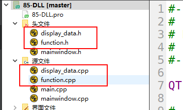   

- 需要将`display_data.cpp`、`display_data.h`、`function.cpp`和`function.h`封装成dll库，用来调用     

### 2.2 创建DLL   

- 创建库函数项目    
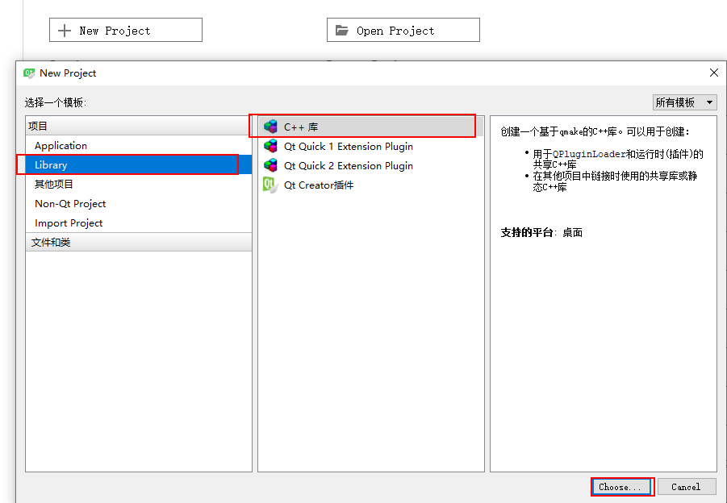   

- 选择共享库

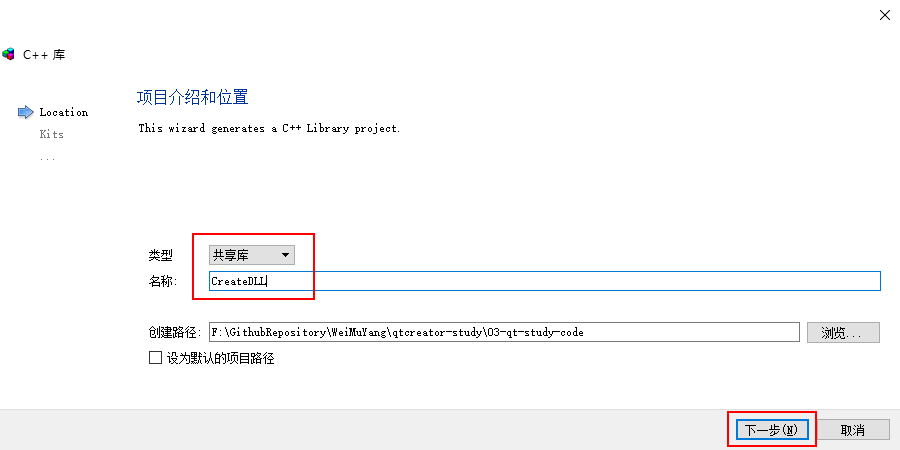     

-  添加模块   
  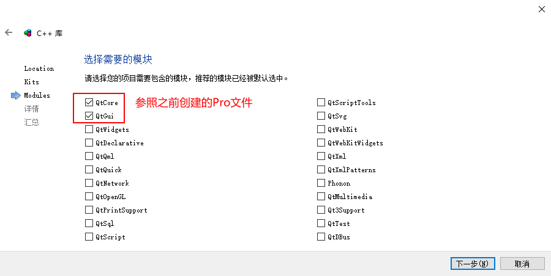     
- 创建基本类(这步骤必须有)     
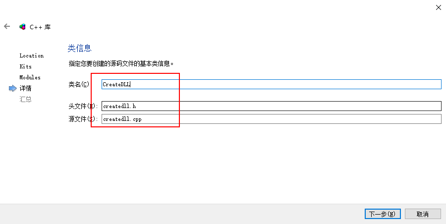     
-  里面会自动生成一个`*_global.h`文件    
  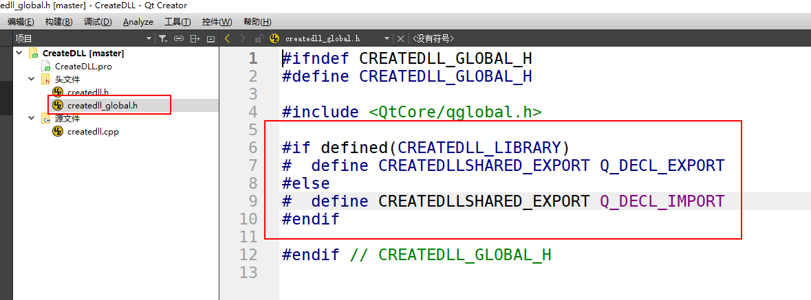   
- 将类中的类名前面的`CREATEDLLSHARED_EXPORT`删除     
  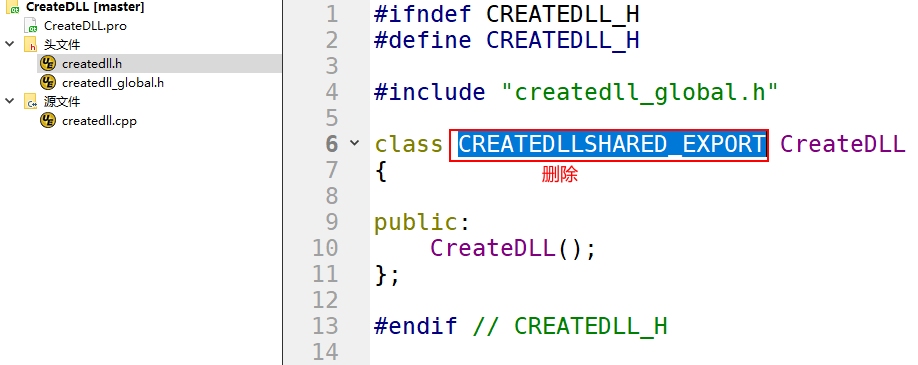   
- 在Pro文件中的TARGET改为qtdll      
  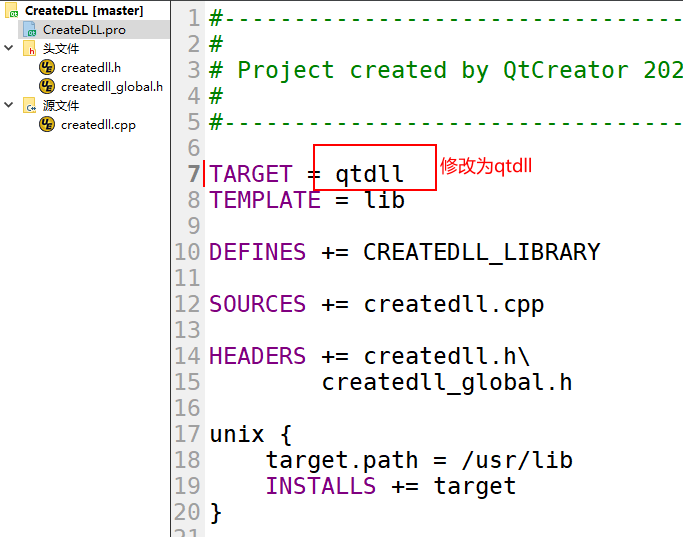    
- 将要编译成库的文件拷贝到目录，并添加进来      
  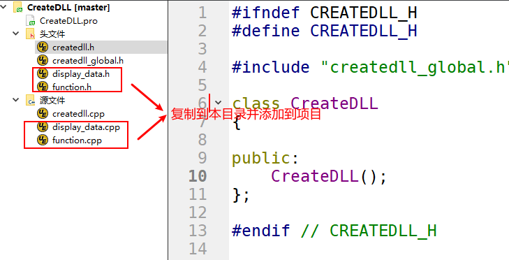   
- 编译生成   
  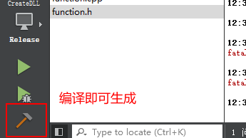       
- 进入编译好的目录看到生成的库文件     
  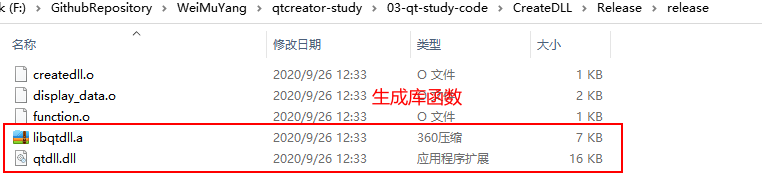   
### 2.3 添加生成的DLL库函数       

- 将函数库添加到调用的目录     
  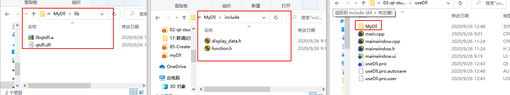     

- 添加生成的库    
  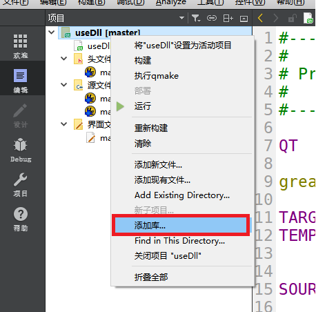    
  
- 选择外部库     
  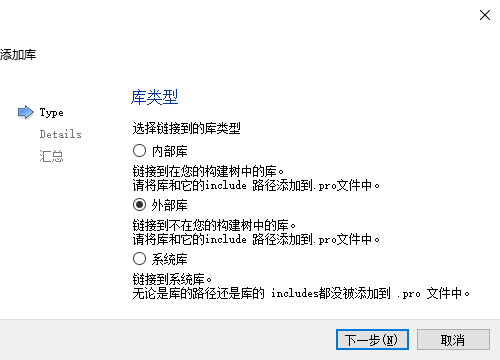    
  
- 会自动识别添加include目录   
  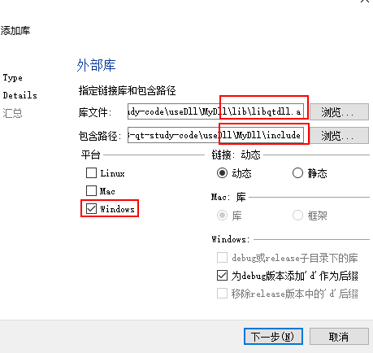     
  
-  直接编译会出现bug     
  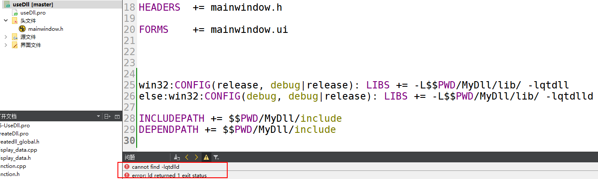    
  
- 仅保留上面的后半部分   
  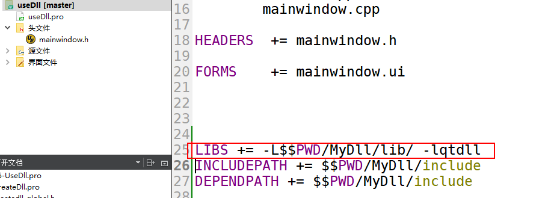     
  
- 编译成功      
  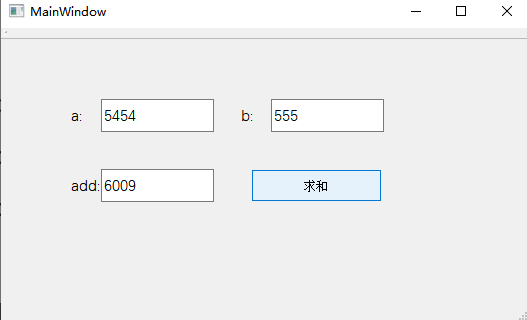   
  
  
## 3 注意事项   
1. 一旦运行成功，删除Pro中添加库的语句也会运行，只是之前生成的缓存没有删除而已    
2. 编译的过程遇到Bug，可能是兼容性问题   
3. 也可以将一些对话框和界面封装成dll   

## 参考资料  
1. https://www.cnblogs.com/findumars/p/8001358.html  
2. https://blog.csdn.net/zhxg576/article/details/60337791   
3. https://blog.csdn.net/cv_yuippe/article/details/39473459   
4. 