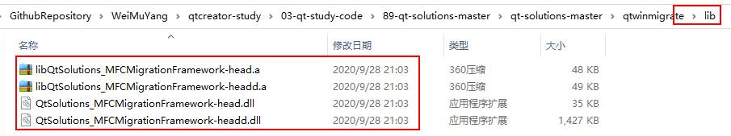
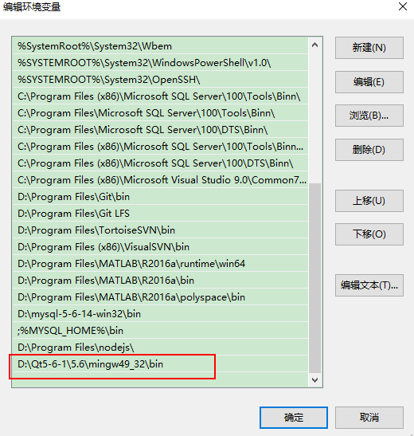

# VS调用qt编译的dll    

## 1 dll的介绍    
- 详见[85-qt编译dll](./85-qt编译dll.md)    
- dllmain()函数，它是dll库的入口函数，在静态链接时，或动态链接时调用LoadLibrary和FreeLibrary都会调用DllMain函数    
- 如果用到了信号槽等qt特有的事件处理机制（比如你用到了QWidget，QCamera等），那你必须在库里跑一个qApp.exec以让qt库可以正常处理QT事件，当然为了不卡死在库里必须要做下处理，这个可以参考**qtwinmigrate**的例程,里面有示例，看qtdll就行，我理解的实质也就是在dllmain入口函数中，当加载库时实例化一个qApp，并让事件驱动起来并过滤掉window的事件,有qt的事件就处理之。卸载时删除qApp。    
- 我在windows下用mingw编译的库是没有lib文件的，只有用mvsc编译才有这玩意。mingw下动态编译就只有dll,静态的话dll都没有，只出来个.a。至于说只有lib没dll这种情况没遇上过，据说加个CONFIG += dll就行。    
- 使用QT静态库编译出来的DLL依然需要别得依懒库，所以没什么必要非要用静态库来编译了。   

## 2 dll中qtwinmigrate的使用    
### 2.1 下载qtwinmigrate   
- [qtwinmigrate的github地址](https://github.com/qtproject/qt-solutions)   
- [qtwinmigrate的本地位置地址：23-qt-solutions-master.zip](../10-others)   

### 2.2 使用方法   
- 在Windows下，可能要用MFC或C#或Java，python调用一个插件，这个插件是一个dll，可以弄一个Qt的界面出来，官方已经给出了一个API了，为**qtwinmigrate**，下面来演示下qtwinmigrate中的一例子，并且修改这个例子达到我们想要的效果。    

#### 2.2.1 编译lib   
1. 首先编译下buildlib这个库，这里可以会有一些小问题，在此不再说明，因为稍微有点Qt基础的都能解决，不再说明   
    
    
    

2. 打开`qt-solutions-master/qtwinmigrate/examples/qtdll`  ，就可以直接构建项目     
3. 添加Widget界面类进行代码编写    

```c++
/**
* Copyright (c) 2020 MYWB. All rights reserved
* @projectName   qtdll
* @file          widget.h
* @brief         Widget的子类，用于展示界面
* @author        YWB
* @date          2020-09-28 21:15:16
*/
#include <QWidget>
namespace Ui {
class Widget;
}
class Widget : public QWidget
{
    Q_OBJECT
public:
    explicit Widget(QWidget *parent = 0);
    ~Widget();
protected slots:
    void btnClicked();
private:
    Ui::Widget *ui;
};

//  widget.cpp
#include "widget.h"
#include "ui_widget.h"
Widget::Widget(QWidget *parent) :
    QWidget(parent),    ui(new Ui::Widget) {
    ui->setupUi(this);
    this->setWindowTitle("Test Dll for Viual Studio");
    connect(ui->pushButton, SIGNAL(clicked(bool)), this, SLOT(btnClicked()));
}
Widget::~Widget() {
    delete ui;
}
void Widget::btnClicked() {
    ui->label->setText(ui->lineEdit->text());
}

// main.cpp
#include <qmfcapp.h>
#include <qwinwidget.h>
#include <QMessageBox>
#include <windows.h>
#include <QDebug>
// 1. 添加头文件
#include "widget.h"
// 自动生成Dll入口  
BOOL WINAPI DllMain( HINSTANCE hInstance, DWORD dwReason, LPVOID /*lpvReserved*/ )
{
    static bool ownApplication = FALSE;

    if ( dwReason == DLL_PROCESS_ATTACH )
        ownApplication = QMfcApp::pluginInstance( hInstance );
    if ( dwReason == DLL_PROCESS_DETACH && ownApplication )
        delete qApp;

    return TRUE;
}
// 自动生成  
extern "C" __declspec(dllexport) bool showDialog( HWND parent )
{
    QWinWidget win( parent );
    win.showCentered();
    QMessageBox::about( &win, "About QtMfc", "QtMfc Version 1.0\nCopyright (C) 2003" );
    return TRUE;
}
/** 2. 添加DLL入口函数
 *  @brief 显示界面
 */
extern "C" __declspec(dllexport) void showWidget(){

    QEventLoop loop;  // 循环事件
    Widget widget;
    widget.show();
    loop.exec();
}

/** 3. 添加DLL入口函数
 * @brief  打印
 */
extern "C" __declspec(dllexport) void DisplayIntoDll(){

    qDebug() << "调用Dll";
}
```

4. debug编译出现1个错误，再次编译即可； release编译出现2个错误，再次编译即可；    

    

5. release编译好的文件，目录出现两个库函数，注意：minngw编译器不会产生lib；    
      

#### 2.2.2 VS项目调用     
1. 创建VS工程，将dll添加到VS目录   
     

2. 写好导入dll的代码，编译出现bug    
    

3. 更改属性，支持多字符集   
       
       

4. 若环境变量添加了qt的bin路径，自此结束    
       

## 3 注意事项   
1. `qtwinmigrate`每次编译不同的dll，最好用最新的，因为之前的可能编译的产生的文件产生干扰   
2. 对于没有配置qt环境变量或者没有安装qt的用户，在发布dll时，需要使用，Qt可使用自带的小工具`windeployqt`（这个是命令行工具,可以自行帮你拷贝依赖到当前文件夹下）   
3. 但是`windeployqt`拿到的信息可能不全，如何发布dll，详见下一篇文档[90-VS调用qt编译的dll之打包规则](./90-VS调用qt编译的dll之打包规则.md)   


## 4 参考文献   
1. https://blog.csdn.net/qq78442761/article/details/87598078   
2. https://blog.csdn.net/wumingzcj/article/details/72637794?utm_medium=distribute.pc_relevant_download.none-task-blog-blogcommendfrombaidu-3.nonecase&depth_1-utm_source=distribute.pc_relevant_download.none-task-blog-blogcommendfrombaidu-3.nonecas    
3. https://blog.csdn.net/vample/article/details/78853384?utm_medium=distribute.pc_relevant.none-task-blog-title-1&spm=1001.2101.3001.4242    
4. https://blog.csdn.net/flfihpv259/article/details/70145080   
5. https://baijiahao.baidu.com/s?id=1651175278380214136&wfr=spider&for=pc  
