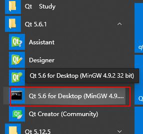
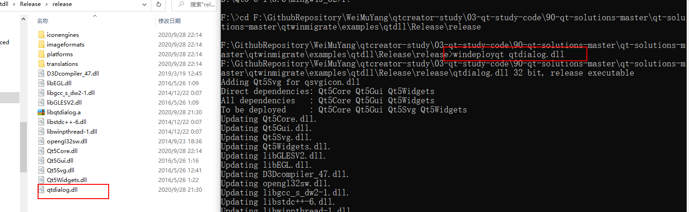
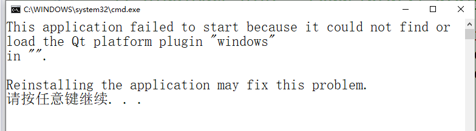
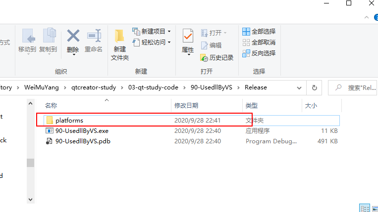
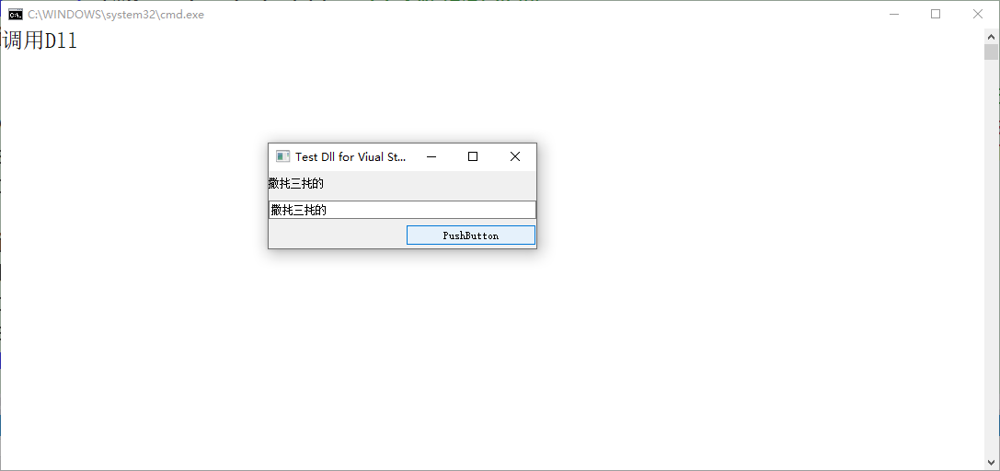

# VS调用qt编译的dll之打包规则(发布)    

## 1 利用windeployqt打包    

1. 打开Qt 5.6 for Desktop   

  

2. 进入dll目录，只留下dll，在使用命令   
  

## 2 打包文件添加  

1. 将打包好的文件添加到，VS引用目录，编译报错   
    

## 3 exe中添加platforms   

1. 将`platforms`复制到exe的目录即可(debug和release都需要)    
     

2. 双击exe，或者重新编译运行即可   

     

## 4 参考文献   
1. https://blog.csdn.net/huapenguag/article/details/88395308?utm_medium=distribute.pc_relevant.none-task-blog-BlogCommendFromMachineLearnPai2-2.channel_param&depth_1-utm_source=distribute.pc_relevant.none-task-blog-BlogCommendFromMachineLearnPai2-2.channel_param    
2. https://www.cnblogs.com/Yu-FeiFei/p/7794575.html   
3. https://blog.csdn.net/u011408697/article/details/42969811?utm_medium=distribute.pc_relevant_download.none-task-blog-baidujs-2.nonecase&depth_1-utm_source=distribute.pc_relevant_download.none-task-blog-baidujs-2.nonecase    

