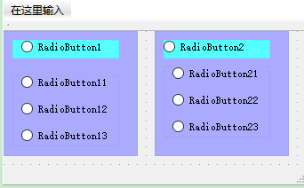
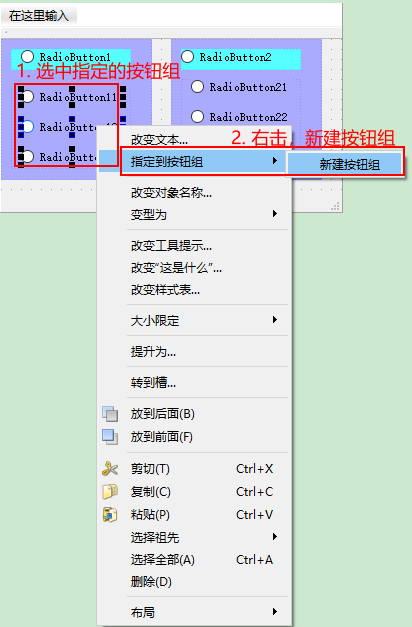
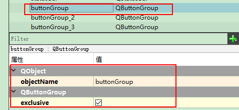
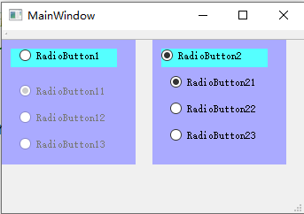

# Qt中单选按钮的实现    

## 1 Radio Button的介绍   
- QRadioButton是一个可以switch on或off的按钮，对应的状态为checked和unchecked。   
- 一组QRadioButton通常用于表示程序中“多选一”的选择，例如单项选择题。在一组radio buttons中，同一时刻只能有一个button处于checked状态，如果用户选择了其他button，原先被选中的button将变为unchecked。   
- 和QpushButton一样，QRadioButton类提供了一个text label和一个small icon，其中text可以在构造函数中设置，也可以通过setText()方法设置，但是icon只能通过setIcon()方法设置，还可以通过在text中某个字母前加“&”符号来指定快捷键，例如：   
```c++
QRadioButton *button = new QRadioButton("RadioButton&1", this);   // 为“Alt + 1”也就是&后面的字母  
// 同时也可以设置  
ui->radioButton_8->setText("radioButton&2");

```

## 2 Radio Button的创建    
1. 将多个Radio Button拖动到MainWidget，如下图所示    

    

2. 选中几个Radio Button右击，构成按钮组    

    

3. buttonGroup仅仅是一个容器，也就是只要把几个Radio Button放到一个容器即可   
    

4. **QButtonGroup默认是exclusive，也就是只能单选**，所以只要它的组内的所有buttons是checkable的，不管是不是QRadioButton，都将表现得与QRadioButton一样。最后如果你创建了一个exclusive的button group，最好为它设置一个初选项，否则组内将没有任何一个button被选中，这不太符合“one of many”的设计吧。   

## 3 对应的信号   
- QRadioButton的信号继承自QAbstractButton，一般我们比较关注的是toggled()和clicked()，也就是**切换**和**单击**     
	- 需要注意的是，radio button无论是被switch on还是off，它都会发送一个toggled(bool)信号，其中包含一个bool型参数用于记录此次发生的是被switch on还是off，所以如果你想根据radio button的状态变化来处理一些事的话，就需要connect它们。   
	- 当然，如果组内有很多个radio buttons，并且你又想跟踪toggled或clicked的状态，你不需要一个个来connect，因为一旦使用QButtonGroup来管理，完全可以用buttonToggled()和buttonClicked()来处理组内所有buttons的toggled()和clicked()信号。   

## 4 实现示例   
```c++
/**
* Copyright (c) 2020 MYWB. All rights reserved
* @projectName   96-radio-button
* @file          mainwindow.cpp
* @brief         单选按钮
* @author        杨伟彬
* @date          2020-10-24 13:15:54
*/
MainWindow::MainWindow(QWidget *parent) :
    QMainWindow(parent),
    ui(new Ui::MainWindow)
{
    ui->setupUi(this);

    ui->radioButton_8->setText("RadioButton&2");
    // 1. 设置一个初选项，否则组内将没有任何一个button被选中，不太符合“one of many”的设计。
    ui->buttonGroup00->buttons().at(0)->setChecked(true);
    ui->buttonGroup01->buttons().at(2)->setChecked(true);
    ui->buttonGroup02->buttons().at(2)->setChecked(true);
    // 2. 设置初始状态。
    for(int i = 0; i < ui->buttonGroup02->buttons().length(); ++i){
        ui->buttonGroup02->buttons().at(i)->setDisabled(true);
        ui->buttonGroup02->buttons().at(i)->setChecked(false);
    }
    for(int i = 0; i < ui->buttonGroup01->buttons().length(); ++i){
        ui->buttonGroup01->buttons().at(i)->setDisabled(false);
        ui->buttonGroup01->buttons().at(i)->setChecked(false);
    }

    // 3. 设置信号槽
    // 按钮组00的切换事件和单击事件
    connect(ui->buttonGroup00, SIGNAL(buttonToggled(int,bool)), this, SLOT(buttonGroup00Toggled(int,bool)));
    connect(ui->buttonGroup00, SIGNAL(buttonClicked(int)), this, SLOT(buttonGroup00Clicked(int)));
    // 按钮组01的切换事件和单击事件
    connect(ui->buttonGroup01, SIGNAL(buttonToggled(int,bool)), this, SLOT(buttonGroup01Toggled(int,bool)));
    connect(ui->buttonGroup01, SIGNAL(buttonClicked(int)), this, SLOT(buttonGroup01Clicked(int)));
    // 按钮组02的切换事件和单击事件
    connect(ui->buttonGroup02, SIGNAL(buttonToggled(int,bool)), this, SLOT(buttonGroup02Toggled(int,bool)));
    connect(ui->buttonGroup02, SIGNAL(buttonClicked(int)), this, SLOT(buttonGroup02Clicked(int)));
}
MainWindow::~MainWindow()
{
    delete ui;
}
/**
 * @brief       收到按钮组切换信号
 * @param id    按钮组中变化按钮的ID
 * @param flag  按钮组中变化后按钮的状态
 * @note        一个动作可能触发多个按钮变化，那么会触发多次
 */
void MainWindow::buttonGroup00Toggled(int id, bool flag)
{
    // 1. 获取按钮组中，选中按钮的ID
    int tmp = ui->buttonGroup00->checkedId();
    // 2. 获取按钮组中，选中按钮的文本内容
    QString strText = ui->buttonGroup00->checkedButton()->text();
    // 3. 获取按钮组中，选中按钮的对象名
    QString strobjectName = ui->buttonGroup00->checkedButton()->objectName();

    qDebug()<< ui->buttonGroup00->button(id)->text();
    qDebug()<< "checkedButton Text = " << strText;
    qDebug()<< "checkedButton objectName = " << strobjectName;
    qDebug()<< "id = " << id << ";  checkedButton id = " << tmp;
    qDebug()<< "flag = " << flag;

    // 4. 若text是"RadioButton&1"的按钮被选中，执行下面内容
    if(ui->buttonGroup00->checkedButton()->text() == "RadioButton&1" ){
        for(int i = 0; i < ui->buttonGroup02->buttons().length(); ++i){
            ui->buttonGroup02->buttons().at(i)->setDisabled(true);
            ui->buttonGroup02->buttons().at(i)->setChecked(false);
        }
        for(int i = 0; i < ui->buttonGroup01->buttons().length(); ++i){
            ui->buttonGroup01->buttons().at(i)->setDisabled(false);
            ui->buttonGroup01->buttons().at(i)->setChecked(false);
        }
    }
    // 5. 若text是"RadioButton&2"的按钮被选中，执行下面内容
    if(ui->buttonGroup00->checkedButton()->text() == "RadioButton&2"){
        for(int i = 0; i < ui->buttonGroup01->buttons().length(); ++i){
            ui->buttonGroup01->buttons().at(i)->setDisabled(true);
            ui->buttonGroup01->buttons().at(i)->setChecked(false);
        }
        for(int i = 0; i < ui->buttonGroup02->buttons().length(); ++i){
            ui->buttonGroup02->buttons().at(i)->setDisabled(false);
            ui->buttonGroup02->buttons().at(i)->setChecked(false);
        }
    }
}
/**
 * @brief       收到按钮组单击信号
 * @param id    按钮组单击按钮的ID
 * @note        单击一次触发一次
 */
void MainWindow::buttonGroup00Clicked(int id)
{
    // 打印按钮组中，单击按钮的对象名
    qDebug()<< "-------button Clicked:" << ui->buttonGroup00->button(id)->objectName();

}

```

    


## 参考资料  
1. https://blog.csdn.net/a724699769/article/details/62216903   
2. https://blog.csdn.net/lu_embedded/article/details/50482356  
3. https://www.cnblogs.com/tianxxl/p/11553859.html   