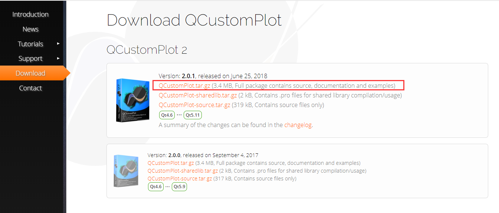
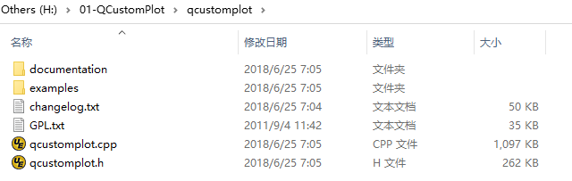
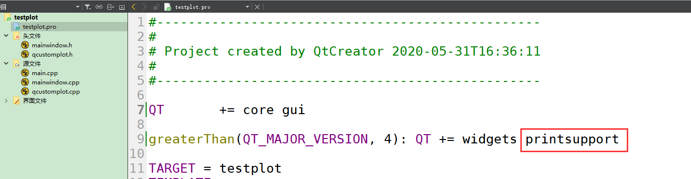
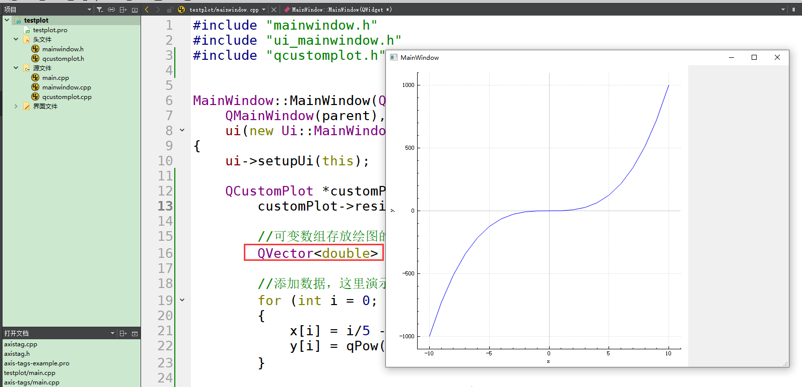
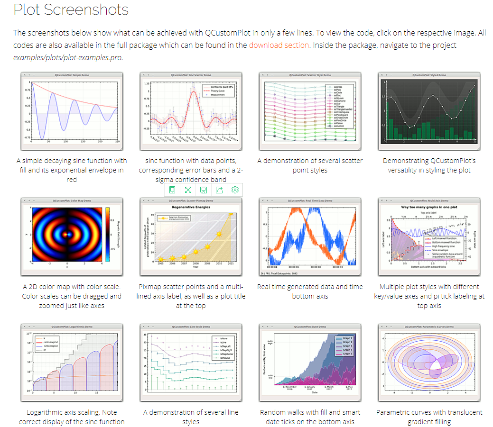

# qt如何画图显示-QCustomPlot配置   

## 1 QCustomPlot简介   
- QCustomPlot是基于Qt的图表库，Qt中使用的一个用来画曲线图、趋势图、坐标图、柱状图等类似二维图的库，可在自己的项目中直接使用两个源文件，或预先编译成库。  
	- 授权协议： GPL  
	- 开发语言： C/C++  
	- 操作系统： 跨平台   
- [QCustomPlot首页](https://www.qcustomplot.com/index.php/introduction)    
- [QCustomPlot文档](https://www.qcustomplot.com/index.php/tutorials/settingup)  
- [QCustomPlot下载](https://www.qcustomplot.com/index.php/download)    
- 下载如下：([本地位置](./others/01-QCustomPlot.tar.gz))
   

## 2 配置   
- 将下载的文件进行解压，里面包含文档、示例、更改日志、GPL授权、以及最重要的两个文件qcustomplot.h与qcustomplot.cpp。   
   

## 3 使用  
-  新建Qt工程，将qcustomplot.h与qcustomplot.cpp拷贝到工程目录下，然后引入这两个文件即可。  
- 右键->添加现有文件...，将这两个文件添加至工程。  
- 由于qcustomplot.h中使用了printsupport模块，所以需要在pro中进行添加！  
   
-  替换 `mainwindow.cpp`   

```C++
#include "mainwindow.h"
#include "ui_mainwindow.h"
#include "qcustomplot.h"


MainWindow::MainWindow(QWidget *parent) :
    QMainWindow(parent),
    ui(new Ui::MainWindow)
{
    ui->setupUi(this);

    QCustomPlot *customPlot = new QCustomPlot(this);
        customPlot->resize(900, 900);

        //可变数组存放绘图的坐标的数据，分别存放x和y坐标的数据，101为数据长度
        QVector<double> x(101), y(101);   // <double>  不可丢 

        //添加数据，这里演示y=x^3，为了正负对称，x从-10到+10
        for (int i = 0; i<101; i++)
        {
            x[i] = i/5 - 10;
            y[i] = qPow(x[i], 3);//x的y次方;
        }

        //向绘图区域QCustomPlot添加一条曲线
        customPlot->addGraph();

        //添加数据
        customPlot->graph(0)->setData(x, y);

        //设置坐标轴名称
        customPlot->xAxis->setLabel("x");
        customPlot->yAxis->setLabel("y");

        //设置坐标轴显示范围，否则只能看到默认范围
        customPlot->xAxis->setRange(-11, 11);
        customPlot->yAxis->setRange(-1100, 1100);
}

MainWindow::~MainWindow()
{
    delete ui;
}
```
   

## 4 总结  
1. qcustomplot.h与qcustomplot.cpp是源码文件，有这两个文件即可操作，但是它调用了printsupport模块,因此，需要添加pro文件中   
2. 可以根据下载好文件中的exsamples中找例子学习，如下效果   
   

3. 为**上位机的编程**学习作铺垫   
4. 如果是界面的话，可以通过**将widget提升为CustomPlot**，然后进入代码中后也需要先设置CustomPlot的属性才可以用。  


## 5 参考资料  
1. http://blog.sina.com.cn/s/blog_a6fb6cc90102v2cs.html   
2. https://blog.csdn.net/qq_40194498/article/details/79666903  
3. https://www.bilibili.com/video/BV17W411G7TH?t=37   
4. https://blog.csdn.net/naturly/article/details/81706089      