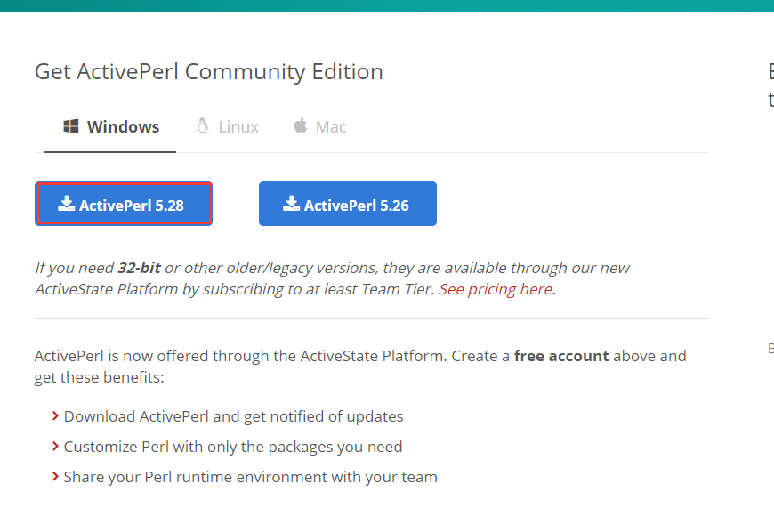
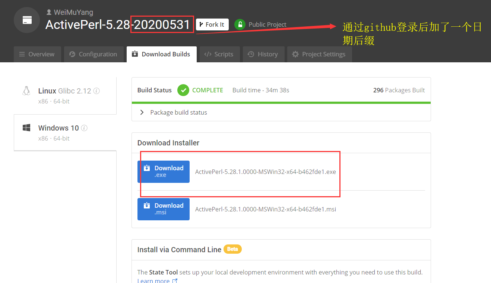
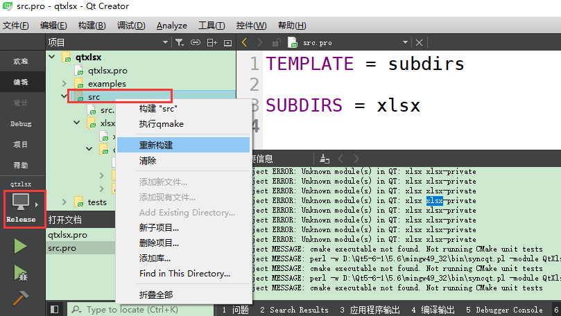
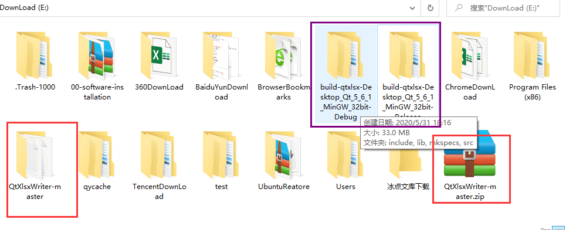
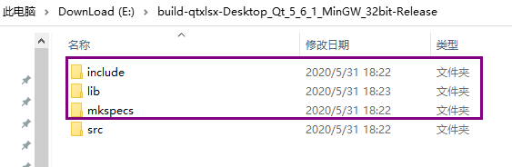
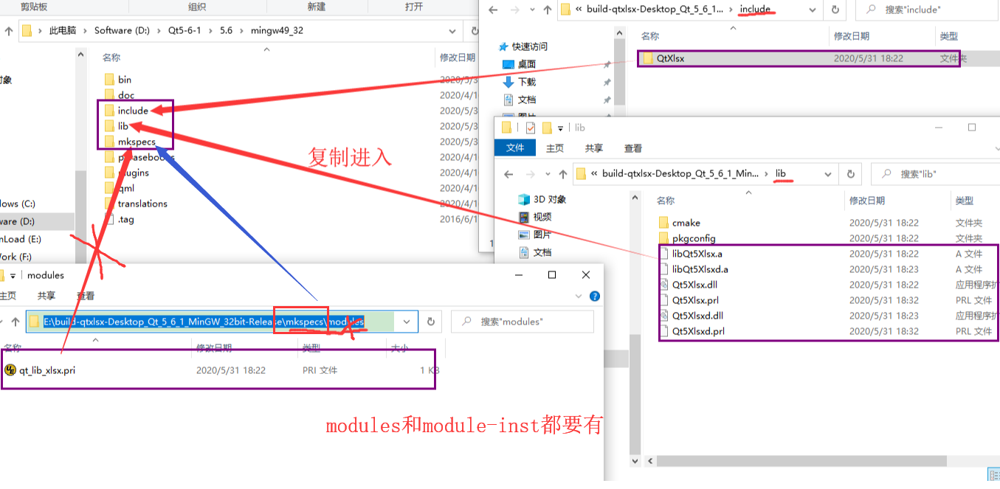
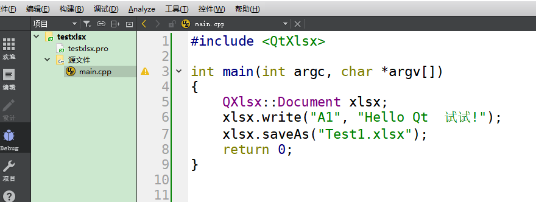
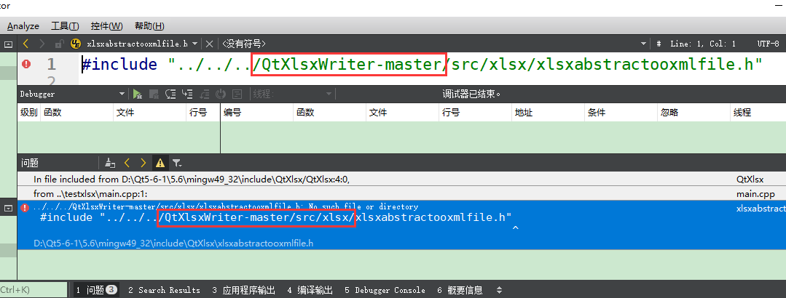
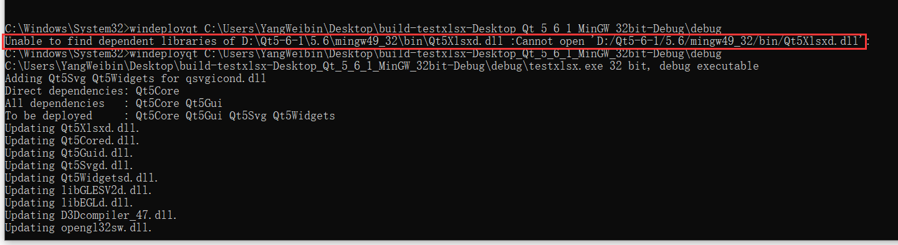
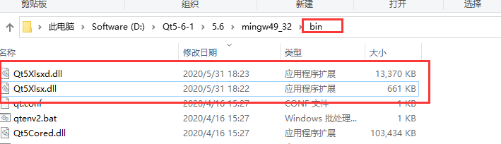

# qt读写xlsx-qtxlsx配置   
## 1 源码下载   
- [源码仓库](https://github.com/dbzhang800/QtXlsxWriter)  
- [本地压缩包](./others/02-QtXlsxWriter-master.zip)   
## 2 下载并安装编译时需要的工具PERL   
- [下载地址](https://www.activestate.com/products/perl/downloads/)  
   
   
   

- [本地位置](./others/03-ActivePerl-5.28.1.exe)     

## 3 编译src   
- 可以编译成debug版也可以是release版，最好用release版   
- 这个过程比较长，耐心等待   
   

- 完成后在上一级目录出现编译后生成的文件目录   
   

## 4 使用   
- 编译后生成三个重要文件   
   

- 将编译成功的文件完成复制入库   
  

- 编译如下代码可以成功   
```c++
// pro
QT +=   xlsx
#不能丢，虽然不会影响运行，但是编辑器不能索引到库里面的类  
greaterThan(QT_MAJOR_VERSION, 4): QT += widgets   
TARGET = testxlsx
TEMPLATE = app
SOURCES += \
    main.cpp
// main.cpp  
# include <QtXlsx>
int main(int argc, char *argv[])
{
    QXlsx::Document xlsx;
    xlsx.write("A1", "Hello Qt  试试!");
    xlsx.saveAs("Test1.xlsx");
    return 0;
}
```
  


## 5 还没结束！    
- 此时qtxlsx调用的是`E:\build-qtxlsx-Desktop_Qt_5_6_1_MinGW_32bit-Release`目录下库，还要修改文件信息    
	1. 打开`D:\Qt5-6-1\5.6\mingw49_32\mkspecs\modules\qt_lib_xlsx.pri`   
	2. 将里面的`E:\build-qtxlsx-Desktop_Qt_5_6_1_MinGW_32bit-Release`改为拷贝进入的目录`D:\Qt5-6-1\5.6\mingw49_32`   

  

- 此时编译还会报错   

  

- 由于使用了`../../../QtXlsxWriter-master/src/xlsx/xlsxabstractooxmlfile.h`说明，还依赖于原来的`QtXlsxWriter-master/src`文件，因此将`QtXlsxWriter-master`文件复制到找的目录下   

    

- 此时，QtXlsxWriter配置结束，目前和编译的文件完全脱离关系，可以删除之前的`build-qtxlsx-Desktop_Qt_5_6_1_MinGW_32bit-Release`文件了     

## 6 总结   
1. 上面的方法是编译完成后手动完成添加的，也可以自动完成，但是不利于移植其他电脑，详情参考下面链接    
2. 完成编译后，需要做下操作
	a). 将库文件拷贝，到qt安装目录    
	b). 修改`qt_lib_xlsx.pri`中文件的目录    
	c). 将`QtXlsxWriter-master`复制到`Qt5-6-1\5.6`下       
3. 为了便于移植将编译后用的文件打包保存至[电脑目录](./others/04-QtXlsxWriter.zip)    

## 7 补充   
- 当使用windeployqt命令时，会报错：在bin目录下找不到`Qt5Xlsxd.dll`   

   

- 需要将`Qt5Xlsxd.dll`文件拷贝到bin目录下即可      

   

## 5 参考资料  
1. https://www.freesion.com/article/774944453/    

2. https://blog.csdn.net/qq_40194498/article/details/80817264    

   