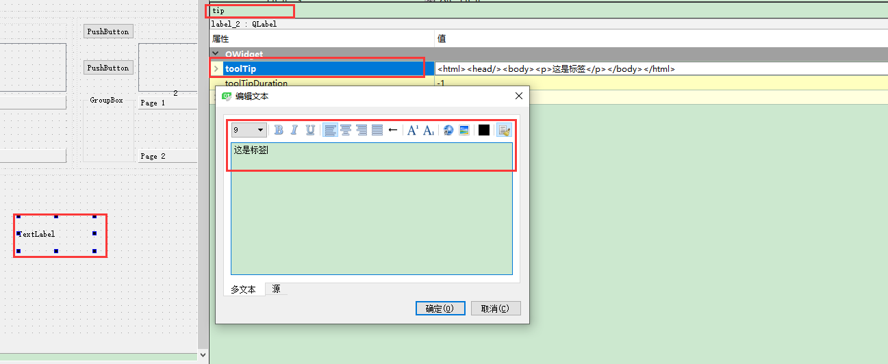

# 鼠标悬停显示   
## 1 界面设计器   
- 在控件属性修改`tooltip`即可   
   

## 2 代码实现   
- `setToolTip`   
- 支持html渲染   
```
// 1 
ui->label_2->setToolTip("这是代码实现的this is label!");

// 2 
ui->label_2->setToolTip("<html><head/><body><p>这是标签</p></body></html>");
```

## 3 根据像素固定   
- 略    

## 3 参考资料   
1. https://blog.csdn.net/qq_39350434/article/details/89633460    
