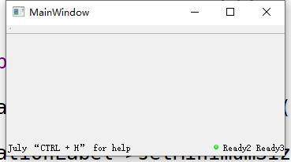

# 状态栏的设置   

## 1 永久性部件-右侧   
- 利用`statusBar()->addPermanentWidget`     
- 利用`statusBar()->insertPermanentWidget`   
- addPermanentWidget(QWidget * widget, int stretch = 0) 添加永久性部件，永久意味着它不能被临时消息（showMessage函数）掩盖，位于最右端，stretch伸缩性为0    
```C++
QLabel *per1 = new QLabel("1", this);
QLabel *per2 = new QLabel("Ready2", this);
QLabel *per3 = new QLabel("Ready3", this);
statusBar()->addPermanentWidget(per1); //现实永久信息
statusBar()->addPermanentWidget(per2);
statusBar()->insertPermanentWidget(2, per3);
```

## 2 一般性部件-左侧   
- `statusBar()->addWidget`    
```C++
QLabel *locationLabel = new QLabel("July");
// 标签居中显示
locationLabel->setAlignment(Qt::AlignCenter);  
// 设置这个Label的最小大小为当前最适合的大小。
// 即Label的最小面积就是现在的大小了
locationLabel->setMinimumSize(locationLabel->sizeHint());
QLabel *aixLabel = new QLabel("“CTRL + H” for help");
// 设置不显示label的边框
statusBar()->setStyleSheet(QString("QStatusBar::item{border: 0px}")); 
// 设置不显示右边的大小控制点
statusBar()->setSizeGripEnabled(false); //设置是否显示右边的大小控制点
statusBar()->addWidget(locationLabel);
statusBar()->addWidget(aixLabel, 1);
```

## 3 临时性信息-左侧   
- `statusBar()->showMessage`    
```C++
// 显示临时信息，时间3秒钟.
statusBar()->showMessage(“Status is here…”, 3000); 
```

## 4 插入小图标   
- 利用插入的图片实现   
```C++
// 定义图片类   
QImage imTrue;
// 图片路径可以通过右击工程的图片获取
// 一定要将图片添加到`*.qrc`文件中   
imTrue.load(":/img/true.png");
per1->setPixmap(QPixmap::fromImage(imTrue));
QPixmap pixmap = QPixmap::fromImage(imTrue);
// int with = ui->labPic->width();
// int height = ui->labPic->height();
// QPixmap fitpixmap = pixmap.scaled(with, height, Qt::IgnoreAspectRatio, Qt::SmoothTransformation);  // 饱满填充
QPixmap fitpixmap = pixmap.scaled(6, 6, Qt::KeepAspectRatio, Qt::SmoothTransformation);  // 设置像素大小 6 * 6s
per1->setPixmap(fitpixmap);
statusBar()->addPermanentWidget(per1); //现实永久信息
```

## 5 源码及效果   
```C++
QImage imTrue;
//图片路径可以通过右击工程的图片获取
imTrue.load(":/img/true.png");
// ui->label->setPixmap(QPixmap::fromImage(imTrue));
QLabel *locationLabel = new QLabel("July");
locationLabel->setAlignment(Qt::AlignCenter);
locationLabel->setMinimumSize(locationLabel->sizeHint());
//QLabel *aixLabel;
QLabel *aixLabel = new QLabel("“CTRL + H” for help");
//Optional
statusBar()->setStyleSheet(QString("QStatusBar::item{border: 0px}")); // 设置不显示label的边框
statusBar()->setSizeGripEnabled(false); //设置是否显示右边的大小控制点
// addWidget(QWidget * widget, int stretch = 0) 位于最左端，
// 当调用showMessage函数时，消息文字将与此函数添加的部件上文字重合
statusBar()->addWidget(locationLabel);
statusBar()->addWidget(aixLabel, 1);
QLabel *per1 = new QLabel("1", this);
QLabel *per2 = new QLabel("Ready2", this);
QLabel *per3 = new QLabel("Ready3", this);
//  addPermanentWidget(QWidget * widget, int stretch = 0) 添加永久性部件，
// 永久意味着它不能被临时消息（showMessage函数）掩盖，位于最右端，stretch伸缩性为0
per1->setPixmap(QPixmap::fromImage(imTrue));
QPixmap pixmap = QPixmap::fromImage(imTrue);
//QPixmap fitpixmap = pixmap.scaled(with, height, Qt::IgnoreAspectRatio, Qt::SmoothTransformation);  // 饱满填充
QPixmap fitpixmap = pixmap.scaled(6, 6, Qt::KeepAspectRatio, Qt::SmoothTransformation);  // 按比例缩放
per1->setPixmap(fitpixmap);
//statusBar()->addPermanentWidget(imTrue);
statusBar()->addPermanentWidget(per1); //现实永久信息
statusBar()->addPermanentWidget(per2);
statusBar()->insertPermanentWidget(0, per3);
statusBar()->showMessage("Status is here…", 5000); // 显示临时信息，时间3秒钟.
```

   

## 参考资料   
1. https://blog.csdn.net/theRookie1/article/details/84751548   
2. https://www.it610.com/article/929649.htm   
3. https://blog.csdn.net/kfy2011/article/details/77867609/  
4. https://bbs.csdn.net/topics/391984697?list=lz    