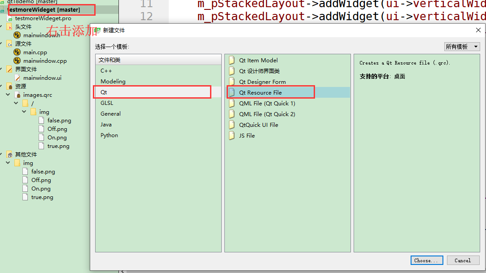
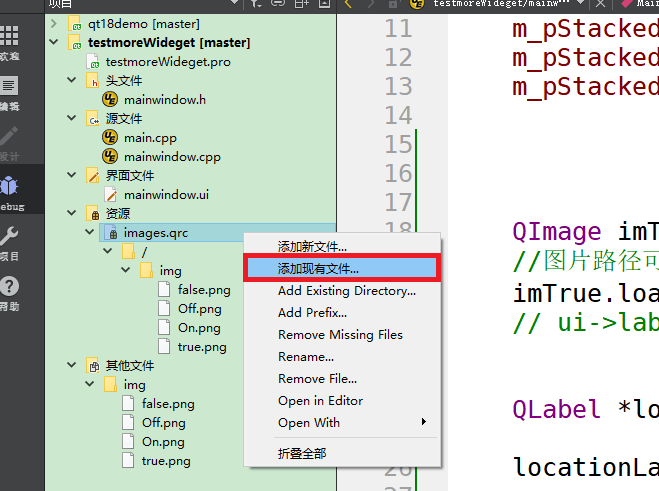
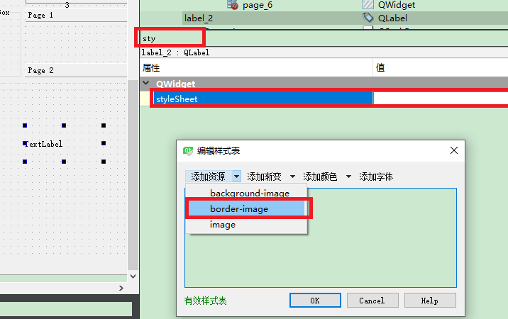
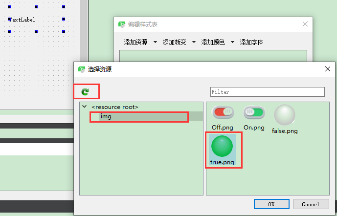

# 插入图片    
## 1 添加资源文件   

    

  

- 路径可以在左侧图片位置右击，选拷贝路径   

## 2 创建图片载体-以Label为例   
### 2.1 界面设计器   
- 修改标签属性`styleSheet`   
    

    

### 2.2 代码实现   
1.  利用`setStyleSheet`   
```C++
ui->label->setStyleSheet("border-image: url(:/img/true.png);");
```

- 不会自动适应图片，background-image像电脑桌面的平铺，图片尺寸不变，可以重复显示图片以填充区域，若要适应大小，设置`plabel->setScaledContents(true);`      
- 自动适应图片，border-image像桌面的拉伸效果，常用   

2. 利用`setPixmap`     
```C++
QImage imTrue;
//图片路径可以通过右击工程的图片获取
imTrue.load(":/img/true.png");
QLabel *per1 = new QLabel("", this);
// 标签载入图片
per1->setPixmap(QPixmap::fromImage(imTrue));
// 设置大小
QPixmap pixmap = QPixmap::fromImage(imTrue); 
// 按比例缩放  
QPixmap fitpixmap = pixmap.scaled(6, 6, Qt::KeepAspectRatio, Qt::SmoothTransformation);  
// 设置的大小值，应用与标签  
per1->setPixmap(fitpixmap);
```

## 参考资料  
1. https://blog.csdn.net/xqhrs232/article/details/78200779/   
2. https://blog.csdn.net/liuligui5200/article/details/47612403   
3. https://www.cnblogs.com/sggggr/p/12842490.html   
4. https://blog.csdn.net/kfy2011/article/details/77867609/   
5. https://blog.csdn.net/danelumax2/article/details/9259693?utm_medium=distribute.pc_relevant_t0.none-task-blog-BlogCommendFromMachineLearnPai2-1.nonecase&depth_1-utm_source=distribute.pc_relevant_t0.none-task-blog-BlogCommendFromMachineLearnPai2-1.nonecase   