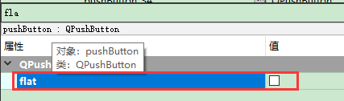
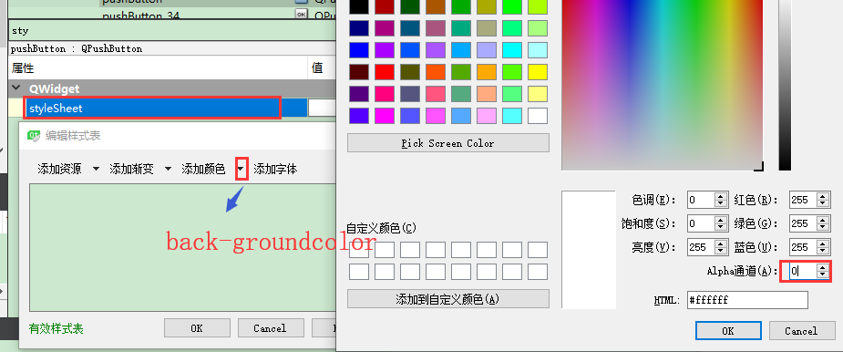

# 设置透明按钮   

## 1 setFlat函数实现按钮透明   
### 1.1 界面设计器   
- 修改按钮的Flat属性   

   

### 1.2 编写代码   
- 利用`setFlat`函数   
```C++
QPushButton *mode =new QPushButton(this);
mode->setText("mode");
mode->move(200,100);
mode->setFlat(true);//就是这句实现按钮透明的效果。
```

- 此时显示透明，但是按下有背景色    

## 2 修改背景色   
### 2.1 界面设计器   
- 修改按钮的styleSheet属性，背景色的Alpha通道设置为：0   

   

### 2.2 编写代码   
- 利用`setFlat`函数   
```C++
QPushButton *mode =new QPushButton(this);
ui->mode->setStyleSheet("background-color: rgba(255, 255, 255, 0);");
```

## 3 参考资料    
1. https://www.cnblogs.com/sggggr/p/12733482.html   