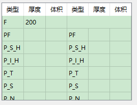
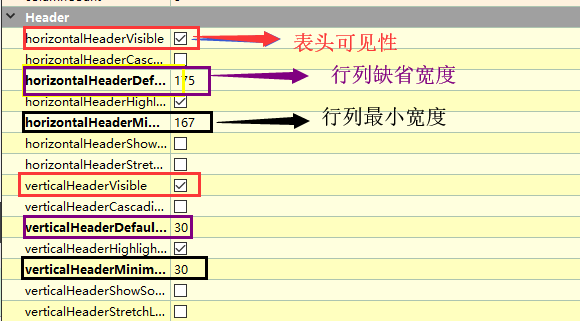
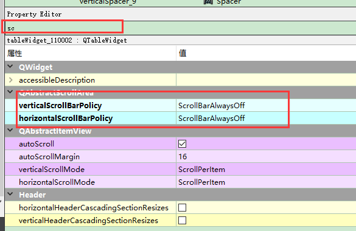
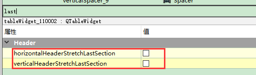

# TableWidget单元格用法   

## 1 表格的设置   
- 修改单元格的背景：`table->item(0,0)->setBackground(QColor(233, 233, 241));`        
- 修改text时，有表头和无表头方法不一样    

## 2 表格填数据   
```C++
ui->tableWidget->setRowCount(8);     //设置行数为8
ui->tableWidget->setColumnCount(6);  //设置列数为6
ui->tableWidget->clear();
//自适应宽度
ui->tableWidget->horizontalHeader()->setStretchLastSection(true);
ui->tableWidget->horizontalHeader()->setSectionResizeMode(QHeaderView::Stretch);
//设置默认高度
ui->tableWidget->verticalHeader()->setDefaultSectionSize(25);

//隐藏滚动条
ui->tableWidget->setHorizontalScrollBarPolicy(Qt::ScrollBarAlwaysOff);
ui->tableWidget->setVerticalScrollBarPolicy(Qt::ScrollBarAlwaysOff);
ui->tableWidget->setEditTriggers(QAbstractItemView::NoEditTriggers);//不可编辑
ui->tableWidget->setSelectionMode(QAbstractItemView::NoSelection);//不可选择
ui->tableWidget->verticalHeader()->setVisible(false); //隐藏列表头

//设置表头
QStringList header;
header << "类型" << "厚度" << "体积" << "类型" << "厚度" << "体积";
ui->tableWidget->setHorizontalHeaderLabels(header);

ui->tableWidget->setSpan(0, 3, 1, 5);//将无用单元格合并

//设置每一项
// 第0行，第0列，插入F
ui->tableWidget->setItem(0, 0, new QTableWidgetItem("F"));//
ui->tableWidget->setItem(1, 0, new QTableWidgetItem("PF"));//
ui->tableWidget->setItem(2, 0, new QTableWidgetItem("P_S_H")); //
ui->tableWidget->setItem(3, 0, new QTableWidgetItem("P_I_H"));//
ui->tableWidget->setItem(4, 0, new QTableWidgetItem("P_T"));//
ui->tableWidget->setItem(5, 0, new QTableWidgetItem("P_S"));//
ui->tableWidget->setItem(6, 0, new QTableWidgetItem("P_N"));//
ui->tableWidget->setItem(7, 0, new QTableWidgetItem("P_I"));//

ui->tableWidget->setItem(1, 3, new QTableWidgetItem("PF")); //
ui->tableWidget->setItem(2, 3, new QTableWidgetItem("P_S_H"));//
ui->tableWidget->setItem(3, 3, new QTableWidgetItem("P_I_H"));//
ui->tableWidget->setItem(4, 3, new QTableWidgetItem("P_T"));//
ui->tableWidget->setItem(5, 3, new QTableWidgetItem("P_S"));//
ui->tableWidget->setItem(6, 3, new QTableWidgetItem("P_N"));//
//每一项的厚度值
ui->tableWidget->setItem(7, 3, new QTableWidgetItem("P_I"));//
ui->tableWidget->setItem(0, 1, new QTableWidgetItem(QString::number(200))); // 插入数字  

```

## 3 运行效果   

   


## 4 注意事项   
- 对于tableWidget最好把表头去掉，方便调格式    
  

- 当没有表头时，可以用setText方法改单元格的值`item(0,0)->setText("作战模式");`，但是有表头的话，只能用setItem方法修改`tableWidget->setItem(7, 3, new QTableWidgetItem("P_I"))`    
- 可以去掉滑动框    
  

- 可以设置最后行或者最后一列自适应到表格大小    
    

- 表格的大小和单元格的大小算完后，需要加上大约3px的线宽才比较好看    


## 参考资料   
1. https://www.cnblogs.com/aiguona/p/10400111.html   