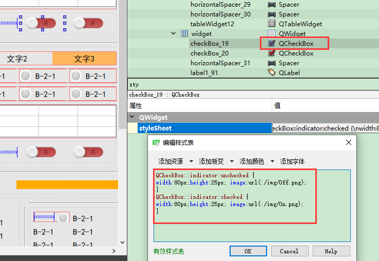
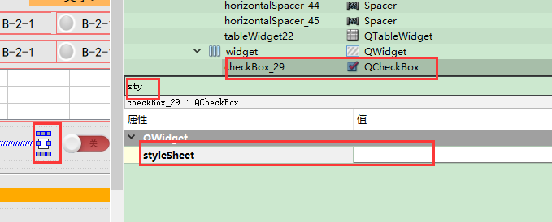
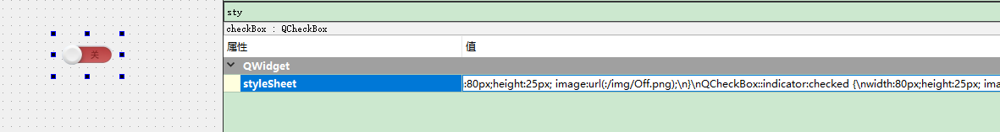
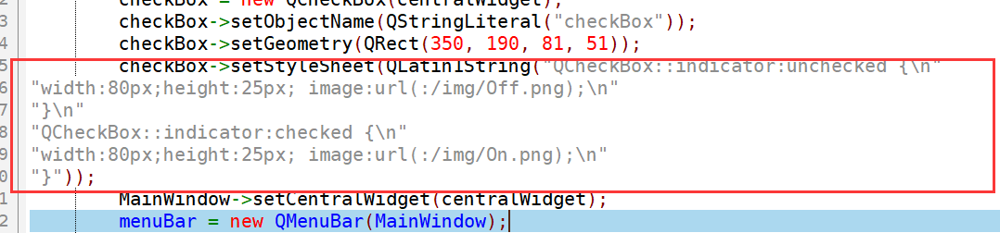

# QSS界面渲染   

## 1 介绍   
- 这部分在StyleSheet属性中进行设置   
   


- 可以自定义线宽，背景色，字体，颜色，网格线，渲染等    

- Qt样式表（以下统称QSS）的术语和语法规则几乎和CSS相同。如果你熟悉CSS，可以快速浏览以下内容。  


## 2  使用设计器修改控件样式    
1. 在UI中选中要修改样式的控件    
    

2. 将CSS样式复制进去    
```
QCheckBox::indicator:unchecked {
width:80px;height:25px; image:url(:/img/Off.png);
}
QCheckBox::indicator:checked {
width:80px;height:25px; image:url(:/img/On.png);
}
```

3. 样式发生了变化   

   


## 3 使用代码   
- 打开编译后的ui.h文件可以看到等效代码：    
```C++
    ui->checkBox->setStyleSheet(QLatin1String("QCheckBox::indicator:unchecked {\n"
                           "width:80px;height:25px; image:url(:/img/Off.png);\n"
                           "}\n"
                           "QCheckBox::indicator:checked {\n"
                           "width:80px;height:25px; image:url(:/img/On.png);\n"
                           "}"));
```

   


## 参考资料  
1. https://blog.csdn.net/aristolto/article/details/80234934   

