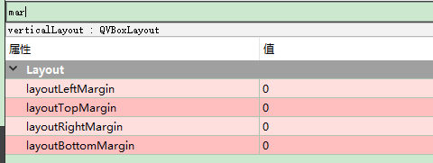

# 界面设计的技巧   

## 注意事项   
1. 先考虑是否需要添加滑动效果    
2. 文字和窗体尽可能先调小，在变大的话比较简单   
3. 先划线确定范围，再依次添加控件   
4. 要有适当的图片和QSS渲染效果   
5. 鼠标事件应该充分考虑   
6. Layout可以提升为Widget，然后就可以调整大小   
7. 在Layout内的部件不能把控布局时，可以调整控件的最大和最小高度和宽度   
8. 在量界面时，一定要减去`-口X`的高度，和菜单栏、状态栏等控件高度  
9. 也可以通过split来划分界面，再进行设计    

## 关于Layout    
1. Layout有个Margin属性，可以调整图层内部的控件距离图层边界的距离，可以都调整为0，很常用      

  