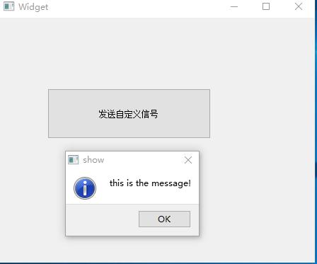

# 信号和槽的自定义    

## 1 概述   
- Qt中的信号和槽应该是最熟悉不过的了，连接信号和槽的关键字 connect有五种连接类型，参考几篇博客和自己的经验进行整理。   
- 采用自定义信号和槽的方式进行整理    
- **发射信号的类里面有信号，接收信号的类，里面存在槽函数**   
## 2 C++的调用方式   
1. 接收端定义公有成员变量以供源端修改，然后接收端处理数据； (不建议用，破坏封装性，不利于多线程编程)   
2. 接收端将私有成员变量通过友元方式共享给源端，源端可以修改接收端变量；(特殊情况除外，也不建议用，紧耦合设计会相互影响，修改了一个类的代码很可能影响另一个，谨慎使用)    
3. 接收端定义公开的get和set方法，提供给源端；(推荐使用可以和信号槽机制协同工作)   
4. 源端给出回调函数约定，接收端定义相同参数和返回值类型的静态成员函数，将静态成员函数作为回调函数交给源端，源端再调用该函数。(可以使用，将静态成员函数的地址传递，实现函数的调用)   
5. Qt中自带的信号槽机制，推荐使用信号槽机制进行通信，下面主要介绍信号槽机制   

## 3 自定义信号和槽沟通    
- 通过信号和槽机制通信，通信的源头和接收端之间是松耦合的：    
	- 源头只需要顾自己发信号就行，不用管谁会接收信号；   
	- 接收端只需要关联自己感兴趣的信号，其他的信号都不管；   
	- 只要源头发了信号，关联该信号的接收端全都会收到该信号，并执行相应的槽函数。  
- 源头和接收端是非常自由的，connect 函数决定源头和接收端的关联关系，并会自动根据信号里的参数传递给接收端的槽函数。   
- 源头和接收端是非常自由的，connect 函数决定源头和接收端的关联关系，并会自动根据信号里的参数传递给接收端的槽函数。   
- 因为源头是不关心谁接收信号的，所以 **connect 函数一般放在接收端类**的代码中，或者放在能同时访问源端和接收端对象的代码位置。   
### 3.1 创建项目添加源端信号     
- 新建一个QWidegt的qobjcom.pro，将widget.h中的类体声明改为如下：   

```C++
class Widget : public QWidget
{
    Q_OBJECT

public:
    explicit Widget(QWidget *parent = 0);
    ~Widget();

// 添加自定义信号：这个标志不带 public 、protected、private 等前缀，那是因为信号默认强制规定为公有类型，这样才能保证其他对象能接收到信号。      
signals:  

// 信号只需要声明，不要给信号写实体代码：注意信号只是一个空壳，只需要声明它，而不要给它写实体代码。
// signals的标识的代码段只能放置信号声明，不能放其他任何东西，普通的函数或变量、槽函数都不要放在这里。
    void SendMsg(QString str);
    
public slots:
// public slots 是公有槽函数代码段的标志，定义了 ButtonClicked 槽函数，接收按钮被点击的信号，这个槽函数以后会触发我们自定义的信号。
// 槽函数代码段也只能放槽函数声明的代码，不要把其他的东西放在这个代码段里。   
    void ButtonClicked();
private:
    Ui::Widget *ui;
};
```

- 下面编写widget.cpp里面的代码，实现发送我们自定义的信号槽函数，并和按钮信号关联    

```C++
Widget::Widget(QWidget *parent) :
    QWidget(parent),
    ui(new Ui::Widget)
{
    ui->setupUi(this);
    
    // 信号和槽建立关联  
    connect(ui->pushButton, SIGNAL(clicked()), this, SLOT(ButtonClicked()));
    // 当pushButton被单击时，调用ButtonClicked()槽函数
}

Widget::~Widget()
{
    delete ui;
}

// 槽函数   
void Widget::ButtonClicked()
{
    emit SendMsg(tr("this is the message!"));
    // 该槽函数只是完成发射信号
    // 源端只是发送信号，至于谁接收信号源端是不管的
}
```
### 3.2 添加接收端槽函数接收信号   
- 那么谁来接收这个信号？答：主调函数接收信号，因此在主调函数中，加槽函数      
- 可以造一个接收SendMsg信号的函数，并将接收到的字符串显示，因此添加一个新类，并编写接收SendMsg信号的槽函数   
- 添加一个新类ShowMsg，基类选择QObject，其他自动填充   
- 特别说明：要使用信号槽机制，必须直接或间接从QObject类派生     
- 接下来，编辑showmsg.h，声明接收SendMsg信号的槽函数RecvMsg   

```C++
class ShowMsg : public QObject
{
    Q_OBJECT
public:
    explicit ShowMsg(QObject *parent = 0);

signals:

public slots:
    // 添加接收SendMsg信号的槽函数
    void RecvMsg(QString str);
};
```
- 编辑showmsg.cpp，声明定义SendMsg信号的槽函数RecvMsg    

```C++
// 添加RecvMsg槽函数的定义  
void ShowMsg::RecvMsg(QString str)
{
    QMessageBox::information(0, tr("show"), str);
}
```

- 加头文件 `<QMessageBox>` 包含之后，我们添加槽函数 RecvMsg 的实体代码，里面就是一句弹窗的代码，显示收到的字符串。             
- `QMessageBox::information` 函数第一个参数是父窗口指针，设为 NULL，代表没有父窗口，就是在系统桌面直接弹窗的意思。     

### 3.3 利用connect函数使信号和槽关联    
- 信号和槽机制有三步：
	1. 有源头对象发信号，我们完成了；
	2. 要有接收对象和槽函数，注意，上面只是类的声明，并没有定义对象。我们必须定义一个接收端的对象    
	3. 然后才能进行第三步 connect。    
- 修改main.cpp如下   

```C++
int main(int argc, char *argv[])
{
    QApplication a(argc, argv);
    Widget w;   // 1. 主窗体对象，内部会发SendMsg信号
    ShowMsg s;  // 2. 接收端对象，有槽函数RecvMsg接收信号

    // 3. 建立关联
    QObject::connect(&w, SIGNAL(SendMsg(QString)), &s, SLOT(RecvMsg(QString)));
    w.show();

    return a.exec();
}
```

### 3.4 运行效果   

   


## 4 信号和槽的写法   
```C++
// 1. 常见的写法,四参数,对于signal中若有参数，由slot函数接收，因此slot函数形参个数，应该比signal中的参数等于或少于  
connect(Sender,SIGNAL(signal),Receiver,SLOT(slot));   

// 2. 也可以是5参数加上省略部分：Qt::DirectConnection   
connect(Sender,SIGNAL(signal),receiver,SLOT(slot)，Qt::DirectConnection);

// 3. 对于重载的情况  
connect(Sender, QOverload<bool>::of(&类名::信号名),this,&类名::槽名);
```

## 5 注意事项   
### 5.1 signals关键词要求     
1、signals前面不可加public、private和protected进行修饰；slots前面可以加，因为Qt说槽函数可以当普通函数使用。   
2、signals区域的函数必须是void类型，而且这些信号函数没有函数体，也就是说不可以自己定义这些信号函数，你只要声明它就够了，其它不用管，Qt内部自己弄。  
3、宏定义和函数指针不能用于信号和槽的参数，信号和槽也不能有缺省参数。  


### 5.2 信号和槽参数个数要求   
- 要将信号与槽链接成功，在有参数的情况下，以下几种情况下都可以链接信号槽成功：  
	1. 信号的参数个数与类型与对应的槽函数参数的个数与类型一致  
	2. 信号的参数个数多于对应的槽函数的参数个数，即对应的槽函数的参数个数可以比信号函数少，但槽函数的所有参数类型必须与信号的参数类型保持一致   
	3. 槽函数与信号函数有默认参数的情况时，遵循以上的第二种规律。   


## 6 参考资料   

1. https://blog.csdn.net/kunkliu/article/details/78872090   
2. https://blog.csdn.net/luoyayun361/article/details/80768567?utm_medium=distribute.pc_relevant.none-task-blog-BlogCommendFromMachineLearnPai2-1.channel_param&depth_1-utm_source=distribute.pc_relevant.none-task-blog-BlogCommendFromMachineLearnPai2-1.channel_param    
3. https://blog.csdn.net/yj_android_develop/article/details/83478200?utm_medium=distribute.pc_relevant_download.none-task-blog-blogcommendfrombaidu-2.nonecase&depth_1-utm_source=distribute.pc_relevant_download.none-task-blog-blogcommendfrombaidu-2.nonecas  
4. https://blog.csdn.net/u012964993/article/details/30454923   
5. https://blog.csdn.net/naibozhuan3744/article/details/79221060   
6. https://www.jianshu.com/p/dcbaceeeb486   
7. https://blog.csdn.net/Shado_walker/java/article/details/53064993


